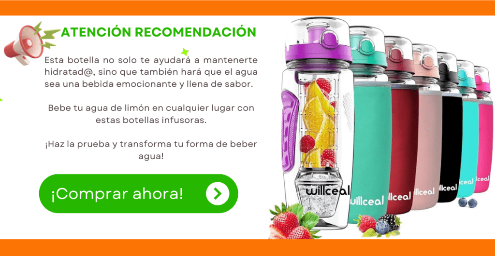

A continuación los 10 beneficios de beber agua con limón, si es en ayunas, mejor:

01. **Hidratación mejorada**: El agua con limón ayuda a mantener tu cuerpo bien hidratado, lo que es esencial para que funcione correctamente.

02. **Refuerzo del sistema inmunológico**: Los limones tienen mucha vitamina C, que ayuda a tu cuerpo a defenderse de enfermedades.

03. **Mejora la digestión**: Beber agua con limón puede ayudar a que tu estómago digiera los alimentos mejor, evitando problemas como el estreñimiento.

04. **Aumenta la energía**: El agua con limón te puede dar un pequeño empujón de energía natural, especialmente por la mañana.

05. **Piel más saludable**: La vitamina C del limón también ayuda a que tu piel se vea más clara y sana.

06. **Ayuda a la pérdida de peso**: Beber agua con limón puede ayudar a sentirte lleno y evitar que comas en exceso.

07. **Aliento fresco**: El limón tiene propiedades antibacterianas que pueden ayudar a mantener tu boca fresca y limpia.

08. **Equilibrio del pH**: Aunque el limón es ácido, ayuda a equilibrar el pH de tu cuerpo, lo que es bueno para la salud general.

09. **Desintoxicación**: El agua con limón ayuda a eliminar las toxinas del cuerpo, manteniendo tus órganos funcionando bien.

10. **Reducción de la inflamación**: Beber agua con limón puede ayudar a reducir la inflamación en tu cuerpo, lo que es beneficioso para tus articulaciones y músculos.

Estos beneficios hacen que el agua con limón sea una opción saludable y refrescante para incluir en tu rutina diaria.

Hasta aquí los 10 beneficios que prometimos que te contaríamos. ¿Ya empezaste a tomar agua con limón en ayunas? ¿cuándo piensas empezar a hacerlo?

[Ver vídeo ahora:](https://www.youtube.com/watch?v=ltO-jl1WcAs)

Nos vemos en el camino 🙂

Si quieres saber más sobre nutrición y vida sana, [suscríbete a mi canal](https://www.youtube.com/user/nutriclubweb) y sigue mi página de [Facebook](https://www.facebook.com/clubdenutricion.es/). Visita la sección de blog [aquí](/blog/).
