# ALIMENTOS RICOS EN HIERRO

## Información y tabla de alimentos ricos en hierro

Hoy vamos a hablar de cuáles son los alimentos ricos en hierro para mantener una óptima salud. Este elemento es básico para el correcto funcionamiento de nuestro organismo. Tiene especial incidencia en el transporte de oxígeno a diferentes partes del organismo ya que forma parte de la hemoglobina. Forma parte de la respiración celular y ayuda a un buen sistema inmunitario.

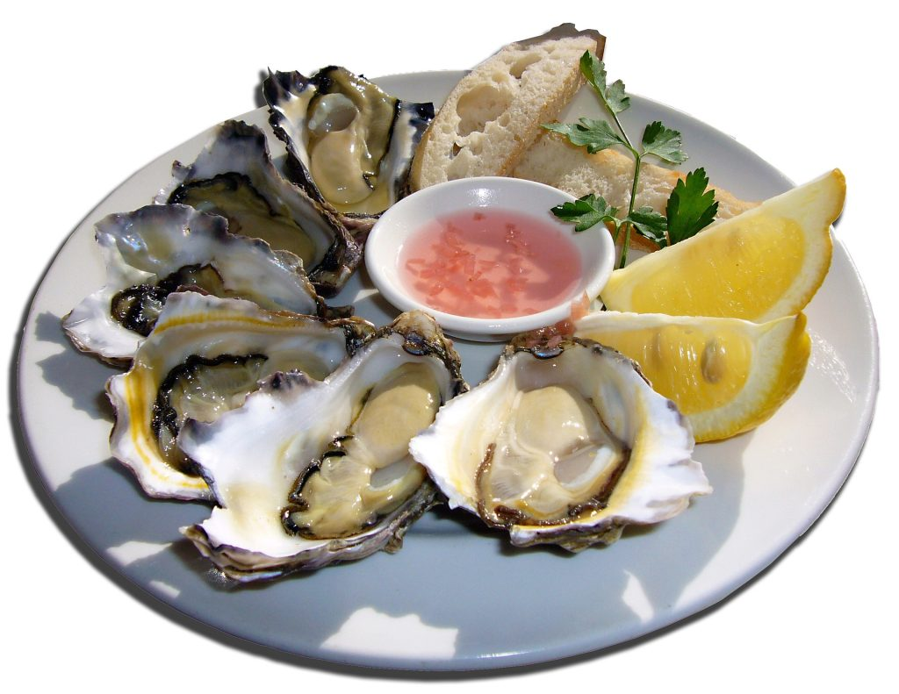

El hierro tiene difícil absorción, alrededor de un 10% del que contienen los alimentos animales, y un 5% en alimentos vegetales. Podemos aumentar la misma,  añadiendo Vitamina C a nuestra ingesta. Por el contrario, existen ciertos alimentos que hacen que la absorción baje, como el té, el café y la clara de huevo. Es por esto, que si solemos tomar este tipo de sustancias, debemos aumentar la ingesta de hierro para evitar su escasez.

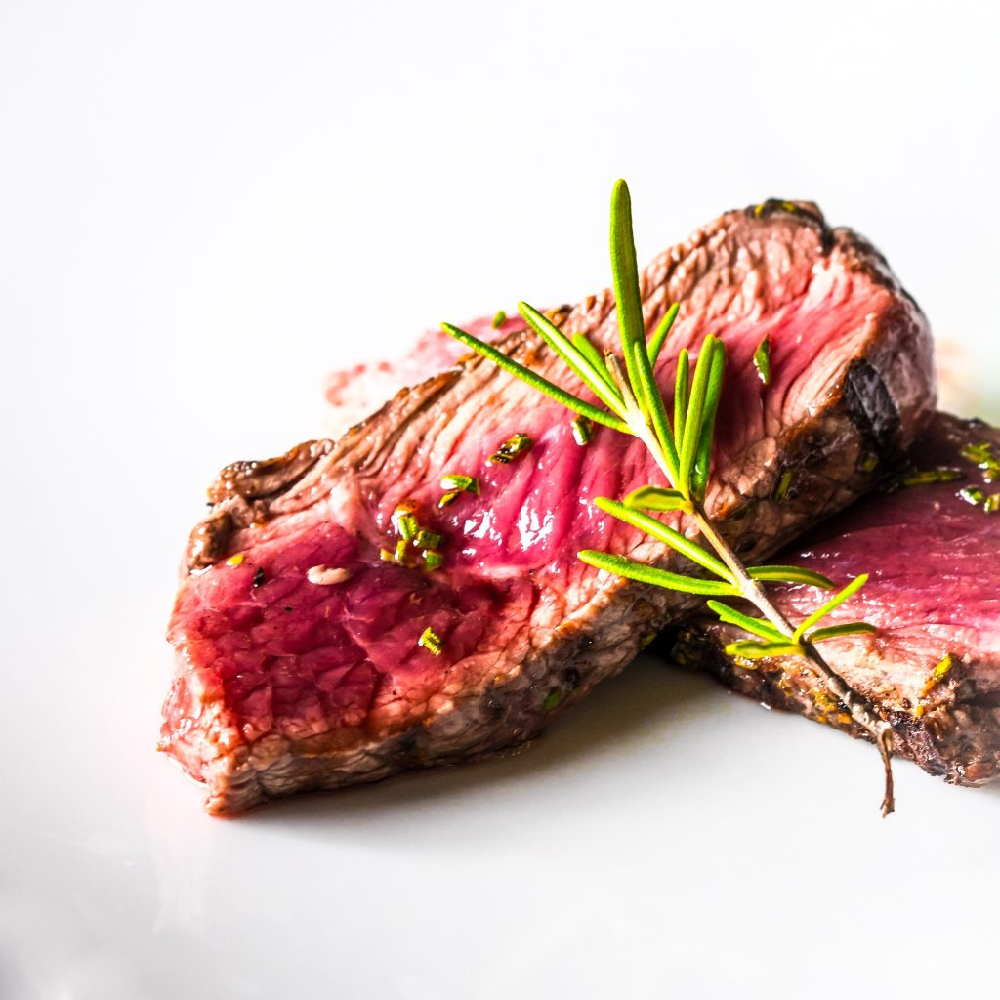

El organismo necesita 1mg diario de hierro, para ello, debemos ingerir 10mg al día, para asegurarnos esa cantidad.Mujeres que menstrúen, embarazadas y lactantes, deberán aumentar la ingesta a 18mg por día.La escasez de Hierro, provoca anemia, una deficiencia que  deriva en diferentes problemas como son el cansancio crónico, el mal humor o la caída del cabello. Por lo tanto, es muy importante tener buenos niveles de hierro para el buen funcionamiento del organismo.

Existe una gran variedad de alimentos ricos en hierro. Pueden ser de origen animal o vegetal, y algunos serán más ricos que otros. Además hay diferencia a la hora de absorverlos.

La siguiente tabla, nos muestras las cantidades diarias recomendadas según edad y sexo.

Alimentos ricos en hierro

| Alimento | Cantidad de hierro por 100 gramos | Absorción del hierro |
| --- | --- | --- |
| Hígado de ternera | 8.8 mg | Muy bien absorbido |
| Almejas | 28 mg | Muy bien absorbido |
| Ostras | 6 mg | Muy bien absorbido |
| Berberechos | 28 mg | Muy bien absorbido |
| Mejillones | 6 mg | Muy bien absorbido |
| Carne de cerdo | 1.2 mg | Bien absorbido |
| Carne de res | 2.6 mg | Bien absorbido |
| Pollo | 1.1 mg | Bien absorbido |
| Pescado | Varía según el tipo de pescado | Bien absorbido |
| Espinacas | 2.7 mg | Bien absorbido |
| Lentejas | 3.3 mg | Regularmente absorbido |
| Garbanzos | 2.9 mg | Regularmente absorbido |
| Soja | 15.7 mg | Regularmente absorbido |
| Tofu | 5.4 mg | Regularmente absorbido |
| Alubias | 2.5 mg | Regularmente absorbido |
| Chícharos | 1.5 mg | Regularmente absorbido |
| Escarola | 2.2 mg | Regularmente absorbido |
| Brócoli | 1 mg | Mal absorbido |
| Patata | 0.7 mg | Mal absorbido |
| Zanahoria | 0.3 mg | Mal absorbido |

\*Declinamos  cualquier  tipo de  responsabilidad  por  errores  que  pueda haber en las tablas.

#### Alimentos ricos en hierro de procedencia animal, también llamado hierro hemo:

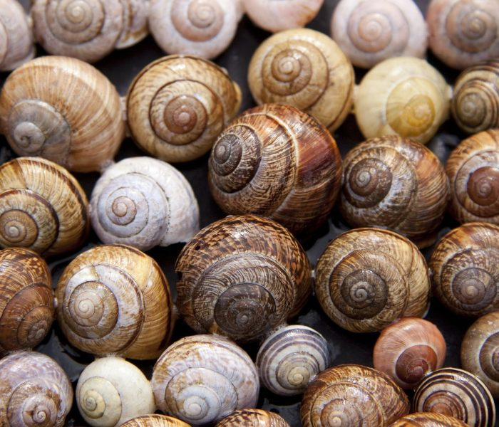

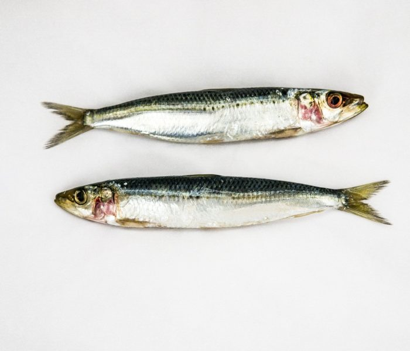

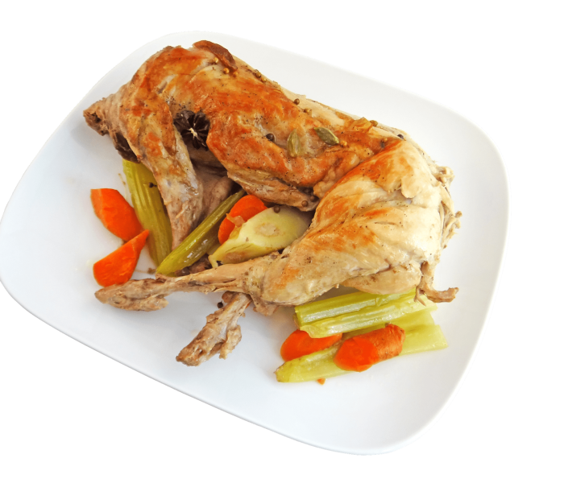

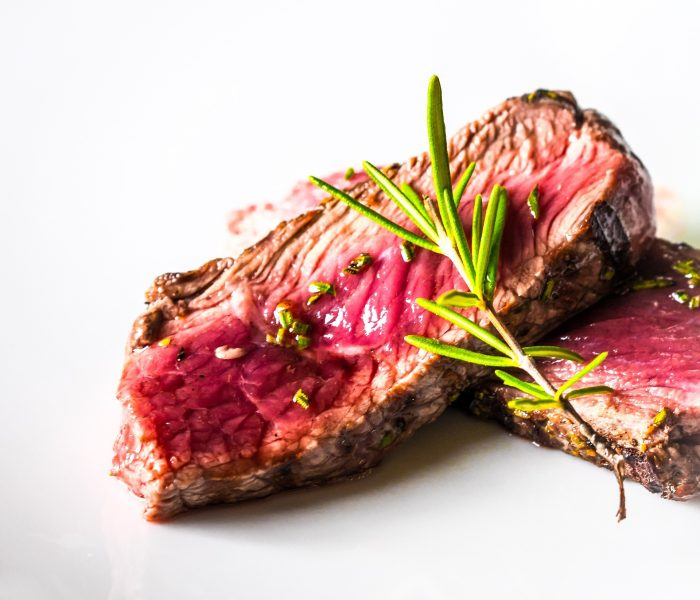

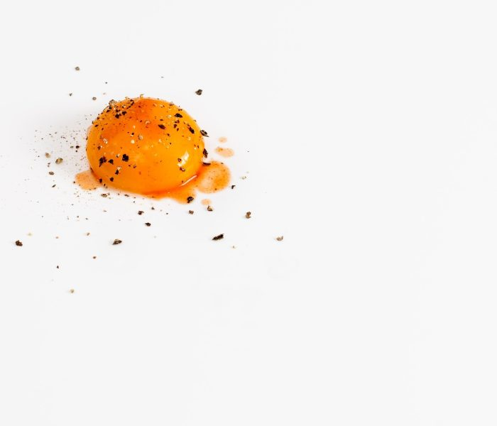

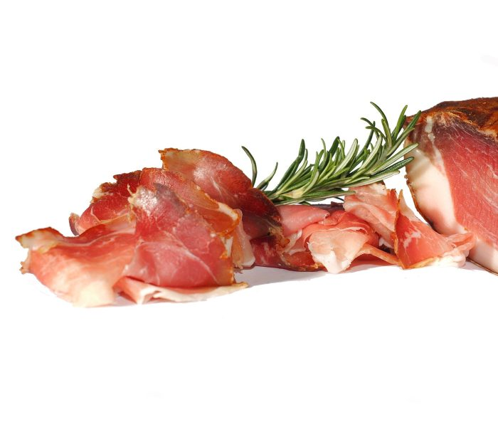

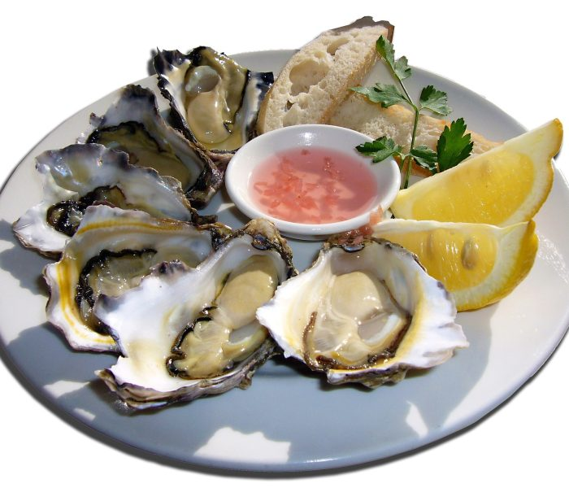

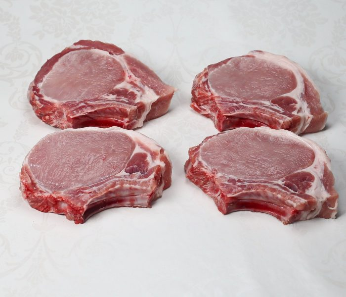

#### Alimentos ricos en hierro de procedencia vegetal (hierro no hemo):

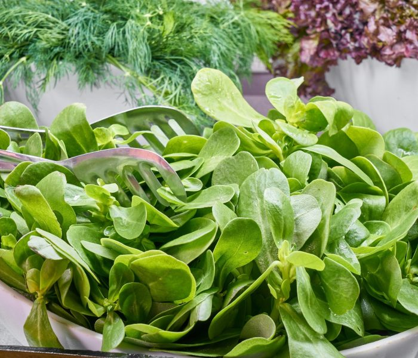

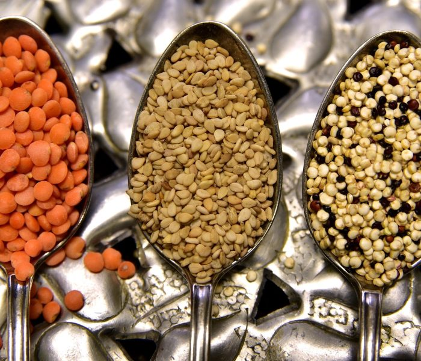

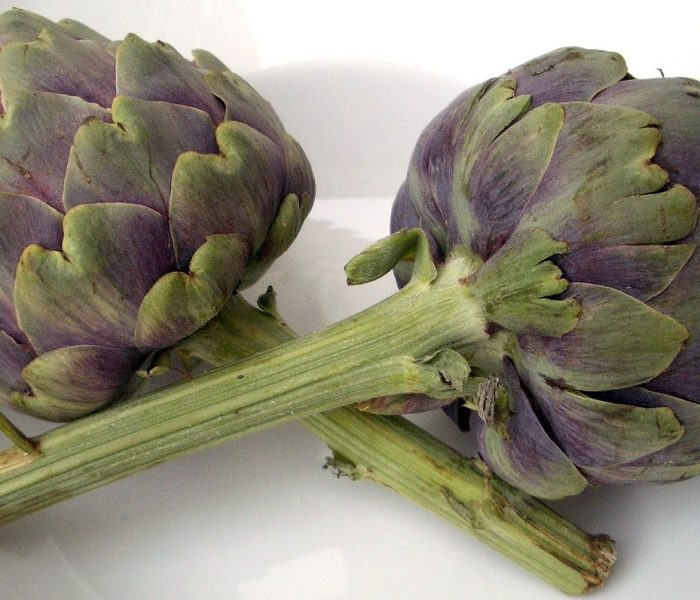

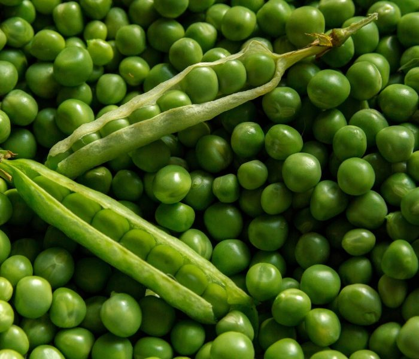

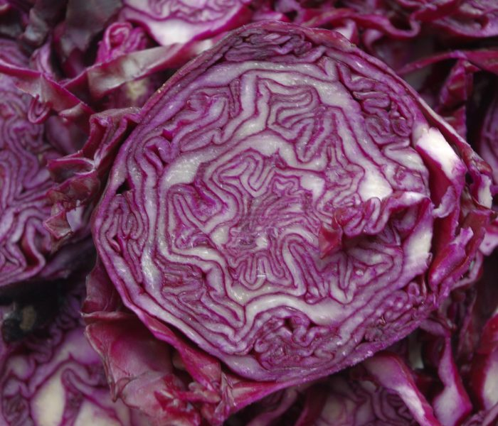

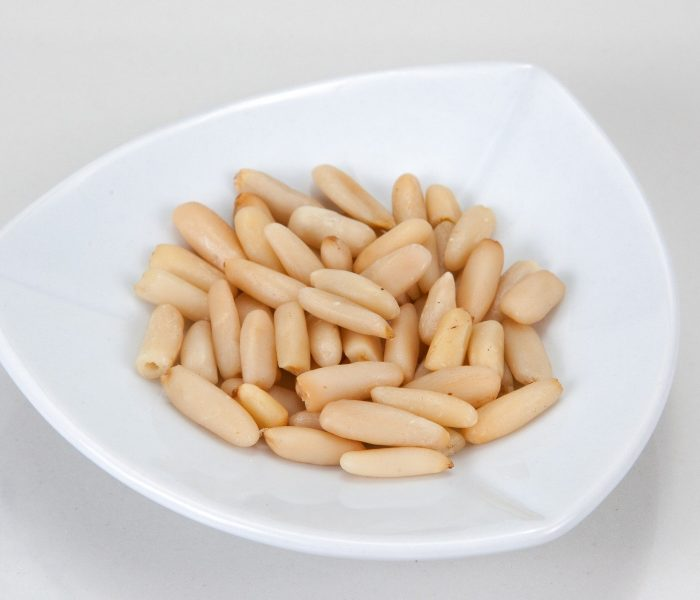

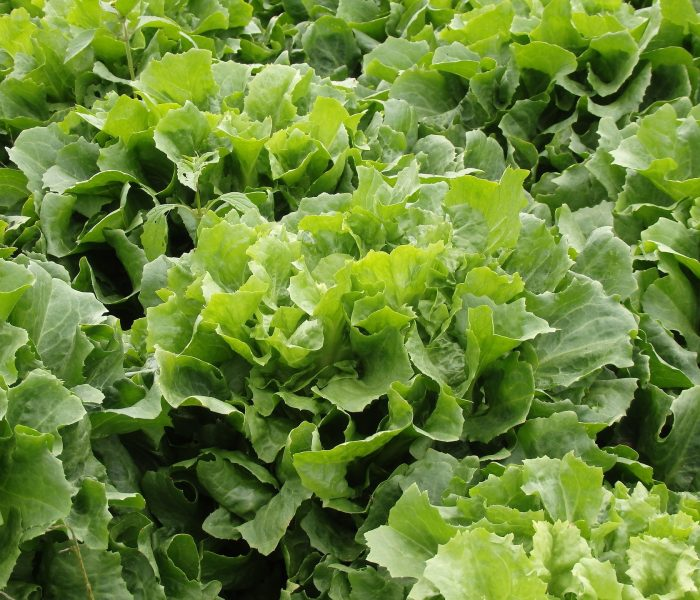

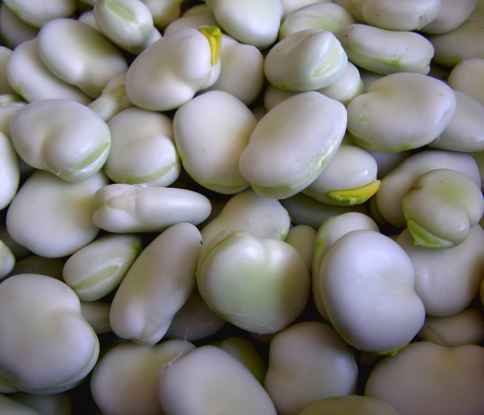

#### Consejos para mejorar la absorción del hierro

1. Consumir alimentos ricos en vitamina C: la vitamina C ayuda a absorber el hierro presente en los alimentos. Algunas buenas fuentes de vitamina C son los cítricos, los pimientos, las coles de Bruselas y los kiwis.

2. Evitar el té y el café: tanto el té como el café contienen compuestos que reducen la capacidad del cuerpo para absorber el hierro. Es mejor evitar consumirlos junto con alimentos ricos en hierro.

3. Combinar alimentos ricos en hierro con alimentos ricos en ácido fólico: el ácido fólico ayuda a aumentar la absorción del hierro. Algunas buenas fuentes de ácido fólico son las espinacas, los espárragos y los cereales integrales.

4. Cocinar en hierro fundido: cocinar los alimentos en una olla o sartén de hierro fundido puede aumentar la cantidad de hierro que se libera en la comida.

5. Evitar el consumo de calcio y zinc junto con alimentos ricos en hierro: estos minerales pueden interferir con la absorción del hierro. Es mejor consumir alimentos ricos en calcio y zinc en momentos separados de los alimentos ricos en hierro.

6. Aumentar el consumo de alimentos ricos en hierro: por último, una forma sencilla de aumentar la cantidad de hierro que se absorbe es aumentando el consumo de alimentos ricos en hierro en la dieta.

#### Por favor, deja tu comentario, nos gustaría saber tu opinión.
