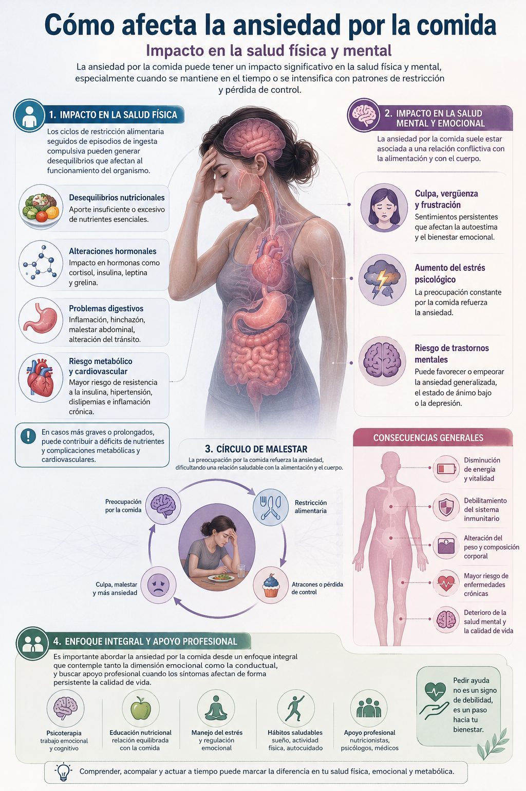

Aprende a identificar la ansiedad por la comida, entender sus causas emocionales y biológicas, y aplicar estrategias prácticas para recuperar una relación saludable con la alimentación

#### Tabla de contenidos

01. [Introducción](/ansiedad-por-la-comida-causas-sintomas/#elementor-toc__heading-anchor-0)

02. [Qué vas a aprender](/ansiedad-por-la-comida-causas-sintomas/#elementor-toc__heading-anchor-1)

03. [¿Qué es la ansiedad por la comida?](/ansiedad-por-la-comida-causas-sintomas/#elementor-toc__heading-anchor-2)

04. [Síntomas de la ansiedad por la comida](/ansiedad-por-la-comida-causas-sintomas/#elementor-toc__heading-anchor-3)

05. [Cómo afecta la ansiedad por la comida](/ansiedad-por-la-comida-causas-sintomas/#elementor-toc__heading-anchor-4)

06. [Relación entre la ansiedad por la comida y las hormonas](/ansiedad-por-la-comida-causas-sintomas/#elementor-toc__heading-anchor-5)

07. [Soluciones para la ansiedad por la comida](/ansiedad-por-la-comida-causas-sintomas/#elementor-toc__heading-anchor-6)

    1. [Buscar ayuda profesional](/ansiedad-por-la-comida-causas-sintomas/#elementor-toc__heading-anchor-7)

    2. [Desarrollar una relación saludable con la comida](/ansiedad-por-la-comida-causas-sintomas/#elementor-toc__heading-anchor-8)

    3. [Evitar la culpa y la vergüenza](/ansiedad-por-la-comida-causas-sintomas/#elementor-toc__heading-anchor-9)

    4. [Practicar técnicas de relajación](/ansiedad-por-la-comida-causas-sintomas/#elementor-toc__heading-anchor-10)

    5. [Crear un plan de comidas saludables](/ansiedad-por-la-comida-causas-sintomas/#elementor-toc__heading-anchor-11)

    6. [Buscar apoyo](/ansiedad-por-la-comida-causas-sintomas/#elementor-toc__heading-anchor-12)
08. [Preguntas frecuentes](/ansiedad-por-la-comida-causas-sintomas/#elementor-toc__heading-anchor-13)

09. [conclusión](/ansiedad-por-la-comida-causas-sintomas/#elementor-toc__heading-anchor-14)

10. [Artículos relacionados](/ansiedad-por-la-comida-causas-sintomas/#elementor-toc__heading-anchor-15)

    1. [La perimenopausia puede empezar antes de lo esperado: estas son sus primeras señales](/ansiedad-por-la-comida-causas-sintomas/#elementor-toc__heading-anchor-16)

    2. [Ultraprocesados y salud digestiva: nueva alerta](/ansiedad-por-la-comida-causas-sintomas/#elementor-toc__heading-anchor-17)

    3. [Dieta cetogénica y salud cerebral: qué dice la ciencia sobre Alzheimer y Parkinson](/ansiedad-por-la-comida-causas-sintomas/#elementor-toc__heading-anchor-18)

    4. [El sueño profundo: la hormona natural que ayuda a regenerar músculo, metabolismo y cerebro](/ansiedad-por-la-comida-causas-sintomas/#elementor-toc__heading-anchor-19)

    5. [Colesterol alto: por qué el LDL aislado podría no contar toda la historia clínica](/ansiedad-por-la-comida-causas-sintomas/#elementor-toc__heading-anchor-20)
11. [¿Sientes que tu energía sube y baja constantemente?](/ansiedad-por-la-comida-causas-sintomas/#elementor-toc__heading-anchor-21)

## Introducción

La ansiedad por la comida es un fenómeno cada vez más frecuente que afecta a personas de distintas edades y contextos. Se caracteriza por una relación difícil con la alimentación, en la que pueden aparecer pensamientos intrusivos, impulsos de comer sin hambre física o episodios de ingesta emocional.

Este problema no tiene una única causa. Suele estar relacionado con factores emocionales como la ansiedad generalizada, la baja autoestima, el estrés crónico o la presión social, así como con hábitos alimentarios restrictivos o una relación poco consciente con la comida.

En este artículo analizaremos en profundidad qué es la ansiedad por la comida, cuáles son sus principales causas y síntomas, y qué estrategias basadas en la evidencia pueden ayudar a gestionarla de forma efectiva. Entender este fenómeno es clave, ya que puede impactar significativamente en la salud física, el bienestar emocional y la calidad de vida. Por ello, en algunos casos puede ser recomendable buscar apoyo profesional para abordar el problema desde un enfoque integral.

## Qué vas a aprender

En este artículo aprenderás a identificar qué es la ansiedad por la comida, cuáles son sus principales causas y cómo reconocer sus síntomas más comunes. También descubrirás estrategias prácticas y basadas en la evidencia para gestionarla de forma efectiva en tu día a día.

**Al finalizar este artículo podrás:**

- Identificar las causas emocionales, conductuales y biológicas de la ansiedad por la comida
- Reconocer los síntomas más habituales de la alimentación emocional o compulsiva
- Comprender cómo mejorar tu relación con la comida desde un enfoque más consciente y equilibrado
- Aplicar técnicas de regulación emocional y relajación para reducir los episodios de ansiedad
- Saber cuándo y cómo buscar ayuda profesional especializada si lo necesitas

## ¿Qué es la ansiedad por la comida?

Definición y explicación

La ansiedad por la comida hace referencia a una relación alterada con la alimentación en la que aparecen emociones intensas como ansiedad, culpa, vergüenza o malestar antes, durante o después de comer. No se trata de un diagnóstico único en sí mismo, sino de un conjunto de patrones emocionales y conductuales asociados a la comida.

En muchos casos, este fenómeno está relacionado con la alimentación emocional, el estrés, la restricción alimentaria previa o una relación poco consciente con las señales de hambre y saciedad. También puede verse influido por factores psicológicos como la baja autoestima, la presión social sobre el cuerpo o el uso de la comida como vía de regulación emocional.

La ansiedad por la comida puede afectar significativamente la calidad de vida, generando ciclos de restricción, pérdida de control y malestar emocional. Por ello, es importante abordarla desde un enfoque integral, que incluya educación alimentaria, regulación emocional y, en algunos casos, acompañamiento profesional especializado.

## Síntomas de la ansiedad por la comida

Señales y síntomas más comunes

La ansiedad por la comida puede manifestarse a través de distintos síntomas emocionales, cognitivos y conductuales que afectan la relación con la alimentación y el bienestar general.

Entre los síntomas más frecuentes se incluyen sentimientos de culpa, vergüenza o malestar emocional después de comer, incluso cuando la ingesta ha sido normal o adecuada. También es habitual la presencia de pensamientos recurrentes u obsesivos sobre la comida, el peso o el control alimentario.

A nivel conductual, puede aparecer evitación de determinados alimentos o situaciones sociales relacionadas con la comida, así como patrones de restricción alimentaria que, en algunos casos, pueden derivar en episodios de ingesta compulsiva o sensación de pérdida de control al comer.

Otros signos relevantes incluyen ciclos de restricción y atracón, preocupación constante por la alimentación y dificultad para identificar las señales reales de hambre y saciedad.

Reconocer estos síntomas es un paso fundamental para abordar la ansiedad por la comida de forma adecuada. En muchos casos, puede ser necesario implementar estrategias de regulación emocional y, si el malestar es persistente, buscar apoyo profesional especializado.

## Cómo afecta la ansiedad por la comida

Impacto en la salud física y mental

La ansiedad por la comida puede tener un impacto significativo tanto en la salud física como en el bienestar psicológico, especialmente cuando se mantiene en el tiempo o se intensifica con patrones de restricción y pérdida de control.

A nivel físico, los ciclos de restricción alimentaria seguidos de episodios de ingesta compulsiva pueden generar desequilibrios nutricionales y afectar al funcionamiento del organismo. En casos más graves o prolongados, esto puede contribuir a déficits de nutrientes, alteraciones hormonales, problemas digestivos y un mayor riesgo de complicaciones metabólicas y cardiovasculares.

A nivel mental y emocional, la ansiedad por la comida suele estar asociada a sentimientos persistentes de culpa, vergüenza y frustración, así como a una relación conflictiva con la alimentación. Esto puede aumentar el estrés psicológico y favorecer la aparición o el empeoramiento de problemas como la ansiedad generalizada, el estado de ánimo bajo o síntomas depresivos.

Además, este patrón puede generar un círculo de malestar en el que la preocupación por la comida refuerza la propia ansiedad, dificultando la relación saludable con la alimentación y el propio cuerpo.

Por ello, es importante abordar la ansiedad por la comida desde un enfoque integral, que contemple tanto la dimensión emocional como la conductual, y buscar apoyo profesional cuando los síntomas afectan de forma persistente la calidad de vida.

## Relación entre la ansiedad por la comida y las hormonas

Cómo las hormonas influyen en la ansiedad por la comida

La relación entre la ansiedad por la comida y el sistema hormonal es compleja y bidireccional. No se trata solo de “falta de fuerza de voluntad”, sino de una interacción entre el cerebro, las emociones y hormonas que regulan el hambre, el estrés y el estado de ánimo.

Cuando una persona experimenta estrés o ansiedad de forma frecuente, se activan sistemas hormonales como el eje del cortisol, una hormona relacionada con la respuesta al estrés. Niveles elevados de cortisol pueden aumentar el apetito, especialmente hacia alimentos muy palatables (ricos en azúcar y grasa), y favorecer la llamada alimentación emocional.

Por otro lado, hormonas como la insulina también influyen en la regulación del azúcar en sangre y la sensación de hambre y saciedad. Alteraciones en estos procesos, por ejemplo debido a patrones de alimentación irregulares o restrictivos, pueden intensificar los picos de hambre y la sensación de pérdida de control al comer.

Además, neurotransmisores como la serotonina y la dopamina juegan un papel clave en la regulación del estado de ánimo, la recompensa y el placer. Cuando estos sistemas se ven afectados por el estrés crónico o hábitos alimentarios desregulados, puede aumentar la búsqueda de comida como forma de alivio emocional.

Comprender esta interacción entre hormonas, emociones y conducta alimentaria es fundamental para abordar la ansiedad por la comida desde una perspectiva más completa, y no únicamente conductual. Esto permite desarrollar estrategias más efectivas y sostenibles para recuperar una relación equilibrada con la alimentación.

## Soluciones para la ansiedad por la comida

Estrategias para gestionar la ansiedad por la comida

### Buscar ayuda profesional

Buscar apoyo profesional es un paso clave para gestionar la ansiedad por la comida. Un profesional de la salud mental o la nutrición puede ayudarte a identificar las causas emocionales y conductuales del problema y diseñar estrategias personalizadas para abordarlo de forma efectiva y sostenible.

### Desarrollar una relación saludable con la comida

Aprender a comer de forma consciente y flexible ayuda a reconstruir una relación equilibrada con la alimentación. Esto implica respetar las señales de hambre y saciedad, evitar restricciones extremas y permitir una mayor libertad sin culpa.

### Evitar la culpa y la vergüenza

Reducir la autocrítica es fundamental para romper el ciclo de ansiedad alimentaria. Practicar la autocompasión y evitar juicios negativos tras comer permite disminuir la carga emocional asociada a la alimentación y favorece una relación más saludable con la comida.

### Practicar técnicas de relajación

Incorporar técnicas de relajación como la meditación, la respiración consciente o el yoga puede ayudar a regular el sistema nervioso y reducir el estrés. Esto disminuye la activación emocional que a menudo desencadena episodios de ansiedad por la comida.

### Crear un plan de comidas saludables

Establecer una planificación de comidas equilibrada ayuda a reducir la incertidumbre y la ansiedad en torno a la alimentación. Organizar menús, realizar listas de la compra y estructurar horarios de comida contribuye a mejorar la relación con la comida y a evitar patrones de restricción o descontrol.

### Buscar apoyo

Contar con una red de apoyo emocional puede facilitar el proceso de cambio. Compartir experiencias con personas de confianza o grupos de apoyo ayuda a reducir el aislamiento, aumentar la comprensión del problema y reforzar la motivación para gestionarlo.

## Preguntas frecuentes

¿Qué es la ansiedad por la comida?

La ansiedad por la comida es una dificultad en la relación con la alimentación en la que aparecen emociones como ansiedad, culpa o malestar en torno a la comida. Puede manifestarse como pensamientos obsesivos sobre comer, episodios de ingesta emocional o pérdida de control al comer. No se trata únicamente de hambre física, sino de una respuesta emocional vinculada al estrés, la regulación emocional o la relación con el cuerpo y la alimentación.

¿Cuáles son las causas de la ansiedad por la comida?

Las causas de la ansiedad por la comida suelen ser multifactoriales. Entre las más comunes se encuentran el estrés crónico, la ansiedad generalizada, la baja autoestima y la presión social relacionada con el cuerpo y la alimentación. También puede influir una historia de dietas restrictivas, una mala relación con la comida o el uso de la alimentación como mecanismo de regulación emocional.

¿Cuáles son los síntomas de la ansiedad por la comida?

Los síntomas pueden variar, pero suelen incluir pensamientos recurrentes sobre la comida, culpa o vergüenza después de comer, y dificultad para controlar la ingesta en determinados momentos. También es frecuente la alternancia entre restricción alimentaria y episodios de ingesta compulsiva, así como la evitación de ciertos alimentos o situaciones sociales relacionadas con la comida.

¿Cómo puedo gestionar la ansiedad por la comida?

La gestión de la ansiedad por la comida requiere un enfoque integral. Entre las estrategias más efectivas se encuentran desarrollar una relación más consciente con la alimentación, aprender a identificar y regular las emociones, y reducir la restricción alimentaria. Técnicas de relajación, una alimentación estructurada y flexible, y el apoyo profesional especializado pueden ser claves para mejorar la relación con la comida de forma sostenible.

## conclusión

La ansiedad por la comida es un problema cada vez más frecuente que puede afectar tanto a la salud física como al bienestar emocional. Más allá de la alimentación, suele estar relacionada con factores como el estrés, la regulación emocional, la autoestima y la relación que una persona mantiene con su cuerpo y con la comida.

Aunque puede generar sentimientos de frustración, culpa o pérdida de control, es importante entender que la ansiedad por la comida tiene solución y puede abordarse de forma efectiva con las estrategias adecuadas. Aprender a identificar los desencadenantes emocionales, desarrollar hábitos alimentarios más flexibles y practicar técnicas de regulación emocional son pasos fundamentales para mejorar la relación con la alimentación.

Además, buscar apoyo profesional no debe verse como una señal de debilidad, sino como una herramienta valiosa para comprender el problema desde un enfoque integral y sostenible. Con paciencia, acompañamiento y un enfoque basado en el autocuidado, es posible recuperar una relación más equilibrada, consciente y saludable con la comida.
