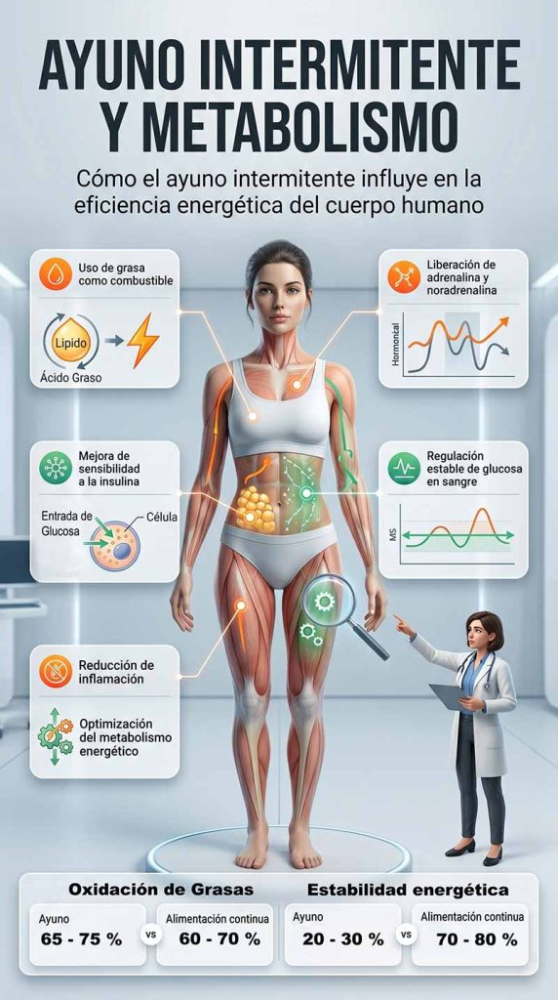

Descubre cómo funciona el ayuno intermitente, qué efectos tiene en tu metabolismo y cómo aplicarlo de forma segura en tu día a día

## Introducción

El ayuno intermitente se ha convertido en una de las estrategias de alimentación más estudiadas y populares en los últimos años dentro del ámbito de la salud y el bienestar.

Más que una dieta, es un patrón de alimentación que organiza los periodos de ingesta y ayuno a lo largo del día, con el objetivo de influir positivamente en procesos metabólicos del organismo.

En este artículo, descubrirás qué es exactamente el ayuno intermitente, qué beneficios puede aportar a la salud y cómo aplicarlo de forma segura y adaptada a tu estilo de vida.

## Qué vas a aprender

En este artículo vas a descubrir los aspectos esenciales del ayuno intermitente para entenderlo y aplicarlo de forma práctica en tu día a día.

Aprenderás cuáles son sus principales beneficios para la salud, cómo actúa en el organismo a nivel metabólico y por qué puede influir en procesos como la energía y el control del apetito.

También verás cómo empezar a practicarlo de manera progresiva y segura, además de consejos útiles para mantenerlo en el tiempo sin que se convierta en una experiencia restrictiva.

## ¿Qué es el ayuno intermitente?

Definición y explicación del concepto

El ayuno intermitente es un patrón de alimentación que consiste en alternar periodos de ayuno con periodos de ingesta de alimentos dentro de un mismo ciclo diario o semanal.

A diferencia de una dieta tradicional, no se centra en qué alimentos comer, sino en **cuándo comer**, organizando las comidas en ventanas de tiempo específicas.

Este enfoque se utiliza con el objetivo de mejorar la salud metabólica, favorecer la regulación del apetito y apoyar la pérdida de grasa en determinados contextos.

Existen diferentes protocolos de ayuno intermitente, entre los más conocidos se encuentran el método 16/8 (16 horas de ayuno y 8 de alimentación), el protocolo 5:2 (alimentación normal cinco días y restricción calórica dos días no consecutivos) y el ayuno en días alternos.

Cada uno de ellos puede adaptarse según el estilo de vida, la experiencia y los objetivos de cada persona.

## Síntomas del sobrepeso y la obesidad

Signos y síntomas del sobrepeso y la obesidad

El sobrepeso y la obesidad no siempre se manifiestan de forma inmediata, pero con el tiempo pueden generar una serie de señales físicas y metabólicas que afectan al bienestar general.

Entre los síntomas más comunes se encuentran la fatiga persistente, una menor capacidad para realizar actividades físicas y una sensación general de baja energía.

También es frecuente experimentar dolor en las articulaciones, especialmente en rodillas, caderas y zona lumbar, debido al aumento de la carga corporal sobre el sistema musculoesquelético.

Otro signo habitual son las dificultades respiratorias, como sensación de ahogo o falta de aire al realizar esfuerzos moderados.

Además, el sobrepeso y la obesidad se asocian a un mayor riesgo de desarrollar enfermedades crónicas, como diabetes tipo 2, hipertensión arterial o enfermedades cardiovasculares, lo que convierte su prevención en un aspecto clave para la salud a largo plazo.

## Cómo afecta el ayuno intermitente al cuerpo

Impacto del ayuno intermitente en la salud

El ayuno intermitente puede generar diversos efectos en el organismo, especialmente a nivel metabólico, hormonal y energético, dependiendo de cómo se aplique y de las características de cada persona.

Uno de sus impactos más conocidos es la posible contribución a la pérdida de peso, ya que ayuda a regular la ingesta calórica y puede favorecer el uso de las reservas de grasa como fuente de energía.

También se ha observado que puede mejorar la sensibilidad a la insulina, lo que permite un mejor control de los niveles de glucosa en sangre y reduce el riesgo de alteraciones metabólicas.

Otro efecto relevante es la posible reducción de la inflamación sistémica, un factor implicado en numerosas enfermedades crónicas.

Además, el ayuno intermitente puede influir en la regulación hormonal, incluyendo hormonas relacionadas con el metabolismo energético y la adaptación del organismo a los periodos de ayuno.

## Relación entre el ayuno intermitente y el metabolismo

Cómo el ayuno intermitente afecta el metabolismo

El ayuno intermitente influye directamente en el funcionamiento del metabolismo, ya que modifica la forma en que el cuerpo utiliza la energía durante los periodos de ayuno y alimentación.

Durante el ayuno, el organismo activa mecanismos de adaptación que favorecen el uso de las reservas energéticas, especialmente la grasa corporal, como fuente de combustible.

Este proceso está relacionado con un aumento en la liberación de ciertas hormonas como la adrenalina y la noradrenalina, que pueden contribuir a la movilización de ácidos grasos y al incremento del gasto energético en reposo.

Además, el ayuno intermitente puede mejorar la sensibilidad a la insulina, lo que facilita una mejor regulación de la glucosa en sangre y un metabolismo más eficiente.

También se ha asociado con una posible reducción de la inflamación, lo que puede influir positivamente en el equilibrio metabólico general del organismo.

En conjunto, estos mecanismos explican por qué el ayuno intermitente se estudia como una estrategia potencial para optimizar la función metabólica en determinados contextos.

## Soluciones para empezar a aplicar el ayuno intermitente

Consejos y pasos para empezar el ayuno intermitente de forma segura y progresiva

Empezar con el ayuno intermitente no requiere cambios drásticos, sino una adaptación progresiva que permita al cuerpo ajustarse de manera natural.

La clave está en avanzar paso a paso, mantener hábitos saludables y escuchar las señales del organismo para lograr una experiencia sostenible y segura a largo plazo.

A continuación, encontrarás una serie de recomendaciones prácticas para comenzar correctamente.

### Empieza con un método simple (16/8)

El método 16/8 es la forma más habitual de comenzar. Consiste en ayunar durante 16 horas y concentrar la alimentación en una ventana de 8 horas, lo que facilita una adaptación progresiva y sostenible.

### Mantén una hidratación adecuada

La hidratación es clave durante el ayuno. Beber suficiente agua ayuda a mantener la energía, mejorar la concentración y reducir efectos como la fatiga o el dolor de cabeza.

### Mantén actividad física regular (adaptada a tu energía)

El ejercicio regular mejora la salud metabólica, pero debe adaptarse a tu nivel de energía. Puede realizarse tanto en ayuno como en la ventana de alimentación según tu tolerancia.

### Escucha las señales de tu cuerpo

El ayuno debe adaptarse a cada persona. Si aparecen mareos, debilidad o malestar persistente, es importante ajustar la duración o la frecuencia del ayuno.

### Prioriza una alimentación nutritiva en la ventana de comida

Durante las horas de alimentación, prioriza alimentos ricos en nutrientes como proteínas, grasas saludables, fibra y alimentos naturales para mejorar la energía y la recuperación.

### Haz un seguimiento de tus hábitos y sensaciones

Registrar cómo te sientes, tus horarios y tu energía te ayudará a identificar patrones y ajustar el ayuno para hacerlo más efectivo y sostenible.

## Preguntas frecuentes

¿Es seguro el ayuno intermitente?

En general, el ayuno intermitente puede ser seguro para personas sanas si se realiza de forma progresiva y bien planificada. Sin embargo, no es adecuado para todo el mundo y debe adaptarse a cada caso.

¿Cuánto tiempo se tarda en acostumbrarse?

La fase de adaptación suele durar entre unos días y un par de semanas. Durante este periodo pueden aparecer síntomas leves como fatiga o hambre, que tienden a disminuir con el tiempo.

¿Puedo tomar café durante el ayuno?

Sí, en la mayoría de casos se permite el consumo de café solo o infusiones sin calorías, ya que no interrumpen el estado de ayuno.

¿Se puede hacer ejercicio en ayuno?

Sí, pero depende de la persona y de la intensidad. El ejercicio moderado suele ser bien tolerado, especialmente una vez que el cuerpo se ha adaptado.

## ⚠️ Errores comunes al hacer ayuno intermitente

Empezar con ayunos demasiado largos

No cuidar la alimentación

No hidratarse correctamente

Ignorar las señales del cuerpo

Empezar con ayunos demasiado largos

Uno de los errores más frecuentes es comenzar directamente con protocolos exigentes, como ayunos prolongados, sin haber pasado por una fase de adaptación.

Esto puede generar efectos secundarios innecesarios como fatiga intensa, dolor de cabeza, irritabilidad o sensación de debilidad. El cuerpo necesita tiempo para adaptarse al cambio en la disponibilidad de energía, por lo que lo más recomendable es empezar de forma progresiva y aumentar la duración del ayuno de manera gradual.

No cuidar la alimentación

Otro error habitual es pensar que el ayuno, por sí solo, compensa una mala alimentación. Sin embargo, la calidad de los alimentos durante la ventana de ingesta es clave para obtener resultados positivos.

Una dieta basada en ultraprocesados, azúcares refinados o baja en nutrientes puede limitar los beneficios del ayuno e incluso generar picos de hambre, fatiga o falta de energía. Es importante priorizar alimentos naturales, ricos en proteínas, fibra y grasas saludables.

No hidratarse correctamente

La hidratación suele subestimarse, pero juega un papel fundamental durante el ayuno intermitente. No beber suficiente agua puede provocar síntomas como dolor de cabeza, cansancio, falta de concentración o sensación de malestar general.

Además del agua, en algunos casos se pueden incluir infusiones o café sin azúcar, siempre dentro de un enfoque equilibrado. Mantener una correcta hidratación ayuda al organismo a funcionar correctamente durante los periodos de ayuno.

Ignorar las señales del cuerpo

Forzar el ayuno a pesar de sentir malestar persistente es un error importante. Aunque es normal una fase de adaptación inicial, no se deben ignorar señales como mareos intensos, debilidad o malestar continuado.

Cada persona responde de forma diferente, por lo que es fundamental ajustar el protocolo a las necesidades individuales. El ayuno debe ser una herramienta flexible, no una imposición rígida.

## conclusión

El ayuno intermitente es un patrón de alimentación que puede influir positivamente en distintos aspectos de la salud, como el metabolismo, el control del peso y la regulación de la energía.

Sin embargo, sus efectos dependen en gran medida de cómo se aplique y de los hábitos que lo acompañen en la vida diaria. No se trata solo de ayunar, sino de mantener un enfoque equilibrado y sostenible en el tiempo.

Antes de empezar, es recomendable comprender bien cómo funciona este método y adaptarlo de forma progresiva a tus necesidades personales. Además, consultar con un profesional de la salud puede ser importante en determinados casos para asegurar una práctica adecuada.

En definitiva, el ayuno intermitente puede ser una herramienta útil dentro de un estilo de vida saludable, siempre que se combine con una alimentación equilibrada y hábitos coherentes.
