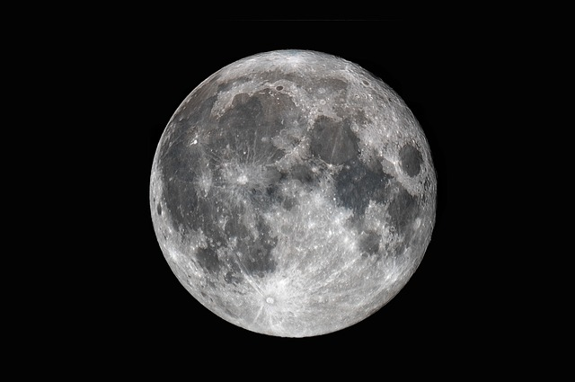

## Ayuno Lunar: Otra Forma De Mejorar La Salud

El ayuno lunar es una práctica que se basa en los ciclos de la luna, una costumbre ancestral que muchas culturas han adoptado por sus múltiples beneficios para la salud. Este artículo explorará en qué consiste el ayuno lunar, sus beneficios y cómo puede integrarse en una rutina de bienestar.

### ¿Qué es el Ayuno Lunar?

El ayuno lunar se practica durante las fases específicas de la luna, principalmente en la luna nueva y la luna llena. Se cree que estas fases tienen un efecto significativo sobre el cuerpo humano, influenciando el equilibrio de fluidos y los procesos de desintoxicación.

#### Fases de la Luna y el Ayuno

1. **Luna Nueva**: Se considera un momento ideal para comenzar el ayuno, ya que simboliza nuevos comienzos y renovación. Durante esta fase, el cuerpo está más preparado para liberar toxinas.
2. **Luna Llena**: Este es el momento en que el cuerpo es más receptivo a la desintoxicación. El ayuno durante la luna llena puede ayudar a eliminar las toxinas acumuladas y revitalizar el organismo.

## Ayuno Lunar: Otra Forma De Mejorar La Salud

### Beneficios del Ayuno Lunar

Desintoxicación Natural

El ayuno lunar facilita la eliminación de toxinas del cuerpo. Durante el ayuno, el cuerpo entra en un estado de autofagia, un proceso en el cual las células se descomponen y reciclan componentes dañados o innecesarios. Esto contribuye a una limpieza profunda y una mejor salud celular.

Mejora del Equilibrio Emocional

Las fases de la luna también influyen en las emociones. Ayunar durante la luna nueva y la luna llena puede ayudar a equilibrar el estado de ánimo y reducir el estrés. Muchas personas reportan sentirse más centradas y emocionalmente equilibradas después de un ayuno lunar.

Promoción de la Salud Digestiva

El descanso periódico del sistema digestivo permite una mejor regeneración de las células del tracto gastrointestinal. Esto puede mejorar la digestión, reducir la hinchazón y promover un microbioma intestinal saludable.

## Ayuno Lunar: Otra Forma De Mejorar La Salud

### Cómo Practicar el Ayuno Lunar

#### Preparación

Antes de comenzar el ayuno lunar, es importante preparar el cuerpo. Esto puede incluir:

- **Reducir el consumo de alimentos procesados** y aumentar la ingesta de frutas y verduras frescas en los días previos.
- **Hidratarse adecuadamente** para asegurar que el cuerpo está bien hidratado al comenzar el ayuno.

#### Durante el Ayuno

Durante el ayuno lunar, se recomienda consumir solo líquidos claros como agua, tés de hierbas y caldos ligeros. Algunos también optan por jugos de frutas y verduras frescas.

#### Post Ayuno

Después del ayuno, es crucial reintroducir los alimentos lentamente. Comienza con comidas ligeras como sopas y ensaladas, y gradualmente reintroduce alimentos sólidos para evitar sobrecargar el sistema digestivo.

Nos vemos en el camino 🙂

Si quieres saber más sobre nutrición y vida sana, [suscríbete a mi canal](https://www.youtube.com/user/nutriclubweb) y sigue mi página de [Facebook](https://www.facebook.com/clubdenutricion.es/). Visita la sección de blog [aquí](/blog/).
