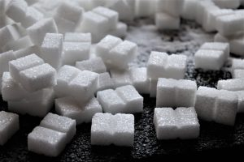

## ¿Qué es el Azúcar?

El azúcar es un tipo de carbohidrato que se encuentra en muchos alimentos. Hay azúcares naturales, como los que están en las frutas y la leche, y azúcares añadidos, que se ponen en los alimentos durante su fabricación. ¡Es importante saber la diferencia y cómo afectan a tu cuerpo!

## ¿Qué Dice la Organización Mundial de la Salud?

La Organización Mundial de la Salud (OMS) recomienda que el consumo de azúcar añadido sea menos del 10% de tu ingesta calórica diaria. Para una dieta de 2000 calorías, esto significa no más de 50 gramos de azúcar al día, ¡aproximadamente 12 cucharaditas! Idealmente, la OMS sugiere reducir este consumo aún más, a menos del 5% para obtener beneficios adicionales para la salud.

Esto se traduce en 25 gr de azúcar, o lo que es lo mismo, 3 sobres o 6 terrones.

Hoy hablaremos, entre otros, de los **refrescos o sodas**, tan consumidos por jóvenes y adolescentes.

- Según mediciones de laboratorios independientes,  una lata de refresco de 330 ml, contiene 6 terrones de azúcar, el 100% de la cantidad recomendada diaria. Teniendo en cuenta que hay quién toma varias latas, se está superando la cantidad de una forma escandalosa.
- Otro tipo de bebida que está muy de moda entre este target, son las bebidas energéticas, las cuáles suelen tomarse por latas de 500 ml. En una de estas latas, podemos encontrar 20 terrones, o lo que es lo mismo, más del triple de la cantidad que debemos tomar en un día.

Se estima que un 80% de los alimentos que se venden en los supermercados, contienen algún tipo de azúcar añadida (muchas veces innecesaria), por lo que es complicado el poder cumplir las recomendaciones de la O.M.S.

## ADICCIÓN AL AZÚCAR:

- Según algunos estudios, el azúcar es una potente fuente de adicción. Tal es el caso, que también se le añade al tabaco, para potenciar sus efectos adictivos.
- Y lo más sorprendente: en diferentes estudios con ratas, se ha descubierto que el azúcar ha creado más adicción que drogas como la cocaína.

### 1\. Evita el Sobrepeso y la Obesidad

El consumo excesivo de azúcar puede llevar al sobrepeso y la obesidad. Los alimentos y bebidas con mucho azúcar suelen tener muchas calorías pero pocos nutrientes. Además, el exceso de azúcar que no se usa, el cuerpo la convierte en grasa para almacenarla y usarla más adelante, cuando tenga falta de energía, esto significa que ayuda a acumular grasa y ganar peso. Todo ello, sin obtener los nutrientes que tu cuerpo necesita para estar sano.

### 2\. Protege tus Dientes

El azúcar es uno de los principales culpables de las caries dentales. Las bacterias en tu boca se alimentan de azúcar y producen ácidos que dañan tus dientes. Limitar el azúcar ayuda a mantener tus dientes fuertes y sanos.

### 3\. Mejora tu Energía

El azúcar puede darte un rápido aumento de energía, pero esta energía desaparece rápidamente, dejándote cansado. Comer demasiada azúcar puede hacer que te sientas con poca energía y sin fuerzas durante el día. Opta por alimentos con azúcares naturales y fibra para mantener tu energía estable.

## Lo Que Dicen los Doctores Expertos en Keto y Metabolismo

Los doctores que promueven dietas cetogénicas (keto) y estudios sobre metabolismo sugieren que el azúcar puede afectar negativamente a tu salud metabólica. El azúcar puede causar picos en los niveles de insulina, lo que puede llevar a problemas como la resistencia a la insulina y la diabetes tipo 2.

## Beneficios de Reducir el Azúcar Según los Expertos

- **Control del Apetito**: Reducir el azúcar puede ayudar a controlar el hambre y los antojos.
- **Mejor Salud Metabólica**: Menos azúcar significa una mejor regulación de los niveles de azúcar en sangre y menos riesgo de enfermedades metabólicas.
- **Mayor Energía y Enfoque**: Una dieta baja en azúcar puede proporcionar una energía más constante y mejorar la concentración y el enfoque.

## ¿Dónde se Esconde el Azúcar en los Alimentos?

El azúcar no solo está en los postres y dulces. También se encuentra en muchos otros alimentos que quizás no esperes, como:

- **Salsas**: Como la salsa de tomate y las salsas para ensaladas.
- **Pan y Productos de Panadería**: Incluso el pan puede contener azúcar añadido.
- **Bebidas**: Refrescos, jugos de frutas y bebidas deportivas a menudo tienen mucho azúcar.
- **Snacks Procesados**: Muchos snacks como galletas, barras de granola y cereales tienen azúcar añadido.

## Consejos para Reducir el Consumo de Azúcar

Lee las Etiquetas

Revisa las etiquetas de los alimentos para ver cuánto azúcar añadido contienen. Busca nombres como jarabe de maíz, dextrosa, sacarosa y fructosa, que son tipos de azúcar, y evítalos todo lo posible.

Opta por Alimentos Naturales

Elige alimentos sin procesar. Evitar salchichas, embutidos, enlatados que contengan azúcar añadida. Si tomas frutas, que sean frescas en lugar de jugos o frutas enlatadas con almíbar o jarabe. Las frutas tienen azúcar natural y también fibra, la fruta envasada exceso de azúcar y falta de fibra.

Bebe Agua

En lugar de bebidas azucaradas, opta por agua, café o infusiones sin azúcar. ¡Es una manera fácil de reducir tu ingesta de azúcar!

Puedes ver el [Vídeo explicativo](https://www.youtube.com/watch?v=rWos7zMjjdA) a continuación:

Nos vemos en el camino 🙂

Si quieres saber más sobre nutrición y vida sana, [suscríbete a mi canal](https://www.youtube.com/user/nutriclubweb) y sigue mi página de [Facebook](https://www.facebook.com/clubdenutricion.es/). Visita la sección de blog [aquí](/blog/).
