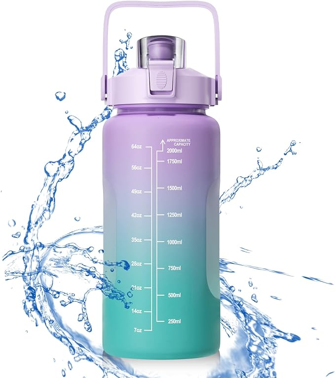

El ayuno ha sido una práctica utilizada durante siglos por diversas culturas y religiones. Sin embargo, en los últimos años, ha ganado popularidad en el ámbito de la salud y el bienestar debido a los múltiples beneficios que puede ofrecer. En este artículo, exploraremos los beneficios del ayuno y cómo puede mejorar la salud, respaldados por los estudios más recientes.

## ¿Qué es el Ayuno?

El ayuno es la abstinencia voluntaria de alimentos y bebidas por un período determinado. Existen diferentes tipos de ayuno, entre los más populares se encuentran:

- **Ayuno Intermitente**: Alterna períodos de alimentación y ayuno. Por ejemplo, comer durante 8 horas y ayunar durante 16 horas.
- **Ayuno de Agua**: Consiste en consumir solo agua durante el período de ayuno.
- **Ayuno Prolongado**: Extiende el período de ayuno más allá de 24 horas.
- **Ayuno Lunar:** El ayuno lunar es una práctica que se basa en los ciclos de la luna, una costumbre ancestral que muchas culturas han adoptado por sus múltiples beneficios para la salud.

## Beneficios del Ayuno

### Pérdida de Peso y Mejora del Metabolismo

Uno de los beneficios más reconocidos del ayuno es la pérdida de peso. Al limitar el período de alimentación, el cuerpo se ve obligado a utilizar sus reservas de grasa para obtener energía. Estudios recientes han demostrado que el ayuno intermitente puede ser tan efectivo como la restricción calórica continua para la pérdida de peso .

### Mejora de la Sensibilidad a la Insulina

El ayuno puede mejorar la sensibilidad a la insulina, lo que es crucial para la prevención y el manejo de la diabetes tipo 2. Durante el ayuno, los niveles de insulina en el cuerpo disminuyen, permitiendo que las células absorban glucosa de manera más eficiente .

### Reducción de la Inflamación

La inflamación crónica está relacionada con diversas enfermedades, incluyendo enfermedades cardíacas, cáncer y trastornos autoinmunes. Se ha observado que el ayuno reduce los marcadores de inflamación en el cuerpo, ayudando a prevenir estas condiciones .

### Mejora de la Salud Cardiovascular

El ayuno puede contribuir a una mejor salud cardiovascular al reducir los niveles de colesterol LDL (malo) y los triglicéridos. Además, puede mejorar la presión arterial, lo que disminuye el riesgo de enfermedades cardíacas .

### Promoción de la Salud Cerebral

El ayuno estimula la producción de una proteína llamada BDNF (factor neurotrófico derivado del cerebro), que es esencial para la salud cerebral. Esta proteína ayuda a proteger las células cerebrales y puede reducir el riesgo de enfermedades neurodegenerativas como el Alzheimer y el Parkinson .

### Aumento de la Longevidad

Algunos estudios en animales han sugerido que el ayuno puede aumentar la longevidad. Se cree que esto se debe a la capacidad del ayuno para mejorar la función metabólica, reducir la inflamación y proteger contra enfermedades crónicas .

## Cómo Comenzar con el Ayuno

### Consulta a un Profesional de la Salud

Antes de comenzar cualquier régimen de ayuno, es importante consultar a un profesional de la salud, especialmente si tienes alguna condición médica preexistente o estás tomando medicamentos.

### Elige el Tipo de Ayuno Adecuado

Dependiendo de tus objetivos y estilo de vida, puedes elegir entre los diferentes tipos de ayuno mencionados anteriormente. El ayuno intermitente suele ser una opción popular y fácil de adaptar.

### Hidratación

Durante el período de ayuno, es crucial mantenerse bien hidratado. Consumir agua, té sin azúcar y otros líquidos sin calorías puede ayudar a mantener el cuerpo en buen estado.

### Escucha a Tu Cuerpo

El ayuno puede ser un desafío al principio. Es importante escuchar a tu cuerpo y no forzar el ayuno si experimentas mareos, fatiga extrema o malestar.

## Beneficios del Ayuno y Cómo Puede Mejorar la Salud

## Productos Recomendados para el Ayuno

Para apoyar tu viaje de ayuno, aquí hay algunas recomendaciones de productos:

Puedes ver el [vídeo](https://youtu.be/kvzFaXOl27k) aquí:

Nos vemos en el camino 🙂

Si quieres saber más sobre nutrición y vida sana, [suscríbete a mi canal](https://www.youtube.com/user/nutriclubweb) y sigue mi página de [Facebook](https://www.facebook.com/clubdenutricion.es/). Visita la sección de blog [aquí](/blog/).
