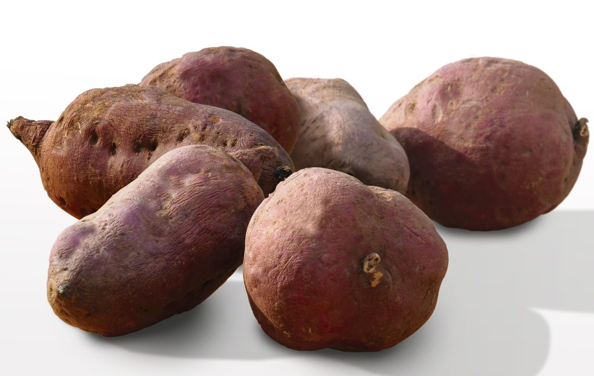
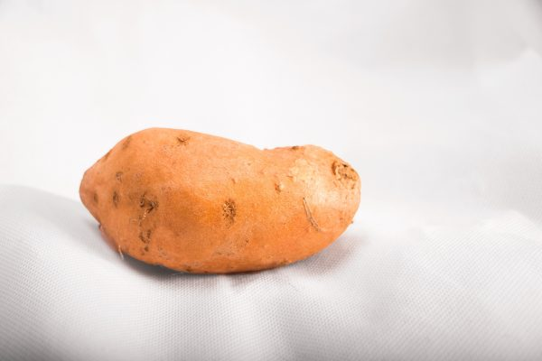
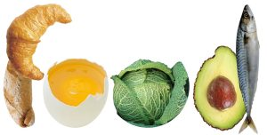

# BENEFICIOS DEL BONIATO

Propiedades y beneficios del boniato o batata. Aunque muchos creen que la batata es de la misma familia que las papas, no tienen relación, la batata es una raíz de sabor dulce, mientras que las papas son tubérculos. Hay boniatos de diferentes formas y colores, lo que les da también diferente sabor y propiedades. Se puede encontrar boniato blanco, rojo o amarillo. La batata tiene gran densidad nutritiva, incluso más que la papa. Veremos su composición bajo la foto.

### Macronutrientes del boniato

La composición mayoritaria del boniato, son los carbohidratos (un tipo de azúcar), y contiene tanto simples como complejos. Los azúcares complejos, se absorben lentamente, por lo que dan energía durante más tiempo. Es muy rico en fibra que es un carbohidrato no digerible.  Éste ayuda al correcto funcionamiento intestinal, y por lo tanto, nos beneficia en caso de estreñimiento.

También contiene proteínas, aunque en un valor bastante escaso, alrededor de un 1,2%, tienen tan buena calidad, que se aprovechan al tener una alta absorción.

Las grasas son casi inexistentes en los boniatos, no llega ni a 1 g por cada 100g.

### Micronutrientes del boniato

El boniato contiene gran cantidad de Vitamina A en forma de betacaroteno. De ahí el color anaranjado de la pulpa, lo que quiere decir que según el tipo de boniato, tendrá más o menos cantidad de esta vitamina.

Otras vitaminas presentes en menor cantidad, son las vitaminas B1 (tiamina), B2 (riboflavina), B3 (niacina), B6, B12, D, E y C (gran antioxidante). También nos aporta minerales como el calcio, hierro, yodo, magnesio, Zinc, Sodio, potasio, fósforo y selenio, todos ellos indispensables para el buen funcionamiento del organismo.

Te recomendamos ver la diferencia entre micronutrientes y macronutrientes

[Ver la información](/nutricion/macronutrientes-y-micronutrientes/)

## Composición nutricional del boniato

| Información Nutricional | Cantidad por porción |
| --- | --- |
| Calorías | 86 kcal |
| Grasas | 0.1 g |
| Carbohidratos | 20.1 g |
| Azúcares | 4.2 g |
| Fibra alimentaria | 3 g |
| Proteínas | 1.6 g |
| Vitamina A | 14,187 UI |
| Vitamina C | 2.4 mg |
| Vitamina B6 | 0.2 mg |
| Potasio | 337 mg |

## Beneficios del boniato

[Antioxidante y anticancerígeno](/beneficios-del-boniato-o-batata/)

La mezcla de vitaminas, proteínas y minerales que contienen, hacen del boniato un elemento antioxidante frente a los radicales libres.

[Antiinflamatorio](/beneficios-del-boniato-o-batata/)

Los betacarotenos que contiene, ayudan a desinflamar el tejido nervioso y cerebral.

[Anti-estreñimiento](/beneficios-del-boniato-o-batata/)

La fibra que contiene, ayuda a un mejor funcionamiento del aparato digestivo, y por consiguiente, una mejor limpieza intestinal.

[Regulador](/beneficios-del-boniato-o-batata/)

Regulador de gran cantidad de procesos básicos del organismo, gracias al aporte de magnesio.

[▶ Beneficios del boniato (o batata)](https://www.youtube.com/watch?v=v5YgXzRR2t0)

#### Por favor, deja tu comentario, nos gustaría saber tu opinión.
