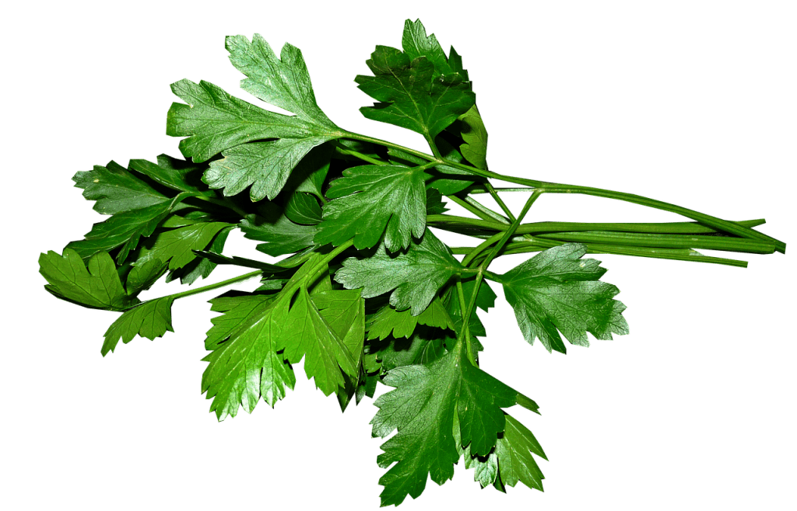

# Beneficios y Propiedades del Perejil: ¡El Superhéroe de las Hierbas!

## ¿Qué es el Perejil?

El perejil es una hierba verde que se usa mucho en la cocina para dar sabor y color a los platos. Es fácil de encontrar en el supermercado y tiene muchas propiedades que lo hacen muy especial. ¡Vamos a descubrir por qué el perejil es tan beneficioso!

## Beneficios y Propiedades del Perejil

1\. Rico en Nutrientes

El perejil está lleno de vitaminas y minerales que son muy buenos para tu cuerpo. Tiene mucha vitamina C, que es importante para mantenerte sano y ayudar a tu cuerpo a combatir los resfriados. También tiene vitamina K, que ayuda a que tu sangre coagule correctamente y mantiene tus huesos fuertes.

2\. Ayuda a la Digestión

El perejil es conocido por ayudar a la digestión. Si tienes problemas de estómago o te sientes hinchado, comer perejil puede ayudarte a sentirte mejor. ¡Es como un pequeño ayudante para tu estómago!

3\. Mejora el Aliento

Masticar perejil fresco puede ayudarte a tener un aliento fresco. Tiene un compuesto natural que combate las bacterias en tu boca, haciendo que tu aliento huela bien.

4\. Propiedades Antioxidantes

El perejil está lleno de antioxidantes, que son como pequeños escudos que protegen tus células del daño. Estos antioxidantes ayudan a mantener tu cuerpo sano y a prevenir enfermedades.

5\. Propiedades Anti-inflamatorias

El perejil tiene propiedades anti-inflamatorias, lo que significa que puede ayudar a reducir la inflamación en tu cuerpo. Esto es especialmente útil si tienes dolores o condiciones inflamatorias, como la artritis.

## ¿Cómo Incorporar el Perejil en tu Dieta?

### En Ensaladas

El perejil fresco es una excelente adición a cualquier ensalada. Corta unas hojas y mézclalas con tus vegetales favoritos para darle un toque de sabor y frescura.

### En Salsas

Puedes usar perejil para hacer salsas deliciosas, como la salsa chimichurri o el pesto. Estas salsas son perfectas para acompañar carnes, pastas y vegetales.

### Como Decoración

El perejil picado es una bonita decoración para cualquier plato. Espolvorea un poco sobre tus comidas para hacerlas ver más apetitosas y añadir un poco de sabor.

### En Jugos o Batidos

Añadir perejil a tus jugos o batidos verdes es una manera fácil de obtener sus beneficios. Combínalo con otras frutas y verduras para una bebida súper saludable.

## Curiosidades Sobre el Perejil

### Un Antiguo Remedio

El perejil ha sido usado como remedio natural desde hace miles de años. En la antigua Grecia, se usaba para tratar problemas de la piel y picaduras de insectos.

### Símbolo de Salud

En muchas culturas, el perejil es visto como un símbolo de salud y frescura. A menudo se utiliza en ceremonias y rituales como símbolo de limpieza y renovación.

## ¿Sabías Que…?

- El perejil pertenece a la misma familia que las zanahorias y el apio.
- Hay diferentes tipos de perejil, como el perejil rizado y el perejil italiano (de hoja plana).
- El perejil puede crecer fácilmente en una maceta en tu cocina o jardín.

## Conclusión

Los beneficios y propiedades del perejil lo convierten en un superhéroe de las hierbas. Está lleno de nutrientes, ayuda a la digestión, mejora el aliento, tiene propiedades antioxidantes y anti-inflamatorias. Incorporar el perejil en tu dieta es una manera deliciosa y saludable de aprovechar todas sus ventajas.

¡Así que la próxima vez que veas perejil en la tienda, no dudes en llevarlo a casa y disfrutar de sus increíbles beneficios para la salud!

Te dejo el [vídeo](https://www.youtube.com/watch?v=U5kaekAFd-g) a continuación:

YouTube

Nos vemos en el camino 🙂

Si quieres saber más sobre nutrición y vida sana, [suscríbete a mi canal](https://www.youtube.com/user/nutriclubweb) y sigue mi página de [Facebook](https://www.facebook.com/clubdenutricion.es/). Visita la sección de blog [aquí](/blog/).
