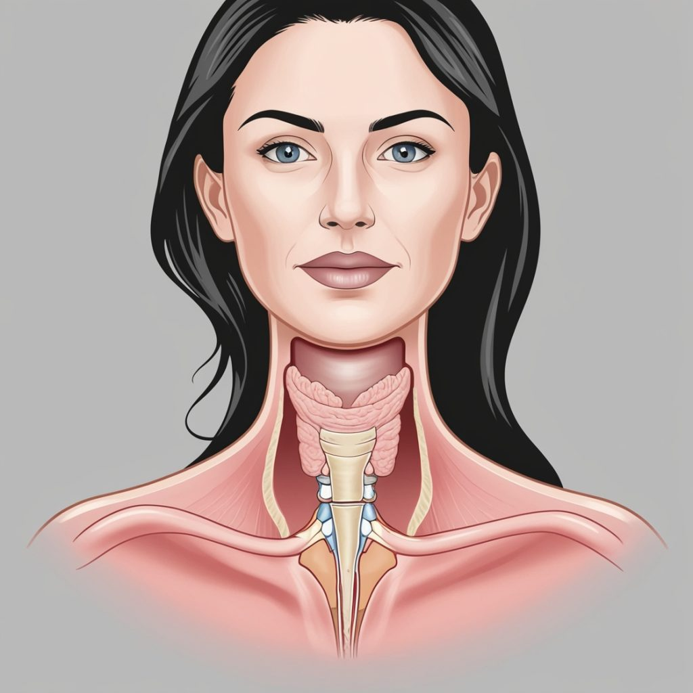
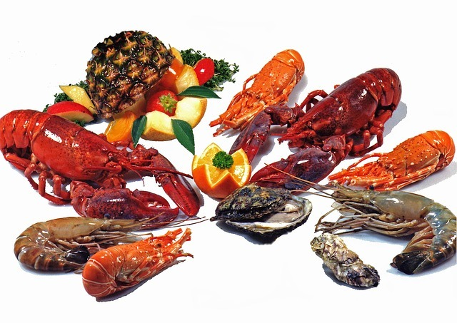

# Bocio: Causas, Síntomas y Tratamientos para Prevenir Esta Enfermedad

El bocio, una afección que afecta a la glándula tiroides, es una enfermedad frecuente que afecta a millones de personas en todo el mundo. Este artículo explorará las causas, los síntomas y los tratamientos para prevenir esta enfermedad.

## ¿Qué es el Bocio?

El bocio es un agrandamiento de la glándula tiroides visible al ojo humano. Es un trastorno frecuente que afecta a personas de todas las edades y puede deberse a varios factores. Situada en el cuello, la glándula tiroides libera hormonas para controlar el metabolismo.

Síntomas del Bocio

- Dificultad para tragar
- Ronquera
- Falta de aliento

Las posibles causas del bocio pueden variar desde la deficiencia de yodo hasta trastornos autoinmunes. Es importante buscar ayuda médica para determinar la causa subyacente y recibir el tratamiento adecuado. La prevención del bocio puede hacerse mediante una dieta sana con ingredientes ricos en yodo, como el marisco y los productos lácteos, y evitando las toxinas ambientales nocivas.

## Causas del Bocio

La tromegalia, o bocio, es una afección que afecta a la glándula tiroides. La insuficiencia de yodo es la causa más común, ya que el tiroides necesita este mineral para crear hormonas. Otros factores incluyen enfermedades autoinmunes como la de Hashimoto, ciertos medicamentos como el litio, y los tumores malignos, aunque raros.

Factores de Riesgo

- Zonas con bajos niveles de yodo
- Mujeres que toman anticonceptivos
- Embarazadas
- Antecedentes familiares de enfermedad tiroidea
- Tabaquismo
- Exposición a radiaciones

El bocio simple, una forma de bocio causada por la carencia de yodo, suele ser indoloro y asintomático. No obstante, puede ser un problema de salud peligroso si se descuida. Además, el consumo de alimentos goitrogénicos, como la col, el brécol y la soja, puede dificultar la absorción de yodo.

## Signos y Síntomas del Bocio

La presencia de un agrandamiento del tiroides puede identificarse por diversos signos y síntomas. Dependiendo del tamaño, la inflamación puede ser visible o causar dificultad para respirar o tragar. Otros síntomas incluyen:

- Ronquera
- Tos
- Presión u opresión en el cuello
- Fatiga
- Aumento de peso
- Sensación de frío
- Ritmo cardiaco acelerado
- Temblores
- Ansiedad

Si tienes alguno de estos síntomas o notas un aumento del tamaño en el cuello, debes buscar atención médica.

## Pruebas y Diagnóstico del Bocio

Si sospechas de bocio, es probable que tu médico realice varias pruebas para diagnosticar la enfermedad. Estas pueden incluir:

- Examen físico del cuello
- Análisis de sangre para detectar niveles anormales de hormonas tiroideas
- Ecografía de la tiroides
- Gammagrafía tiroidea
- Biopsia mediante aspiración con aguja fina

Para quienes se les diagnostica bocio difuso, es esencial colaborar estrechamente con el médico para crear el plan de tratamiento adecuado, que puede incluir medicación, cirugía o terapia con yodo radiactivo.

## Tratamientos para el Bocio

Millones de personas en todo el mundo padecen bocio, una afección tiroidea frecuente. Afortunadamente, existen varios tratamientos para controlar los síntomas y mejorar la calidad de vida.

Opciones de Tratamiento

- **Medicación:** Levotiroxina, liotironina y extracto desecado de tiroides.
- **Cirugía:** Extirpación parcial o total de la glándula tiroides.
- **Terapia con yodo radiactivo:** Para destruir células hiperactivas o cancerosas.
- **Cambios en el estilo de vida:** Evitar alimentos como la soja y las verduras crucíferas, hacer ejercicio regular y mantener un peso saludable.

## Prevención del Bocio

La prevención siempre es preferible al tratamiento. Para prevenir el bocio, es esencial asegurar un consumo adecuado de yodo. La forma más sencilla es utilizar sal yodada y consumir alimentos ricos en yodo que veremos en el siguiente apartado «Alimentos Ricos en Yodo para Prevenir el Bocio»

Consejos de Prevención

- **Moderación en alimentos goitrogénicos:** Consumir con moderación verduras crucíferas como el brécol y la col.
- **Ejercicio regular:** Ayuda a mantener la salud general y regula las hormonas.
- **Control del estrés:** Practicar técnicas como la meditación o el yoga.
- **Revisiones periódicas:** Visitar regularmente al médico para controlar la función tiroidea.

El bocio es una enfermedad tiroidea que puede estar causada por diversos factores, como la carencia de yodo, la exposición a la radiación y los desequilibrios hormonales. Con un diagnóstico y tratamiento adecuados, las personas con bocio pueden controlar su enfermedad eficazmente y evitar complicaciones posteriores. Manteniéndose informados y proactivos, los individuos pueden reducir el riesgo de desarrollar bocio y mantener un estilo de vida sano y activo.

## Alimentos Ricos en Yodo para Prevenir el Bocio

Una adecuada ingesta de yodo es esencial para la salud de la glándula tiroides y la prevención del bocio. Incorporar alimentos ricos en yodo en tu dieta puede ayudar a mantener los niveles hormonales equilibrados y evitar el agrandamiento de la tiroides. Aquí te presentamos una lista de alimentos ricos en yodo que debes considerar:

#### 1\. Mariscos

Los mariscos, como camarones, almejas, ostras y pescado de agua salada, son excelentes fuentes de yodo. Estos alimentos no solo son deliciosos, sino que también proporcionan una buena cantidad de este mineral esencial.

#### 2\. **Algas Marinas**

Las algas marinas, especialmente el kelp, nori y wakame, son extremadamente ricas en yodo. Incluye algas en ensaladas, sopas o como acompañamiento para aumentar tu ingesta diaria de yodo.

#### 3\. **Productos Lácteos**

Los productos lácteos como la leche, el yogur y el queso también contienen yodo. Asegúrate de incorporar una variedad de productos lácteos en tu dieta diaria.

#### 4\. **Huevos**

Los huevos son una fuente conveniente y versátil de yodo. Consúmelos en el desayuno o como parte de tus comidas para obtener una dosis saludable de este mineral.

#### 5\. **Sal Yodada**

La sal yodada es una forma sencilla y efectiva de asegurarte de que estás obteniendo suficiente yodo. Reemplaza la sal común en tu cocina con sal yodada para mejorar tu ingesta de yodo sin cambiar tus hábitos alimenticios.

#### 6\. **Frutas y Verduras**

Algunas frutas y verduras, como las fresas, los arándanos, las patatas y los frijoles, contienen pequeñas cantidades de yodo. Añadir una variedad de estos alimentos a tu dieta puede contribuir a tu ingesta total de yodo.

## Beneficios de los Alimentos Ricos en Yodo

Consumir alimentos ricos en yodo no solo ayuda a prevenir el bocio, sino que también asegura el correcto funcionamiento de la glándula tiroides. Mantener niveles adecuados de yodo puede mejorar el metabolismo, aumentar la energía y apoyar la salud general.

## Recomendaciones para Incluir Yodo en tu Dieta

Para maximizar los beneficios del yodo, es importante:

- **Variar tu dieta:** Incluye una variedad de fuentes de yodo para evitar deficiencias.
- **Moderación:** Aunque es esencial, evita el consumo excesivo de yodo, ya que también puede causar problemas de salud.
- **Consulta con un profesional:** Si tienes dudas sobre tu ingesta de yodo, consulta con un nutricionista o médico.

Integrar estos alimentos en tu dieta diaria puede hacer una gran diferencia en la salud de tu tiroides y ayudarte a prevenir el bocio de manera efectiva.

Nos vemos en el camino 🙂

Si quieres saber más sobre nutrición y vida sana, [suscríbete a mi canal](https://www.youtube.com/user/nutriclubweb) y sigue mi página de [Facebook](https://www.facebook.com/clubdenutricion.es/). Visita la sección de blog [aquí](/blog/).
