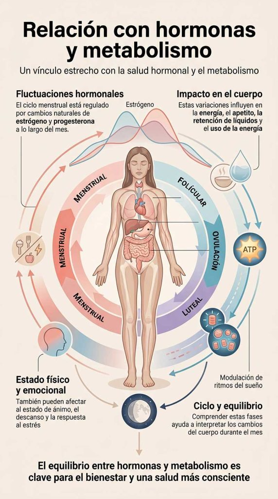

Descubre las fases del ciclo menstrual, cómo influyen las hormonas en tu cuerpo y qué cambios físicos y emocionales pueden producirse durante cada etapa

#### Tabla de contenidos

01. [Introducción](/ciclo-menstrual-fases/#elementor-toc__heading-anchor-0)

02. [Qué vas a aprender](/ciclo-menstrual-fases/#elementor-toc__heading-anchor-1)

03. [¿Qué es el ciclo menstrual?](/ciclo-menstrual-fases/#elementor-toc__heading-anchor-2)

04. [Síntomas del ciclo menstrual](/ciclo-menstrual-fases/#elementor-toc__heading-anchor-3)

05. [Cómo afecta el ciclo menstrual tu cuerpo](/ciclo-menstrual-fases/#elementor-toc__heading-anchor-4)

06. [Relación con hormonas y metabolismo](/ciclo-menstrual-fases/#elementor-toc__heading-anchor-5)

07. [Soluciones para mejorar tu salud hormonal](/ciclo-menstrual-fases/#elementor-toc__heading-anchor-6)

    1. [Mantén un peso saludable](/ciclo-menstrual-fases/#elementor-toc__heading-anchor-7)

    2. [Gestiona el estrés](/ciclo-menstrual-fases/#elementor-toc__heading-anchor-8)

    3. [Sigue una alimentación equilibrada](/ciclo-menstrual-fases/#elementor-toc__heading-anchor-9)

    4. [Prioriza el descanso](/ciclo-menstrual-fases/#elementor-toc__heading-anchor-10)

    5. [Realiza ejercicio de forma regular](/ciclo-menstrual-fases/#elementor-toc__heading-anchor-11)

    6. [Valora el apoyo de suplementos](/ciclo-menstrual-fases/#elementor-toc__heading-anchor-12)
08. [Preguntas frecuentes](/ciclo-menstrual-fases/#elementor-toc__heading-anchor-13)

09. [conclusión](/ciclo-menstrual-fases/#elementor-toc__heading-anchor-14)

10. [Artículos relacionados](/ciclo-menstrual-fases/#elementor-toc__heading-anchor-15)

    1. [La perimenopausia puede empezar antes de lo esperado: estas son sus primeras señales](/ciclo-menstrual-fases/#elementor-toc__heading-anchor-16)

    2. [Ultraprocesados y salud digestiva: nueva alerta](/ciclo-menstrual-fases/#elementor-toc__heading-anchor-17)

    3. [Dieta cetogénica y salud cerebral: qué dice la ciencia sobre Alzheimer y Parkinson](/ciclo-menstrual-fases/#elementor-toc__heading-anchor-18)

    4. [El sueño profundo: la hormona natural que ayuda a regenerar músculo, metabolismo y cerebro](/ciclo-menstrual-fases/#elementor-toc__heading-anchor-19)

    5. [Colesterol alto: por qué el LDL aislado podría no contar toda la historia clínica](/ciclo-menstrual-fases/#elementor-toc__heading-anchor-20)
11. [¿Sientes que tu energía sube y baja constantemente?](/ciclo-menstrual-fases/#elementor-toc__heading-anchor-21)

## Introducción

El ciclo menstrual es un proceso natural y complejo que forma parte esencial de la salud hormonal femenina. A lo largo de cada mes, el cuerpo experimenta una serie de cambios físicos y hormonales que influyen no solo en la fertilidad, sino también en la energía, el estado de ánimo, el metabolismo y el bienestar general.

Aunque todas las mujeres atraviesan este proceso, muchas veces no se comprende del todo cómo funciona el ciclo menstrual ni qué ocurre en cada una de sus fases.

En este artículo descubrirás cómo se desarrolla el ciclo menstrual, qué hormonas intervienen y cómo afectan al cuerpo durante cada etapa. Comprender estos cambios puede ayudarte a conocer mejor tu organismo, interpretar sus señales y cuidar tu salud hormonal de una forma más consciente.

## Qué vas a aprender

En este artículo descubrirás cómo funciona el ciclo menstrual y qué ocurre en el cuerpo durante cada una de sus fases.

Aprenderás qué hormonas intervienen en el ciclo menstrual, cómo influyen en aspectos como la energía, el estado de ánimo o el metabolismo, y por qué estos cambios pueden variar a lo largo del mes.

Además, comprenderás mejor la relación entre el ciclo menstrual y la salud hormonal, y conocerás hábitos y

## ¿Qué es el ciclo menstrual?

Un proceso natural que ocurre en el cuerpo de una mujer cada mes

El ciclo menstrual es un proceso natural y cíclico que prepara el cuerpo femenino para un posible embarazo. A lo largo de este ciclo se producen cambios hormonales y físicos que afectan a diferentes funciones del organismo.

Aunque su duración puede variar de una mujer a otra, el ciclo menstrual suele durar alrededor de 28 días y se divide en distintas fases, cada una caracterizada por variaciones específicas en hormonas como el estrógeno y la progesterona.

Uno de los momentos más importantes del ciclo es la ovulación, que ocurre cuando el ovario libera un óvulo que se desplaza hacia las trompas de Falopio. Este proceso forma parte del funcionamiento normal del sistema reproductivo y está estrechamente relacionado con la salud hormonal y reproductiva.

## Síntomas del ciclo menstrual

Cambios físicos y emocionales que ocurren durante el ciclo menstrual

Los síntomas del ciclo menstrual pueden variar según cada mujer y también dependiendo de la fase del ciclo en la que se encuentre el cuerpo.

Entre los síntomas más comunes se encuentran las molestias abdominales, la sensación de cansancio, la retención de líquidos y los cambios de humor. Algunas mujeres también pueden experimentar mayor sensibilidad emocional, irritabilidad o variaciones en el apetito.

En determinadas etapas del ciclo, especialmente antes de la menstruación, pueden aparecer síntomas relacionados con el síndrome premenstrual, como ansiedad, bajo estado de ánimo o dificultad para concentrarse.

Comprender cómo cambian estos síntomas a lo largo del mes puede ayudar a interpretar mejor las señales del cuerpo y favorecer un mayor equilibrio físico y emocional.

## Cómo afecta el ciclo menstrual tu cuerpo

Un impacto en la salud hormonal y el bienestar general

El ciclo menstrual influye en muchas funciones del organismo debido a los cambios hormonales que se producen a lo largo de cada fase.

Las variaciones en hormonas como el estrógeno y la progesterona pueden afectar al estado de ánimo, los niveles de energía, el apetito, el sueño y la capacidad de concentración.

Por eso, es habitual notar diferencias físicas y emocionales en distintos momentos del mes.

Además, el ciclo menstrual también está relacionado con aspectos importantes de la salud hormonal y metabólica, incluyendo la salud ósea, el sistema cardiovascular y el bienestar mental.

Comprender cómo responde el cuerpo durante cada etapa del ciclo puede ayudarte a interpretar mejor sus señales y a adoptar hábitos que favorezcan un mayor equilibrio y bienestar general.

## Relación con hormonas y metabolismo

Un vínculo estrecho con la salud hormonal y el metabolismo

El ciclo menstrual está profundamente conectado con el equilibrio hormonal y el funcionamiento del metabolismo. A lo largo del mes, hormonas como el estrógeno y la progesterona fluctúan de forma natural, influyendo en distintos procesos del organismo.

Estos cambios hormonales pueden afectar a los niveles de energía, el apetito, la retención de líquidos y la forma en que el cuerpo utiliza y almacena la energía. También pueden influir en el estado de ánimo, el descanso y la respuesta al estrés.

Debido a esta relación, comprender cómo funcionan las distintas fases del ciclo menstrual puede ayudar a interpretar mejor los cambios físicos y emocionales que se producen durante el mes y favorecer una mejor salud hormonal y metabólica.

El equilibrio entre hormonas y metabolismo desempeña un papel importante en el bienestar general, por lo que conocer esta conexión puede ayudarte a tomar decisiones más conscientes sobre tu salud y tus hábitos diarios.

## Soluciones para mejorar tu salud hormonal

Hábitos y estrategias para favorecer el equilibrio hormonal y el bienestar

Cuidar la salud hormonal implica prestar atención a diferentes aspectos del estilo de vida que pueden influir en el equilibrio del organismo y en cómo el cuerpo responde a los cambios del ciclo menstrual.

### Mantén un peso saludable

Mantener un peso equilibrado puede ayudar a favorecer una mejor regulación hormonal y metabólica. Una alimentación adecuada y la actividad física regular son factores importantes para apoyar este equilibrio.

### Gestiona el estrés

El estrés prolongado puede influir negativamente en distintas hormonas del cuerpo. Técnicas como la meditación, el yoga, la respiración consciente o los momentos de descanso pueden ayudar a mejorar el bienestar emocional y hormonal.

### Sigue una alimentación equilibrada

Una dieta rica en alimentos frescos y nutritivos, incluyendo proteínas de calidad, grasas saludables, fibra, frutas y verduras, puede contribuir al buen funcionamiento hormonal y energético del organismo.

### Prioriza el descanso

Dormir bien es fundamental para la regulación hormonal. Un descanso insuficiente puede afectar al estado de ánimo, la energía y distintos procesos metabólicos. Intentar mantener horarios regulares y dormir entre 7 y 9 horas puede marcar una gran diferencia.

### Realiza ejercicio de forma regular

La actividad física moderada puede ayudar a mejorar la sensibilidad hormonal, reducir el estrés y favorecer el bienestar físico y mental. Además, el ejercicio también puede contribuir a mejorar la calidad del sueño.

### Valora el apoyo de suplementos

En algunos casos, nutrientes como el omega-3, la vitamina D o ciertos minerales pueden utilizarse como apoyo para la salud hormonal. Lo más recomendable es consultar con un profesional antes de incorporar suplementos a la rutina diaria.

## Preguntas frecuentes

¿Qué es el ciclo menstrual?

El ciclo menstrual es un proceso natural que ocurre en el cuerpo femenino y que prepara al organismo para un posible embarazo. Está regulado por cambios hormonales y se divide en diferentes fases que se repiten aproximadamente cada mes.

¿Cuánto dura el ciclo menstrual?

Aunque el promedio suele ser de 28 días, la duración del ciclo menstrual puede variar entre mujeres e incluso cambiar ligeramente de un mes a otro. En muchos casos, un ciclo considerado normal puede durar entre 21 y 35 días.

¿Cuáles son las fases del ciclo menstrual?

El ciclo menstrual se divide en cuatro fases principales: menstruación, fase folicular, ovulación y fase lútea. Cada una está acompañada de cambios hormonales específicos que influyen en el cuerpo y el estado emocional.

¿Qué hormonas intervienen en el ciclo menstrual?

Las principales hormonas implicadas son el estrógeno y la progesterona, aunque también participan otras hormonas como la FSH y la LH, encargadas de regular la ovulación y el funcionamiento del sistema reproductivo.

¿Es normal tener síntomas durante el ciclo menstrual?

Sí, muchas mujeres experimentan síntomas físicos o emocionales a lo largo del ciclo, como cansancio, cambios de humor, dolor abdominal o retención de líquidos. La intensidad puede variar según cada persona.

¿Qué es la ovulación y cuándo ocurre?

La ovulación es el momento en el que el ovario libera un óvulo. En un ciclo de 28 días suele producirse alrededor de la mitad del ciclo, aunque puede variar dependiendo de cada mujer.

¿Cómo influye el ciclo menstrual en el estado de ánimo?

Los cambios hormonales que ocurren durante el ciclo pueden influir en el estado emocional, la sensibilidad, el estrés o la energía. Algunas fases del ciclo pueden favorecer una mayor estabilidad emocional que otras.

¿Cómo puedo mejorar mi salud hormonal durante el ciclo menstrual?

Mantener una alimentación equilibrada, dormir bien, reducir el estrés y realizar actividad física regular puede ayudar a favorecer un mejor equilibrio hormonal y mejorar el bienestar general durante el ciclo menstrual.

## conclusión

El ciclo menstrual es un proceso natural y complejo que forma parte fundamental de la salud hormonal femenina. A lo largo de cada mes, el cuerpo atraviesa distintas fases en las que se producen cambios físicos, hormonales y emocionales que influyen en el bienestar general.

Comprender cómo funciona el ciclo menstrual y cómo afecta al organismo es clave para interpretar mejor las señales del cuerpo y tomar decisiones más conscientes sobre la salud.

Aplicar hábitos saludables como una buena alimentación, el descanso adecuado, la gestión del estrés y la actividad física regular puede contribuir a mejorar el equilibrio hormonal y, en consecuencia, la calidad de vida.
