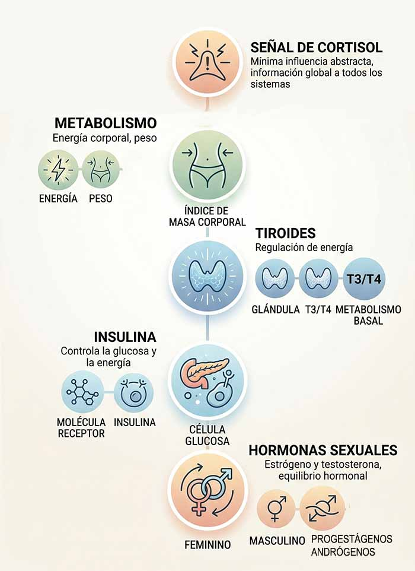

Descubre cómo el estrés crónico puede afectar tu salud hormonal y aprende a restaurar el equilibrio

## Introducción

El estrés forma parte natural de la vida, pero cuando se mantiene de forma prolongada puede afectar profundamente a la salud. En este proceso, una de las hormonas clave es el cortisol, conocido como la “hormona del estrés”, que el cuerpo libera como respuesta ante situaciones de alerta o demanda.

Cuando sus niveles se mantienen elevados durante demasiado tiempo, el equilibrio hormonal y metabólico puede alterarse, afectando al sueño, la energía, el peso y el bienestar general. Por eso, aprender a regular el cortisol es fundamental para cuidar la salud a largo plazo.

En este artículo veremos qué es el cortisol, cuáles son los síntomas de unos niveles elevados, sus causas más comunes y qué estrategias pueden ayudarte a restablecer el equilibrio de forma natural y efectiva.

## Qué vas a aprender

En este artículo, profundizaremos en el tema del cortisol alto, cubriendo desde su definición hasta soluciones prácticas para equilibrarlo.

Descubrirás cuáles son los síntomas más comunes, las principales causas que lo desencadenan y qué ocurre en el organismo cuando se mantiene elevado durante demasiado tiempo.

Lo más importante: aprenderás estrategias prácticas y naturales para ayudarte a regular tus niveles de cortisol y recuperar el equilibrio hormonal.

## ¿Qué es el cortisol?

Entendiendo la hormona del estrés

El cortisol es una hormona producida por las glándulas suprarrenales que desempeña un papel fundamental en la respuesta del cuerpo ante situaciones de estrés. Su función es ayudar al organismo a adaptarse, regulando procesos como la presión arterial, el metabolismo y ciertas funciones cognitivas como la memoria y el aprendizaje.

En condiciones normales, el cortisol es esencial para la supervivencia y el equilibrio del cuerpo. Sin embargo, cuando sus niveles se mantienen elevados de forma crónica, puede generar efectos negativos en la salud, como aumento de peso, alteraciones del sueño, fatiga y una disminución de la función inmunológica.

## Síntomas del cortisol alto

Reconociendo los signos del cortisol elevado

Los niveles elevados de cortisol pueden manifestarse de diferentes formas en el cuerpo y la mente, y sus síntomas no siempre son evidentes al principio.

Entre los más comunes se encuentran el aumento de peso, especialmente en la zona abdominal, la fatiga persistente, los problemas de sueño, la ansiedad y los estados de bajo ánimo. También es frecuente experimentar mayor apetito, cambios de humor e incluso una disminución del deseo sexual.

Identificar estos signos a tiempo es un paso clave para comprender lo que está ocurriendo en tu organismo y poder empezar a trabajar en el equilibrio hormonal.

## Cómo afecta el cortisol alto al cuerpo

Impacto en la salud general

Cuando el cortisol se mantiene elevado durante largos periodos, sus efectos pueden extenderse a prácticamente todo el organismo.

A nivel metabólico, puede favorecer la resistencia a la insulina, lo que aumenta el riesgo de desarrollar alteraciones en el control de la glucosa, incluida la diabetes tipo 2.

También puede influir en la acumulación de grasa corporal, especialmente en la zona abdominal.

En el sistema óseo, unos niveles elevados de cortisol de forma sostenida pueden debilitar la densidad ósea, aumentando el riesgo de osteoporosis con el tiempo. Además, su impacto no se limita al cuerpo: también se ha relacionado con un mayor riesgo de problemas cardiovasculares y alteraciones del estado de ánimo, como ansiedad o depresión.

Comprender estos efectos ayuda a darle contexto a los síntomas y a abordar el problema desde una perspectiva más global, no solo puntual.

## Relación con otras hormonas y el metabolismo

El cortisol y su influencia en el equilibrio hormonal

El cortisol no actúa de forma aislada: forma parte de una red hormonal compleja en la que interactúa de manera constante con otras hormonas clave del organismo.

Cuando sus niveles se mantienen elevados durante demasiado tiempo, puede alterar el equilibrio con la insulina y las hormonas tiroideas, lo que repercute directamente en el metabolismo. Esto puede traducirse en cambios en el peso corporal, dificultad para regular la energía y variaciones en la composición corporal.

Además, el exceso de cortisol puede interferir en la producción de hormonas sexuales como el estrógeno y la testosterona, afectando aspectos como la libido, la fertilidad y el bienestar general.

Comprender estas interacciones ayuda a ver el cuerpo como un sistema integrado, donde el estrés sostenido puede tener efectos mucho más amplios de lo que parece a simple vista.

## Soluciones para el cortisol alto

Estrategias prácticas para equilibrar el cortisol de forma natural

### Práctica de ejercicios de relajación

Técnicas como el yoga, la meditación y el ejercicio suave pueden ayudar a reducir los niveles de cortisol. Estas prácticas promueven la relajación y ayudan a manejar el estrés crónico.

### Ingesta adecuada de agua

Beber suficiente agua es esencial para el equilibrio hormonal. La deshidratación puede aumentar los niveles de cortisol, por lo que se recomienda beber al menos 8 vasos de agua al día.

### Mejora de los hábitos de sueño

Establecer una rutina de sueño saludable es crucial para regular los niveles de cortisol. Se recomienda dormir entre 7 y 9 horas cada noche para ayudar a equilibrar las hormonas.

### Limitar el estrés

Identificar y abordar las fuentes de estrés es crucial. Esto puede incluir técnicas de manejo del estrés, como la terapia cognitivo-conductual o el apoyo social.

### Alimentación saludable

Una dieta rica en frutas, verduras, granos integrales y proteínas magras puede ayudar a reducir el cortisol. También es importante limitar el consumo de azúcares refinados y cafeína.

### Suplementación adecuada

Algunos suplementos, como el ashwagandha y el magnesio, pueden ayudar a reducir los niveles de cortisol. Sin embargo, es importante consultar con un profesional de la salud antes de iniciar cualquier suplemento.

## PREGUNTAS FRECUENTES

¿Qué es el cortisol y por qué es importante?

El cortisol es una hormona producida por la glándula suprarrenal que ayuda a regular la respuesta del cuerpo al estrés. Es importante porque juega un papel crucial en la supervivencia y el bienestar general.

¿Cuáles son los síntomas del cortisol alto?

Los síntomas del cortisol alto incluyen aumento de peso, fatiga, problemas de sueño, ansiedad y depresión. También se puede experimentar un aumento en el apetito y cambios de humor.

¿Cómo se puede reducir el cortisol de forma natural?

El cortisol se puede reducir de forma natural a través de prácticas como la meditación, el ejercicio suave, la mejora de los hábitos de sueño, una alimentación saludable y limitar el estrés.

¿Es importante consultar con un profesional de la salud?

Sí, es importante consultar con un profesional de la salud para obtener un diagnóstico y tratamiento adecuados. Un profesional puede ofrecer guía personalizada y ayudar a desarrollar un plan de acción efectivo para manejar el cortisol alto.

## conclusión

El cortisol alto es un desequilibrio que puede influir de forma significativa en la salud física y emocional, especialmente cuando el estrés se mantiene en el tiempo.

Comprender sus síntomas, sus causas y sus efectos en el organismo es el primer paso para poder abordarlo con mayor conciencia. A partir de ahí, pequeños cambios en el estilo de vida pueden marcar una diferencia real en el equilibrio hormonal.

No se trata de eliminar el estrés por completo, sino de aprender a gestionarlo de forma más saludable para proteger tu bienestar a largo plazo.
