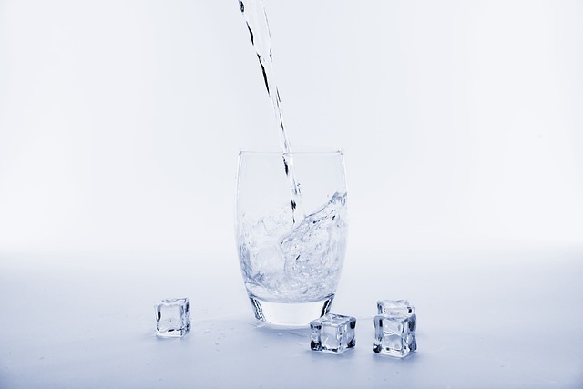

## Claves sobre cuándo tomar agua.

Cuándo tomar agua. El agua es el elemento más importante para la vida. Sin agua, no hay procesos vitales. Es por eso, que es importante tomar el agua recomendada por la OMS (Organización Mundial de la Salud) al día. Hay personas a las que les cuesta mucho beber agua, ya sea por cuestiones de tiempo, olvido… En este artículo, vamos a aprender, cuándo es el mejor momento, y qué cantidad es la más recomendable.

### ¿QUÉ CANTIDAD TOMAR?

No existe una cantidad fija de agua para todo el mundo, porque cada cuerpo es diferente. Pero se puede calcular fácilmente el agua que necesita cada persona. Para ello, sólo hay que dividir tu peso en kg, entre 7 y te dará la cantidad de vasos de agua necesarios diarios conforme al peso.

Ej: 70 kg / 7 = 10 vasos de agua de 250ml, que son un total de 2,5 litros de agua.

#### Productos purificadores de agua recomendados

### ¿CUÁNDO BEBER AGUA?

Veremos un ejemplo para los 10 vasos calculados anteriormente:

- 2 vasos por la mañana, en ayunas, nos ayudan a activar los órganos vitales.
- 2 vasos más a largo de la mañana, nos ayudarán a oxigenar el cerebro y mantenernos activos.
- 1 vaso media hora antes de cada comida(2-3), hace que tengamos una mejor digestión.
- 1 vaso justo antes de cada ducha, nos ayuda a reducir la presión sanguínea.
- 1 vaso antes de irte a dormir, puede ayudar a evitar infartos y embolias.

En total son 9 vasos de agua. Siguiendo estos pasos, y contando con que cada vaso es un vaso común de 250ml, con sólo tomar 1 vaso más en el resto del día, por ejemplo en la tarde, ya llegamos a los 10 vasos recomendados diarios.

Ver [vídeo](https://www.youtube.com/watch?v=DYOqe1UJfw0):

También nos recomiendan beber agua con limón, si quieres descubrir su beneficios entra [AQUÍ](/10-beneficios-de-beber-agua-con-limon/).

Nos vemos en el camino 🙂

Si quieres saber más sobre nutrición y vida sana, [suscríbete a mi canal](https://www.youtube.com/user/nutriclubweb) y sigue mi página de [Facebook](https://www.facebook.com/clubdenutricion.es/). Visita la sección de blog [aquí](/blog/).
