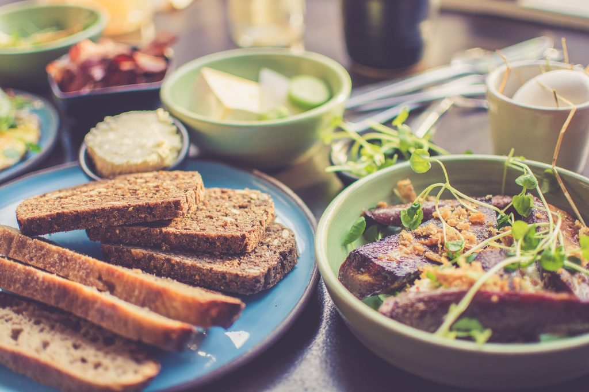
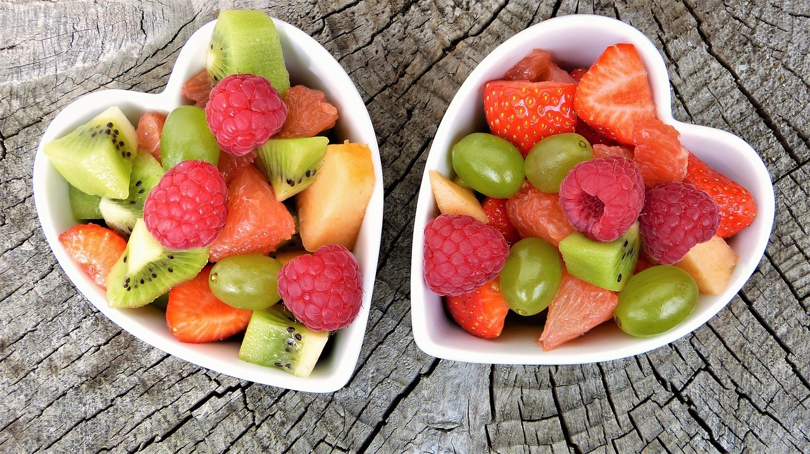
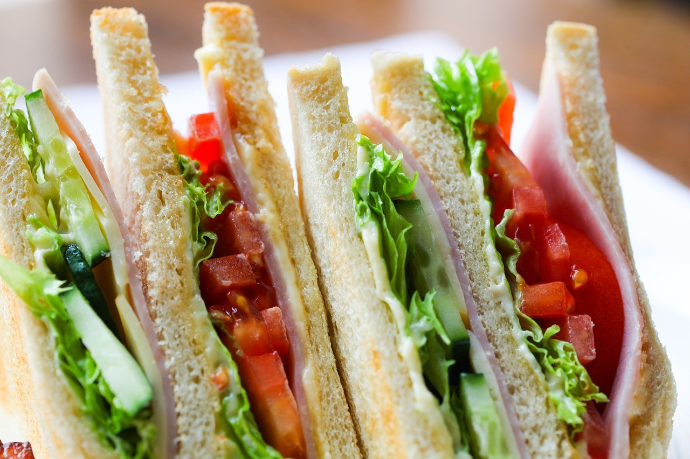
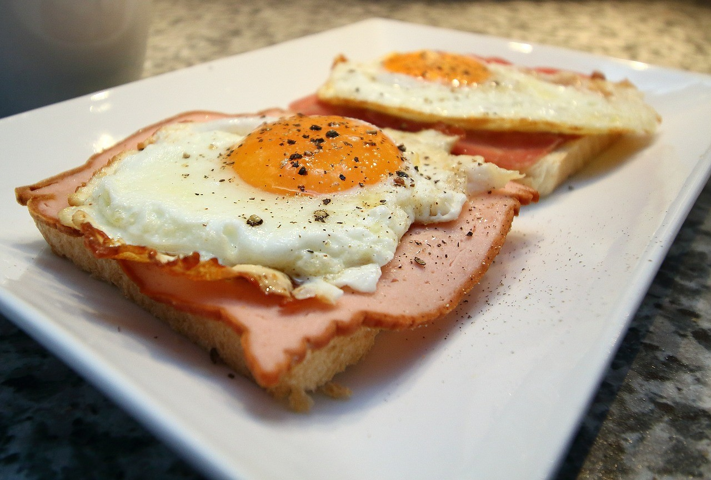
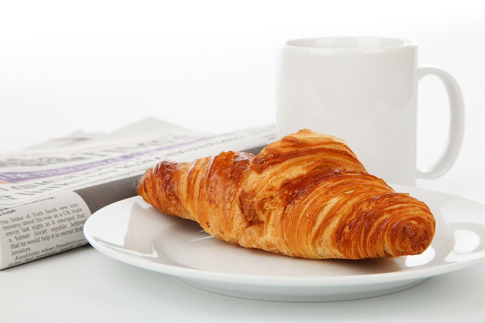
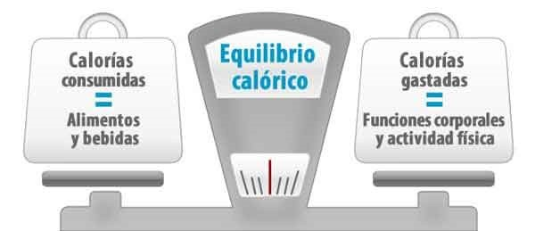

# Desayuno ¿La comida más importante?

## ¿Mito o realidad?

Desayuno ¿La comida más importante?. Seguro que más de una vez te has hecho esta pregunta, o quizás has leído información que nos hace creer que sí es la comida más importante.

Pues cómo decía la canción: DEPENDE, ¿de qué depende? de según qué desayunes todo depende

Sí, hay varios aspectos a tener en cuenta. Principalmente el cuerpo de cada persona. Y es que no tod@s metabolizamos igual, ni consumimos recursos de la misma forma.

**Veamos la diferencia entre dos metabolismos diferentes:**

1. Personas que, para funcionar, tienen que comer algo al levantarse.
2. Personas que empiezan el día sin necesidad de comer.

Las primeras personas, suelen ser aquellas que han agotado las reservas de glucógeno durante la noche. Necesitan combustible para poder funcionar por las mañanas.

Las segundas, ya no es que no necesiten comer a primera hora. Es que incluso les cuesta comer nada más levantarse. Pueden incluso tener sensación de lleno, o náuseas.

## Desayuno ¿La comida más importante?

Por **otro lado, vamos a ver cómo es el día dependiendo de qué desayunen o no:**

- **Desayunos frutales:** son aquellos desayunos basados en _**frutas**_, con un bajo aporte calórico. En este caso, dependiendo también de la cantidad de fibra que contenga, dará mayor sensación de saciedad y plenitud.
- **Desayunos con pan:** Los desayunos típicos de _**tostadas**_ con otros ingredientes. Dependerá si el pan es refinado o de grano completo. También de la calidad nutricional de los ingredientes que lo acompañen. \*Si el carbohidrato es de baja calidad, dará lugar a picos de insulina, y, por lo tanto, acumulación de grasa. También esa bajada repercutirá en episodios de hambre.
- **Desayunos lácteos:** Otro tipo de desayunos, es el basado en **_lácteos_**. Yogur, leche… Al igual que los anteriores, depende de los acompañamientos. Por un lado, uno de los típicos es el de yogur con cereales. Esta combinación, podemos hacerla más sana, si cambiamos los cereales por avena. Evitaremos ingerir azúcares innecesarios. También podemos combinar el yogur con fruta fresca. Por otro lado, la leche suele acompañarse de galletas y bollería. Este desayuno, es el menos apropiado. A no ser que la bollería y las galletas se hayan hecho en casa, con recetas fittness, que no usen cantidades ingentes de azúcar ni harinas refinadas. La primera variante, puede suponer que consigamos saciedad por bastante tiempo. En cambio la segunda, daría lugar al mismo proceso \* que el punto anterior.
- Desayunos inexistentes: Este tema es un tanto controvertido. Por un lado, hay quién dice que, el cuerpo ante un largo proceso de ayuno, guarda grasas como mecanismo de defensa. Por otro lado, hay quién aumenta de peso cuando desayuna. Y otra variante, es que hay personas que si no desayunan, aguantan bien hasta el almuerzo, pero si desayunan, sienten más ansiedad. Estos últimos, pueden no estar desayunando bien, o tener un metabolismo que funciona mejor ayunando.

En conclusión: si sientes ansiedad al desayunar, probablemente no estés tomando un desayuno que vaya bien a tu metabolismo.

**Según un estudio publicado en BMJ**, incluir **un buen desayuno**, con la finalidad de perder peso, **puede no tener los efectos deseados**. Por el contrario, podrían ayudar a aumentarlo. Esto se debe, a que, las personas que desayunan, aportan un mayor número de calorías a su cuerpo a lo largo del día, frente a los que no lo hacen. Y, por mucho que se diga, lo cierto es que las calorías que ingerimos, son las que hacen ganar o perder peso.

Es por tanto, que, aunque llevamos tiempo escuchando que el desayuno es la comida más importante del día. No nos extraña que pueda ser un mito. O que dependa de cada persona, su cuerpo, sus costumbres, el tipo de desayuno que haga, y su capacidad de quemar calorías.

Nosotros pensamos que no hay una teoría irrefutable. Que cada cuerpo es un mundo, y que lo que puede ir bien a un cuerpo, puede irle mal a otro. Por eso, no defendemos ninguna teoría. Cada cual debe observar su cuerpo, y decidir qué es lo mejor para el mismo.

## Nos gustaría saber qué opinas sobre este tema. Si desayunas, qué desayunas, si aguantas toda la mañana, si sientes ansiedad... Deja tu comentario abajo.
