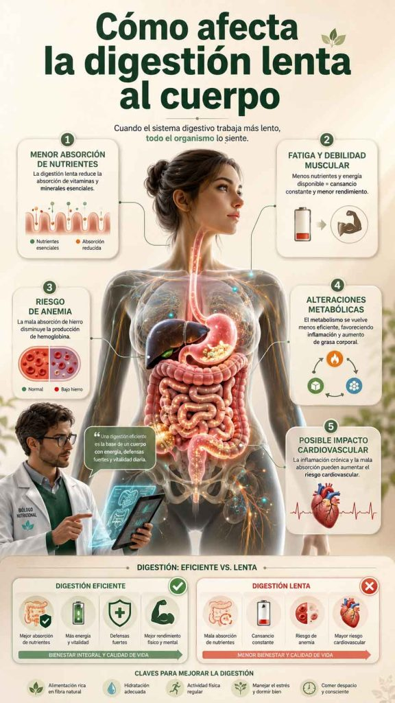

Aprende a identificar la digestión lenta y descubre hábitos y estrategias naturales para mejorar tu digestión y sentirte más ligero

## Introducción

La digestión lenta es un problema digestivo frecuente que puede afectar a personas de cualquier edad o sexo. Se estima que millones de personas en todo el mundo la padecen, experimentando síntomas como hinchazón abdominal, pesadez después de las comidas, gases y malestar digestivo.

En este artículo descubrirás qué es la digestión lenta, cuáles son sus causas más comunes y qué síntomas la caracterizan. Además, aprenderás estrategias prácticas y hábitos naturales para mejorar la digestión y recuperar una sensación de ligereza y bienestar digestivo.

## Qué vas a aprender

En este artículo aprenderás a identificar la digestión lenta y a mejorarla de forma natural a través de hábitos sencillos y efectivos.

Descubrirás cómo reconocer sus síntomas más comunes, entenderás las principales causas que la provocan y conocerás estrategias prácticas para optimizar tu digestión y favorecer un mejor bienestar digestivo.

## ¿Qué es la digestión lenta?

Una explicación clara y concisa

La digestión lenta es un trastorno digestivo en el que el proceso de digestión se vuelve más lento y menos eficiente de lo habitual. Como resultado, el estómago tarda más en procesar los alimentos y puede dificultarse la correcta absorción de nutrientes.

Esto puede provocar síntomas como hinchazón abdominal, pesadez después de las comidas, gases y otras molestias digestivas que afectan al bienestar general.

## Síntomas de la digestión lenta

Cómo reconocer sus señales

Los síntomas de la digestión lenta pueden variar de una persona a otra, pero los más comunes incluyen hinchazón abdominal, sensación de pesadez después de comer, gases y molestias digestivas. También pueden aparecer alteraciones del tránsito intestinal como estreñimiento o diarrea.

En algunos casos, la digestión lenta puede acompañarse de fatiga, dolor abdominal y pérdida de apetito, afectando al bienestar general y a la energía diaria.

## Cómo afecta la digestión lenta al cuerpo

El impacto en la salud general

La digestión lenta no solo provoca molestias digestivas, sino que también puede tener un impacto importante en la salud general.

Cuando el proceso digestivo no funciona de forma eficiente, puede dificultarse la correcta absorción de nutrientes esenciales, lo que a largo plazo puede contribuir a déficits nutricionales.

Esto puede favorecer problemas como fatiga persistente, debilidad muscular o alteraciones relacionadas con la falta de vitaminas y minerales, como la anemia o la pérdida de densidad ósea.

Además, una digestión deficiente mantenida en el tiempo puede asociarse con un mayor riesgo de alteraciones metabólicas y enfermedades crónicas, como la diabetes tipo 2, la hipertensión y enfermedades cardiovasculares, especialmente cuando se combina con otros hábitos de vida poco saludables.

## Relación con hormonas y metabolismo

La conexión entre la digestión, las hormonas y el metabolismo

La digestión lenta puede estar influida por el equilibrio hormonal y el funcionamiento del metabolismo. El sistema digestivo no actúa de forma aislada, sino que está estrechamente conectado con hormonas que regulan procesos clave como la energía, la inflamación y el uso de nutrientes.

Por ejemplo, la insulina participa en la regulación de los carbohidratos, mientras que otros compuestos antioxidantes como el glutatión contribuyen a los procesos de detoxificación y protección celular. Cuando estos sistemas no funcionan de forma óptima, la digestión y el aprovechamiento de los nutrientes pueden verse afectados.

Además, alteraciones en la función tiroidea o en el eje adrenal pueden influir en la velocidad del metabolismo, lo que en algunos casos se asocia con digestiones más lentas, sensación de pesadez y menor energía general.

## Soluciones para la digestión lenta

Cómo mejorar la digestión de manera natural

### Mejorar la alimentación

Una dieta rica en frutas, verduras, legumbres, cereales integrales y proteínas de calidad favorece una digestión más eficiente. Estos alimentos aportan fibra, enzimas naturales y nutrientes que apoyan el tránsito intestinal.

Es recomendable reducir el consumo de alimentos ultraprocesados, azúcares refinados y grasas de baja calidad, ya que pueden ralentizar la digestión y aumentar la inflamación digestiva.

### Reducir el estrés

El estrés tiene un impacto directo sobre el sistema digestivo, pudiendo ralentizarlo y empeorar los síntomas. Incorporar técnicas de relajación como la meditación, el yoga o la respiración profunda ayuda a mejorar la conexión entre el sistema nervioso y la digestión.

Un estado de calma favorece una digestión más eficiente y menos sintomática.

### Mantener una buena hidratación

El agua es esencial para la digestión, ya que facilita la descomposición de los alimentos y la absorción de nutrientes. También ayuda a mantener un tránsito intestinal regular.

Se recomienda una ingesta adecuada de agua a lo largo del día, ajustada a las necesidades individuales.

### Apoyo con suplementos digestivos

Algunos suplementos como las enzimas digestivas, los probióticos o compuestos antioxidantes como el glutatión pueden apoyar el proceso digestivo en casos de digestión lenta.

Su uso debe ser complementario a una buena alimentación y hábitos saludables, no como sustituto.

### Aumentar la actividad física

El ejercicio regular estimula el movimiento intestinal y mejora la circulación sanguínea, lo que favorece una digestión más eficiente.

Actividades como caminar, entrenar fuerza o realizar ejercicio moderado durante al menos 30 minutos al día pueden marcar una gran diferencia.

### Evitar tabaco y alcohol

El tabaco y el alcohol pueden irritar el sistema digestivo y alterar su funcionamiento normal, empeorando la digestión lenta y la inflamación intestinal.

Reducir o eliminar estos hábitos contribuye significativamente a mejorar la salud digestiva y general.

## Preguntas frecuentes

¿Qué es la digestión lenta?

La digestión lenta es una alteración del proceso digestivo en la que los alimentos se procesan más despacio de lo habitual. Esto puede provocar que el estómago tarde más en vaciarse y que la absorción de nutrientes no sea tan eficiente como debería.

Como resultado, pueden aparecer molestias como hinchazón, pesadez o sensación de digestión pesada después de las comidas.

¿Cuáles son los síntomas de la digestión lenta?

Los síntomas más comunes incluyen hinchazón abdominal, sensación de pesadez tras comer, gases y molestias digestivas. También puede aparecer estreñimiento o diarrea en algunos casos.

Además, algunas personas pueden experimentar fatiga, falta de apetito o dolor abdominal leve, especialmente después de comidas copiosas.

¿Cómo puedo mejorar la digestión lenta?

La digestión lenta puede mejorar significativamente con cambios en el estilo de vida. Una alimentación rica en alimentos frescos y fibra, una buena hidratación y la reducción de alimentos ultraprocesados son claves.

También ayuda reducir el estrés, realizar actividad física regular y mantener horarios de comida estables. En algunos casos, pueden utilizarse suplementos digestivos como enzimas o probióticos, siempre como apoyo.

¿Es necesario consultar a un médico si tengo digestión lenta?

Si los síntomas son leves y puntuales, normalmente pueden mejorar con hábitos saludables. Sin embargo, si la digestión lenta es persistente, empeora con el tiempo o se acompaña de síntomas como dolor intenso, pérdida de peso o cambios importantes en el tránsito intestinal, es recomendable consultar a un profesional de la salud para una evaluación adecuada.

¿Qué alimentos empeoran la digestión lenta?

Los alimentos ultraprocesados, ricos en azúcares refinados, grasas saturadas y fritos pueden ralentizar la digestión. También el exceso de alcohol y comidas muy copiosas puede dificultar el proceso digestivo.

¿El estrés puede causar digestión lenta?

Sí. El estrés afecta directamente al sistema digestivo a través del eje intestino-cerebro, pudiendo ralentizar la digestión y aumentar síntomas como hinchazón o malestar abdominal.

¿Cuánto tiempo debería durar una digestión normal?

El tiempo de digestión varía según el tipo de alimento, pero en general el proceso completo puede durar entre 24 y 72 horas. Si se percibe una sensación constante de pesadez o digestión muy lenta, puede indicar un desequilibrio digestivo.

¿La digestión lenta es peligrosa?

Por sí sola no suele ser peligrosa, pero puede afectar a la calidad de vida y, en algunos casos, estar relacionada con problemas digestivos o metabólicos que requieren atención médica.

## conclusión

La digestión lenta es un problema digestivo frecuente que puede afectar de forma importante al bienestar general y a la calidad de vida. Aunque sus síntomas pueden resultar molestos, en la mayoría de los casos es posible mejorarla mediante cambios en el estilo de vida y hábitos diarios.

Adoptar una alimentación más equilibrada, reducir el estrés, mantener una buena hidratación y realizar actividad física de forma regular puede ayudar a optimizar el proceso digestivo de manera natural.

Aplicando las estrategias explicadas en este artículo, puedes favorecer una mejor digestión, reducir los síntomas y recuperar una mayor sensación de ligereza y bienestar en tu día a día.
