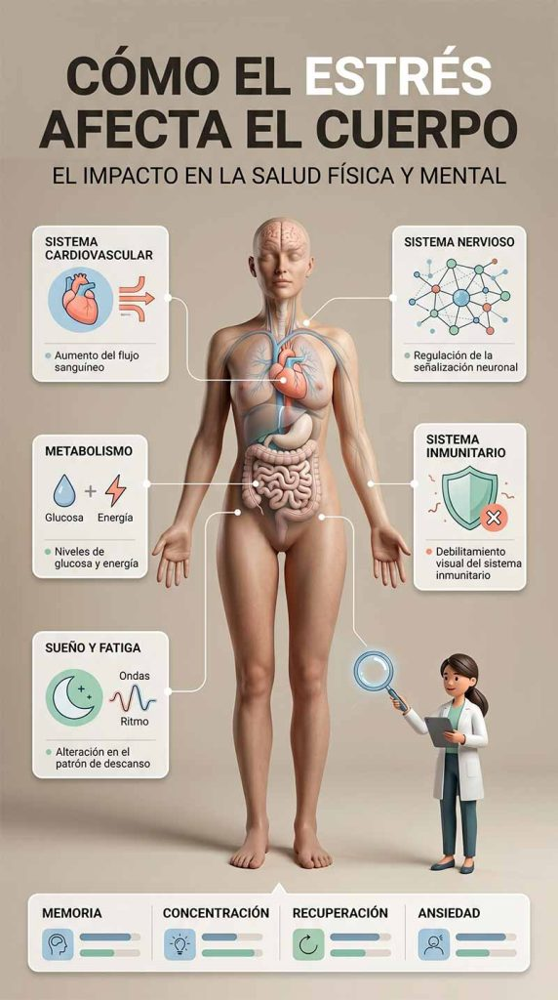
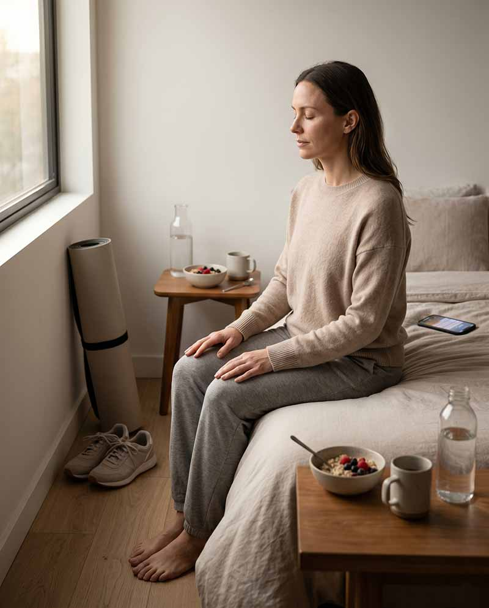

Descubre cómo tus hábitos diarios influyen en el estrés y aprende a gestionarlo de forma eficaz

#### Tabla de contenidos

01. [Introducción](/estres-y-habitos-diarios/#elementor-toc__heading-anchor-0)

02. [Qué vas a aprender](/estres-y-habitos-diarios/#elementor-toc__heading-anchor-1)

03. [¿Qué es el estrés?](/estres-y-habitos-diarios/#elementor-toc__heading-anchor-2)

04. [Síntomas del estrés](/estres-y-habitos-diarios/#elementor-toc__heading-anchor-3)

05. [Cómo el estrés afecta el cuerpo](/estres-y-habitos-diarios/#elementor-toc__heading-anchor-4)

06. [La conexión entre el estrés y los hábitos diarios](/estres-y-habitos-diarios/#elementor-toc__heading-anchor-5)

07. [Soluciones para reducir el estrés a través de la mejora de los hábitos diarios](/estres-y-habitos-diarios/#elementor-toc__heading-anchor-6)

    1. [Establece una rutina matutina relajante](/estres-y-habitos-diarios/#elementor-toc__heading-anchor-7)

    2. [Prioriza el sueño de calidad](/estres-y-habitos-diarios/#elementor-toc__heading-anchor-8)

    3. [Incorpora ejercicio físico regular](/estres-y-habitos-diarios/#elementor-toc__heading-anchor-9)

    4. [Practica la gratitud](/estres-y-habitos-diarios/#elementor-toc__heading-anchor-10)

    5. [Mantén una dieta equilibrada](/estres-y-habitos-diarios/#elementor-toc__heading-anchor-11)

    6. [Conecta con la naturaleza](/estres-y-habitos-diarios/#elementor-toc__heading-anchor-12)
08. [Preguntas frecuentes](/estres-y-habitos-diarios/#elementor-toc__heading-anchor-13)

09. [conclusión](/estres-y-habitos-diarios/#elementor-toc__heading-anchor-14)

10. [Artículos relacionados](/estres-y-habitos-diarios/#elementor-toc__heading-anchor-15)

    1. [La perimenopausia puede empezar antes de lo esperado: estas son sus primeras señales](/estres-y-habitos-diarios/#elementor-toc__heading-anchor-16)

    2. [Ultraprocesados y salud digestiva: nueva alerta](/estres-y-habitos-diarios/#elementor-toc__heading-anchor-17)

    3. [Dieta cetogénica y salud cerebral: qué dice la ciencia sobre Alzheimer y Parkinson](/estres-y-habitos-diarios/#elementor-toc__heading-anchor-18)

    4. [El sueño profundo: la hormona natural que ayuda a regenerar músculo, metabolismo y cerebro](/estres-y-habitos-diarios/#elementor-toc__heading-anchor-19)

    5. [Colesterol alto: por qué el LDL aislado podría no contar toda la historia clínica](/estres-y-habitos-diarios/#elementor-toc__heading-anchor-20)
11. [¿Sientes que tu energía sube y baja constantemente?](/estres-y-habitos-diarios/#elementor-toc__heading-anchor-21)

## Introducción

El estrés no aparece de la nada. Aunque muchas veces lo asociamos a situaciones puntuales, en realidad está profundamente relacionado con nuestros hábitos diarios. Desde cómo dormimos hasta lo que comemos o cómo gestionamos nuestro tiempo, cada pequeña rutina influye directamente en nuestro nivel de estrés.

Entender la conexión entre estrés y hábitos es clave para mejorar el bienestar físico y mental de forma sostenible. En este artículo descubrirás cómo se relacionan y qué cambios simples puedes aplicar para empezar a sentirte mejor.

## Qué vas a aprender

En este artículo vas a comprender cómo el estrés influye en tu cuerpo y en tu mente, cuáles son las causas más comunes que lo desencadenan y qué señales te ayudan a identificarlo a tiempo.

Además, descubrirás estrategias prácticas y efectivas para reducir el estrés en tu día a día y mejorar tus hábitos diarios de forma sencilla y sostenible.

## ¿Qué es el estrés?

Entendiendo la respuesta del cuerpo al estrés

El estrés es una respuesta natural del organismo ante situaciones que percibe como exigentes, amenazantes o fuera de control. No siempre es negativo: en pequeñas dosis puede ayudarnos a reaccionar y adaptarnos.

Esta respuesta está regulada principalmente por el sistema nervioso y provoca una serie de cambios físicos y mentales. Entre ellos se incluyen el aumento de la frecuencia cardíaca, la elevación de la presión arterial y la activación del estado de alerta.

A nivel mental, el estrés también puede influir en la concentración, el estado de ánimo y la capacidad de tomar decisiones, especialmente cuando se mantiene en el tiempo.

## Síntomas del estrés

Reconociendo los signos

Los síntomas del estrés pueden manifestarse de distintas formas, y no siempre son fáciles de identificar al principio. En muchos casos aparecen de manera progresiva y afectan tanto al cuerpo como a la mente y al comportamiento diario.

A nivel físico, es común experimentar dolores de cabeza, tensión muscular o problemas para dormir. En el plano emocional, pueden aparecer irritabilidad, ansiedad o sensación de agobio constante.

También es habitual que el estrés influya en los hábitos diarios, provocando cambios en la alimentación, en la energía o en la motivación para realizar actividades cotidianas.

Reconocer estos signos a tiempo es clave para poder actuar y evitar que el estrés se mantenga en el tiempo.

## Cómo el estrés afecta el cuerpo

El impacto en la salud física y mental

El estrés crónico no solo afecta cómo te sientes en el día a día, sino que también puede tener un impacto significativo en la salud física y mental a largo plazo.

Cuando el estrés se mantiene de forma constante, el organismo permanece en un estado de alerta que puede aumentar el riesgo de problemas cardiovasculares, alteraciones metabólicas como la diabetes y dificultades relacionadas con el peso, como la obesidad.

A nivel mental, también se asocia con una mayor probabilidad de desarrollar ansiedad, síntomas depresivos y fatiga emocional. Además, puede afectar la concentración, la memoria y la capacidad de recuperación ante situaciones cotidianas.

Otro efecto importante es el debilitamiento del sistema inmunológico, lo que hace que el cuerpo sea más vulnerable a infecciones.

También puede interferir con la calidad del sueño, dificultando tanto el descanso profundo como la recuperación física.

En conjunto, estos efectos muestran cómo el estrés sostenido influye en prácticamente todos los sistemas del cuerpo.

## La conexión entre el estrés y los hábitos diarios

Cómo los hábitos diarios pueden influir en el estrés

Nuestros hábitos diarios influyen de forma directa en cómo el cuerpo gestiona el estrés, desde la rutina con la que empezamos el día hasta la forma en la que nos preparamos para descansar por la noche.

Hábitos saludables como la meditación, la actividad física regular, una alimentación equilibrada y un sueño de calidad ayudan a regular el sistema nervioso y a reducir los niveles de estrés de manera progresiva.

Por el contrario, ciertos hábitos pueden aumentar la sensación de estrés sin que siempre seamos conscientes de ello. El consumo excesivo de cafeína, el uso prolongado de pantallas antes de dormir o un estilo de vida sedentario mantienen al organismo en un estado de activación constante.

En este sentido, la clave no está en un solo factor, sino en la suma de pequeñas decisiones diarias que, con el tiempo, influyen en el equilibrio mental y físico.

## Soluciones para reducir el estrés a través de la mejora de los hábitos diarios

Prácticas efectivas para una vida más equilibrada

Antes de aplicar cambios concretos, es importante entender algo: no se trata de hacer grandes transformaciones de golpe, sino de introducir pequeños hábitos que ayuden a regular el sistema nervioso de forma progresiva.

A continuación, tienes prácticas sencillas pero efectivas que pueden ayudarte a reducir el estrés y mejorar tu bienestar diario.

### Establece una rutina matutina relajante

Comienza tu día con actividades que favorezcan la calma y la claridad mental. Prácticas como la meditación, el yoga o incluso una ducha relajante pueden ayudarte a reducir la activación del estrés desde primera hora del día.

### Prioriza el sueño de calidad

Dormir bien es fundamental para regular el estrés. Mantén horarios de sueño constantes, evita pantallas antes de acostarte y crea un entorno tranquilo que favorezca el descanso profundo.

### Incorpora ejercicio físico regular

El ejercicio físico ayuda a liberar tensión y mejorar el estado de ánimo. Actividades como caminar, correr, nadar o bailar reducen los niveles de estrés y mejoran el equilibrio emocional.

### Practica la gratitud

Dedicar unos minutos al día a reconocer lo positivo de tu vida puede cambiar tu enfoque mental. La gratitud ayuda a reducir la percepción del estrés y a mejorar el bienestar emocional.

### Mantén una dieta equilibrada

Una alimentación equilibrada influye directamente en tu energía y estado de ánimo. Prioriza alimentos naturales como frutas, verduras, proteínas magras y cereales integrales, reduciendo ultraprocesados, azúcares y cafeína.

### Conecta con la naturaleza

El contacto con la naturaleza tiene un efecto calmante sobre el sistema nervioso. Pasear al aire libre o simplemente observar espacios naturales ayuda a reducir la tensión mental y el estrés acumulado.

## Preguntas frecuentes

¿Cuál es el síntoma más común del estrés?

Uno de los síntomas más comunes del estrés es la tensión física acompañada de fatiga mental. Muchas personas lo experimentan como cansancio constante, dificultad para concentrarse o sensación de estar “sobrecargado” mentalmente.

A nivel físico, también son frecuentes los dolores de cabeza, la tensión muscular y los problemas para dormir. Sin embargo, la forma en la que se manifiesta puede variar mucho de una persona a otra.

¿Cómo puedo saber si estoy experimentando estrés crónico?

El estrés crónico se produce cuando la respuesta de estrés se mantiene activa durante un periodo prolongado de tiempo. No se trata de un episodio puntual, sino de un estado constante.

Algunas señales habituales incluyen irritabilidad frecuente, problemas de sueño persistentes, fatiga continua, ansiedad mantenida y dificultad para desconectar incluso en momentos de descanso.

Si estos síntomas se mantienen durante semanas o meses, es importante prestar atención y empezar a introducir cambios en los hábitos diarios.

¿Es posible manejar el estrés sin medicación?

Sí, en muchos casos es posible gestionar el estrés sin necesidad de medicación, especialmente cuando no existe un diagnóstico clínico asociado.

Las estrategias más efectivas suelen estar relacionadas con el estilo de vida: mejorar el sueño, practicar ejercicio físico regular, reducir la exposición a estímulos digitales, cuidar la alimentación y aprender técnicas de relajación como la respiración consciente o la meditación.

En casos de estrés severo o persistente, siempre es recomendable consultar con un profesional de la salud.

¿Cuánto tiempo lleva ver resultados al intentar reducir el estrés?

El tiempo para notar mejoras depende del nivel de estrés y de los cambios que se implementen. En general, algunas personas pueden empezar a notar mejoras leves en pocos días, especialmente al mejorar el sueño o reducir estímulos como la cafeína o las pantallas.

Sin embargo, los cambios más profundos suelen observarse tras varias semanas de constancia. La clave no está en la rapidez, sino en la regularidad de los nuevos hábitos.

¿Qué hábitos empeoran el estrés sin darte cuenta?

Algunos hábitos cotidianos pueden aumentar el estrés sin que seas plenamente consciente de ello. Entre los más comunes están el uso excesivo del móvil, la falta de descanso real, el sedentarismo, la mala alimentación y la multitarea constante.

Identificar y reducir estos hábitos es uno de los pasos más efectivos para recuperar el equilibrio mental.

## conclusión

El estrés es una respuesta natural del organismo y forma parte de la vida cotidiana, pero no tiene por qué dominar tu bienestar ni tu calidad de vida.

Comprender la relación entre el estrés y los hábitos diarios es el primer paso para poder gestionarlo de forma más consciente. A partir de ahí, la clave está en aplicar pequeños cambios sostenidos en el tiempo, en lugar de buscar soluciones rápidas o perfectas.

Cada ajuste en tu rutina —por pequeño que parezca— puede tener un impacto real en tu salud mental y física. Con constancia, es posible recuperar el equilibrio y construir una vida con menos estrés y más bienestar.

El cambio no ocurre de un día para otro, sino a través de un proceso progresivo. Y en ese proceso, cada hábito cuenta.
