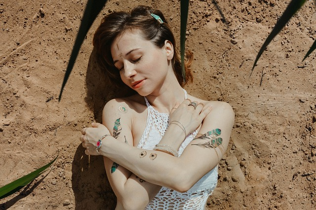

# La Importancia de la Exposición al Sol para el Organismo: Beneficios y Riesgos de la Falta de Luz Solar

La exposición al sol es esencial para mantener un buen estado de salud. En este artículo, exploraremos los múltiples beneficios que la luz solar aporta a nuestro organismo y los problemas que pueden surgir por la falta de exposición. Además, proporcionaremos información valiosa sobre cómo optimizar tu exposición al sol para obtener los mejores resultados. ¡Vamos a sumergirnos en el tema!

## Beneficios de la Exposición al Sol

### Producción de Vitamina D

Uno de los principales beneficios de la exposición al sol es la producción de vitamina D en la piel. Esta vitamina es crucial para:

- **Fortalecimiento de los huesos**: La vitamina D ayuda en la absorción del calcio, lo que fortalece los huesos y previene enfermedades como la osteoporosis.
- **Sistema inmunológico**: Un nivel adecuado de vitamina D mejora la respuesta inmunológica, protegiéndonos de diversas infecciones.
- **Salud mental**: La vitamina D está relacionada con la mejora del estado de ánimo y la prevención de la depresión.

### Mejora del Estado de Ánimo

La luz solar aumenta la producción de serotonina, una hormona que mejora el estado de ánimo y nos hace sentir más felices. Esto puede ayudar a combatir el trastorno afectivo estacional (TAE), una forma de depresión que ocurre en los meses de invierno.

### Regulación del Ritmo Circadiano

La exposición al sol ayuda a regular nuestro ritmo circadiano, el reloj interno que controla los ciclos de sueño y vigilia. Un ritmo circadiano bien regulado mejora la calidad del sueño y la salud general.

### Reducción de la Presión Arterial

Se ha demostrado que la exposición a la luz solar directa puede ayudar a reducir la presión arterial, disminuyendo así el riesgo de enfermedades cardiovasculares.

### RECOMENDAMOS

## Problemas Derivados de la Falta de Exposición al Sol

### Deficiencia de Vitamina D

La falta de exposición al sol puede llevar a una deficiencia de vitamina D, que puede causar:

- **Debilidad ósea**: Aumenta el riesgo de fracturas y osteoporosis.
- **Sistema inmunológico débil**: Mayor susceptibilidad a infecciones y enfermedades.
- **Problemas de salud mental**: Incremento del riesgo de depresión y otros trastornos del estado de ánimo.

### Trastorno Afectivo Estacional (TAE)

La falta de luz solar, especialmente en los meses de invierno, puede desencadenar el TAE, causando síntomas como tristeza, irritabilidad y falta de energía.

### Problemas de Sueño

La exposición insuficiente al sol puede desregular el ritmo circadiano, lo que lleva a problemas de sueño como insomnio y somnolencia diurna.

## Cómo Optimizar la Exposición al Sol

Tiempo Adecuado de Exposición

Para obtener los beneficios del sol sin riesgos, es recomendable exponerse al sol durante 10 a 30 minutos al día, dependiendo de tu tipo de piel y la intensidad del sol.

Exposición Gradual

Si no estás acostumbrado a la exposición al sol, es mejor comenzar de manera gradual para evitar quemaduras solares.

Nos vemos en el camino 🙂

Si quieres saber más sobre nutrición y vida sana, [suscríbete a mi canal](https://www.youtube.com/user/nutriclubweb) y sigue mi página de [Facebook](https://www.facebook.com/clubdenutricion.es/). Visita la sección de blog [aquí](/blog/).
