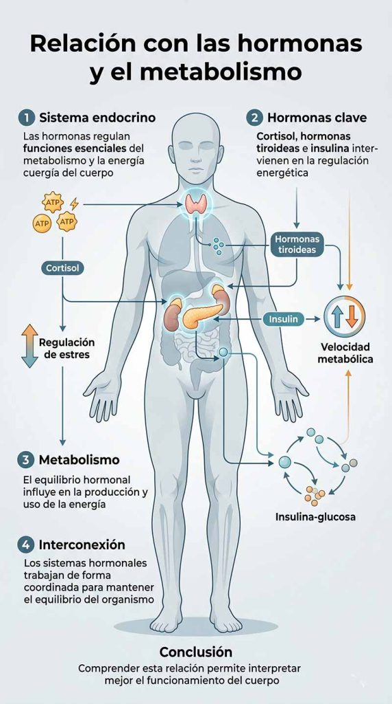

Aprende a identificar los síntomas de la fatiga crónica y descubre estrategias efectivas para recuperar tu energía y bienestar diario

#### Tabla de contenidos

01. [Introducción](/fatiga-cronica-sintomas-causas/#elementor-toc__heading-anchor-0)

02. [Qué vas a aprender](/fatiga-cronica-sintomas-causas/#elementor-toc__heading-anchor-1)

03. [¿Qué es la fatiga crónica?](/fatiga-cronica-sintomas-causas/#elementor-toc__heading-anchor-2)

04. [Síntomas de la fatiga crónica](/fatiga-cronica-sintomas-causas/#elementor-toc__heading-anchor-3)

05. [Cómo afecta la fatiga crónica al cuerpo](/fatiga-cronica-sintomas-causas/#elementor-toc__heading-anchor-4)

06. [Relación con las hormonas y el metabolismo](/fatiga-cronica-sintomas-causas/#elementor-toc__heading-anchor-5)

07. [Soluciones para la fatiga crónica](/fatiga-cronica-sintomas-causas/#elementor-toc__heading-anchor-6)

    1. [Mejorar la calidad del sueño](/fatiga-cronica-sintomas-causas/#elementor-toc__heading-anchor-7)

    2. [Reducir el estrés](/fatiga-cronica-sintomas-causas/#elementor-toc__heading-anchor-8)

    3. [Aumentar la actividad física](/fatiga-cronica-sintomas-causas/#elementor-toc__heading-anchor-9)

    4. [Buscar apoyo](/fatiga-cronica-sintomas-causas/#elementor-toc__heading-anchor-10)

    5. [Mejorar la alimentación](/fatiga-cronica-sintomas-causas/#elementor-toc__heading-anchor-11)

    6. [Buscar atención médica](/fatiga-cronica-sintomas-causas/#elementor-toc__heading-anchor-12)
08. [Preguntas frecuentes](/fatiga-cronica-sintomas-causas/#elementor-toc__heading-anchor-13)

09. [conclusión](/fatiga-cronica-sintomas-causas/#elementor-toc__heading-anchor-14)

10. [Artículos relacionados](/fatiga-cronica-sintomas-causas/#elementor-toc__heading-anchor-15)

    1. [La perimenopausia puede empezar antes de lo esperado: estas son sus primeras señales](/fatiga-cronica-sintomas-causas/#elementor-toc__heading-anchor-16)

    2. [Ultraprocesados y salud digestiva: nueva alerta](/fatiga-cronica-sintomas-causas/#elementor-toc__heading-anchor-17)

    3. [Dieta cetogénica y salud cerebral: qué dice la ciencia sobre Alzheimer y Parkinson](/fatiga-cronica-sintomas-causas/#elementor-toc__heading-anchor-18)

    4. [El sueño profundo: la hormona natural que ayuda a regenerar músculo, metabolismo y cerebro](/fatiga-cronica-sintomas-causas/#elementor-toc__heading-anchor-19)

    5. [Colesterol alto: por qué el LDL aislado podría no contar toda la historia clínica](/fatiga-cronica-sintomas-causas/#elementor-toc__heading-anchor-20)
11. [¿Sientes que tu energía sube y baja constantemente?](/fatiga-cronica-sintomas-causas/#elementor-toc__heading-anchor-21)

## Introducción

La fatiga crónica es un estado persistente de agotamiento físico y mental que no mejora fácilmente con el descanso y que puede afectar de forma significativa a la calidad de vida. Se trata de un problema cada vez más frecuente que puede aparecer en personas de cualquier edad y estilo de vida.

Sus causas son variadas y suelen estar relacionadas con un conjunto de factores que alteran el equilibrio energético del organismo, como la falta de sueño, una alimentación inadecuada, el estrés prolongado, el sedentarismo o la presencia de enfermedades crónicas.

En este artículo analizaremos en profundidad qué es la fatiga crónica, cuáles son sus principales causas y síntomas, y qué estrategias pueden ayudarte a recuperar la energía y mejorar tu bienestar diario de forma efectiva.

## Qué vas a aprender

En esta guía vas a entender en profundidad las principales causas de la fatiga crónica y cómo se manifiesta en el cuerpo y la mente. Aprenderás a identificar sus síntomas más frecuentes, desde el cansancio persistente hasta la falta de concentración y la baja energía diaria.

Además, descubrirás qué factores pueden estar detrás de este agotamiento continuo y qué estrategias puedes aplicar para mejorar tu nivel de energía, recuperar el equilibrio y reducir el impacto de la fatiga crónica en tu vida diaria.

## ¿Qué es la fatiga crónica?

Definición y características

La fatiga crónica es un estado de agotamiento físico y mental persistente que se mantiene durante más de seis meses y no mejora de forma significativa con el descanso. A diferencia del cansancio habitual, este tipo de fatiga interfiere de manera directa en la energía diaria, la concentración y el rendimiento físico y mental.

Se trata de un problema multifactorial que puede estar relacionado con diferentes causas, como la falta de sueño de calidad, una alimentación desequilibrada, el estrés prolongado, el sedentarismo o la presencia de enfermedades crónicas.

Entre sus principales características destacan la sensación constante de cansancio, la falta de recuperación tras el descanso, la disminución del rendimiento cognitivo y físico, y una sensación general de agotamiento que afecta a la calidad de vida.

## Síntomas de la fatiga crónica

Cómo se manifiesta la fatiga crónica

La fatiga crónica puede manifestarse de forma progresiva y afectar tanto al cuerpo como a la mente, interfiriendo en las actividades diarias y en la calidad de vida.

Entre sus síntomas más comunes se encuentran el cansancio persistente y la falta de energía incluso después de descansar, la sensación de debilidad o fatiga muscular, y una disminución notable del rendimiento físico.

A nivel cognitivo, es frecuente la dificultad para concentrarse, los problemas de memoria a corto plazo y la sensación de “mente nublada”. También pueden aparecer síntomas emocionales como irritabilidad, ansiedad o bajo estado de ánimo, que en algunos casos pueden evolucionar hacia cuadros depresivos.

En conjunto, estos síntomas reflejan un estado de agotamiento profundo que no se resuelve con el descanso habitual y que requiere abordar sus posibles causas para recuperar el equilibrio energético.

## Cómo afecta la fatiga crónica al cuerpo

Impacto en la salud física y mental

La fatiga crónica no solo se manifiesta como cansancio, sino que puede tener un impacto significativo en el funcionamiento general del organismo.

A nivel físico, provoca una reducción de la energía disponible, sensación constante de agotamiento y menor capacidad de recuperación tras el esfuerzo, lo que puede limitar la actividad diaria y el rendimiento corporal.

En el plano mental y emocional, este estado de fatiga persistente puede contribuir a la aparición de problemas como ansiedad, irritabilidad o bajo estado de ánimo.

Con el tiempo, también puede generar desmotivación, dificultad para mantener la concentración y una disminución de la productividad tanto en el ámbito personal como profesional.

En conjunto, la fatiga crónica afecta de forma global al equilibrio entre cuerpo y mente, haciendo que tareas cotidianas que antes resultaban simples se vuelvan más exigentes y difíciles de sostener en el tiempo.

## Relación con las hormonas y el metabolismo

Cómo la fatiga crónica afecta las hormonas y el metabolismo

La fatiga crónica puede alterar el equilibrio hormonal y el funcionamiento del metabolismo, lo que contribuye a mantener el estado de cansancio y dificulta la recuperación de la energía.

Cuando el organismo permanece en un estado de estrés prolongado, pueden producirse desequilibrios en hormonas clave como el cortisol, la insulina o las hormonas tiroideas. Estos cambios pueden influir directamente en la regulación de la energía, el estado de ánimo y la capacidad del cuerpo para recuperarse.

Entre las consecuencias más comunes se encuentran la resistencia a la insulina, que afecta a la forma en que el cuerpo utiliza la glucosa como fuente de energía, y posibles alteraciones en la función tiroidea, que pueden ralentizar el metabolismo.

También puede producirse una desregulación del eje del estrés (relacionado con las glándulas suprarrenales), lo que contribuye a la sensación persistente de agotamiento.

En conjunto, estos desequilibrios hormonales y metabólicos ayudan a explicar por qué la fatiga crónica no mejora fácilmente con el descanso y requiere un abordaje más profundo del estilo de vida y la salud general.

## Soluciones para la fatiga crónica

Cómo recuperar la energía y superar la fatiga crónica

La recuperación de la fatiga crónica requiere un enfoque integral que combine hábitos de vida saludables, gestión del estrés y, en algunos casos, acompañamiento profesional.

### Mejorar la calidad del sueño

Uno de los pilares fundamentales es el descanso reparador. Establecer un horario de sueño regular, reducir el uso de pantallas antes de dormir y evitar estimulantes como la cafeína por la tarde puede ayudar a mejorar la calidad del sueño. También es importante crear un entorno adecuado para dormir, tranquilo, oscuro y relajante.

### Reducir el estrés

El estrés mantenido en el tiempo es uno de los factores que más contribuyen al agotamiento. Incorporar técnicas como la meditación, el yoga o la respiración profunda puede ayudar a regular el sistema nervioso. Además, establecer límites claros en el trabajo y en la vida personal es clave para evitar la sobrecarga.

### Aumentar la actividad física

Aunque pueda parecer contradictorio, el ejercicio moderado y constante ayuda a mejorar los niveles de energía. Actividades como caminar, practicar yoga o realizar ejercicio suave de forma regular contribuyen a reducir el estrés y mejorar el equilibrio físico y mental.

### Buscar apoyo

Compartir lo que se está experimentando con familiares, amigos o profesionales de la salud puede ser de gran ayuda.

En algunos casos, participar en grupos de apoyo permite conectar con otras personas que atraviesan situaciones similares.

### Mejorar la alimentación

Una dieta equilibrada es esencial para mantener una buena energía. Se recomienda priorizar alimentos naturales como frutas, verduras, cereales integrales y proteínas de calidad, y reducir el consumo de ultraprocesados, azúcares refinados y grasas poco saludables.

### Buscar atención médica

Si la fatiga es persistente, es importante consultar con un profesional sanitario para identificar posibles causas subyacentes y recibir un tratamiento adecuado.

Un diagnóstico correcto es clave para abordar el problema de forma efectiva y personalizada.

## Preguntas frecuentes

¿Qué es exactamente la fatiga crónica?

La fatiga crónica es un estado de cansancio físico y mental persistente que no mejora con el descanso y que se mantiene durante largos periodos de tiempo. Puede afectar la energía diaria, la concentración y el rendimiento general.

¿Cuáles son los síntomas más comunes de la fatiga crónica?

Los síntomas más frecuentes incluyen cansancio constante, falta de energía, debilidad muscular, dificultad para concentrarse, problemas de memoria, irritabilidad y cambios en el estado de ánimo como ansiedad o tristeza.

¿Cómo se diagnostica la fatiga crónica?

No existe una única prueba específica. El diagnóstico se basa en la evaluación médica de los síntomas, su duración (generalmente más de 6 meses) y la exclusión de otras enfermedades que puedan explicar el cansancio persistente.

¿La fatiga crónica tiene tratamiento?

No existe una cura única, pero sí se pueden aplicar estrategias para mejorar los síntomas, como mejorar el sueño, reducir el estrés, ajustar la alimentación, hacer actividad física adaptada y tratar posibles causas subyacentes con ayuda médica.

¿Qué causa la fatiga crónica?

Puede estar relacionada con múltiples factores como estrés prolongado, falta de sueño, mala alimentación, sedentarismo, desequilibrios hormonales o enfermedades crónicas.

¿La fatiga crónica es lo mismo que el cansancio normal?

No. El cansancio normal mejora con el descanso, mientras que la fatiga crónica se mantiene incluso después de dormir o descansar adecuadamente.

¿El estrés puede provocar fatiga crónica?

Sí. El estrés mantenido en el tiempo puede alterar el sistema hormonal y nervioso, lo que contribuye a un estado de agotamiento constante.

¿Cuánto tiempo puede durar la fatiga crónica?

Puede durar meses o incluso años si no se abordan las causas que la provocan, especialmente si hay hábitos o condiciones subyacentes no tratadas.

## conclusión

La fatiga crónica es un problema frecuente que puede afectar a cualquier persona y que impacta de forma directa en la energía, la concentración y la calidad de vida. Aunque sus causas pueden ser variadas, identificar los factores que la provocan es un paso clave para empezar a mejorar.

A través de hábitos saludables como una mejor gestión del sueño, la reducción del estrés, una alimentación equilibrada y la práctica de actividad física regular, es posible recuperar progresivamente los niveles de energía.

En los casos en los que los síntomas persisten, contar con la valoración de un profesional de la salud resulta fundamental para abordar el problema de forma adecuada. Con un enfoque integral y constante, es posible reducir el impacto de la fatiga crónica y recuperar el bienestar diario.
