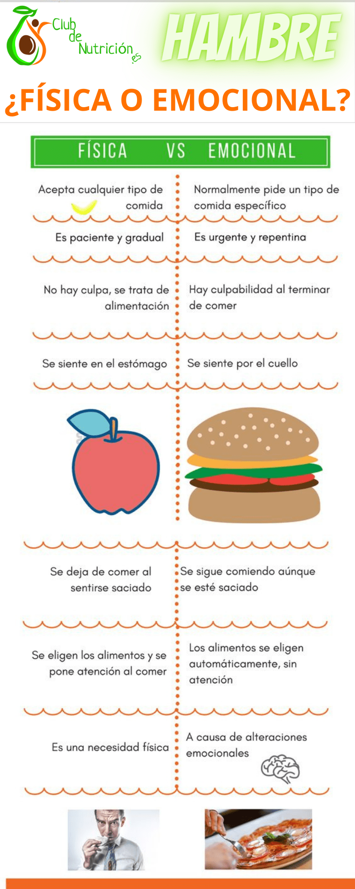

## Hambre Física o Emocional: ¿Cómo Diferenciarlas?

### ¿Qué es el Hambre?

El hambre es esa sensación que tenemos cuando nuestro cuerpo necesita comida. Pero, ¿sabías que no siempre comemos porque tenemos hambre de verdad? A veces, comemos porque estamos tristes, aburridos o nerviosos. ¡Vamos a aprender más sobre esto!

## Hambre Física: ¿Qué es?

### Señales de Hambre Física

El hambre física es cuando tu cuerpo realmente necesita comida para tener energía. Aquí hay algunas señales de que tienes hambre física:

- Ruido en el Estómago: Tu barriga hace ruidos como gruñidos.
- Debilidad o Mareo: Te sientes débil o mareado.
- Bajo Nivel de Energía: Te sientes cansado y sin fuerzas.
- Dolor de Cabeza: A veces, el hambre física puede causar dolores de cabeza.

### ¿Cuándo Ocurre?

El hambre física generalmente ocurre varias horas después de haber comido. Es la manera que tiene tu cuerpo de decirte que necesita más combustible para seguir funcionando.

El hambre física, es una necesidad biológica. En este tipo de hambre, comemos para nutrir nuestro cuerpo, que esté fuerte y pueda afrontar el día a día. Se manifiesta de forma gradual y paciente. Acepta cualquier tipo de comida, por lo que somos libres de elegirla. Paramos al estar saciados.

## Hambre Emocional: ¿Qué es?

### Señales de Hambre Emocional

El hambre emocional es cuando comes no porque tengas hambre, sino porque tus emociones te están diciendo que lo hagas. Algunas señales de hambre emocional son:

- Comer de Repente: Te dan ganas de comer de repente, sin previo aviso.
- Antojo de Comida Específica: Quieres comer algo específico, como chocolate o papas fritas.
- Comer para Sentirte Mejor: Comes para sentirte feliz, calmarte o porque estás aburrido.
- No Parar de Comer: Sigues comiendo incluso después de estar lleno.

### ¿Cuándo Ocurre?

El hambre emocional puede ocurrir en cualquier momento, especialmente cuando estás pasando por algo difícil o te sientes aburrido. No está relacionado con la necesidad de energía de tu cuerpo.

_El hambre emocional_, es una vía de escape. Este tipo de hambre, lo usamos para «sentirnos mejor». Esto es muy relativo, ya que podemos sentirnos mejor en el momento, pero la mayoría de las veces, nos hace sentir culpable. Se manifiesta de repente y con urgencia. Nos induce hacia un tipo de comida concreto, normalmente poco sano. Nos hace comer incluso cuando nos hemos saciado.

## Diferenciar Hambre Física o Emocional

### Preguntas para Hacerte

Para saber si tienes hambre física o emocional, puedes hacerte estas preguntas:

1. **¿Cuándo Comí por Última Vez?**
   - Si han pasado varias horas, es probable que sea hambre física.
   - Si comiste hace poco, podría ser hambre emocional.
2. **¿Qué Tipo de Comida Quiero?**
   - Si quieres algo específico y poco saludable, podría ser hambre emocional.
   - Si cualquier comida saludable suena bien, es más probable que sea hambre física.
3. **¿Cómo Me Siento?**
   - Si te sientes emocional (triste, aburrido, estresado), podría ser hambre emocional.
   - Si te sientes físicamente débil o con poca energía, es más probable que sea hambre física.

#### Recomendamos Diario de Alimentación Consciente

A  continuación te dejo una infografía visual de la diferencia entre hambre física o emocional:

## Estrategias para Manejar el Hambre Emocional

#### 1\. Encuentra Alternativas

Busca otras formas de lidiar con tus emociones. Puedes hablar con un amigo, hacer ejercicio, leer un libro o hacer una actividad que te guste.

#### 2\. Escucha a Tu Cuerpo

Presta atención a las señales de tu cuerpo. Si no estás seguro, espera unos minutos antes de comer y pregúntate nuevamente si realmente tienes hambre.

#### 3\. Come Conscientemente

Cuando comas, hazlo despacio y disfruta cada bocado. Esto te ayudará a reconocer cuándo estás lleno y evitará que comas en exceso.

## En definitiva...

Diferenciar entre el hambre física o emocional es importante para mantener una alimentación saludable. El hambre física es la forma en que tu cuerpo te pide energía, mientras que el hambre emocional está relacionada con tus sentimientos. Aprender a escuchar a tu cuerpo y encontrar maneras saludables de manejar tus emociones te ayudará a hacer mejores elecciones alimenticias.

Recuerda, está bien disfrutar de tus comidas favoritas, pero también es importante cuidar de tu cuerpo y tus emociones de manera saludable. ¡Escucha a tu cuerpo y dale lo que realmente necesita!

Veamos a continuación un [vídeo](https://youtu.be/-c_mF0GeiH8) sobre el hambre emocional y el hambre física:

Nos vemos en el camino 🙂

Si quieres saber más sobre nutrición y vida sana, [suscríbete a mi canal](https://www.youtube.com/user/nutriclubweb) y sigue mi página de [Facebook](https://www.facebook.com/clubdenutricion.es/). Visita la sección de blog [aquí](/blog/).
