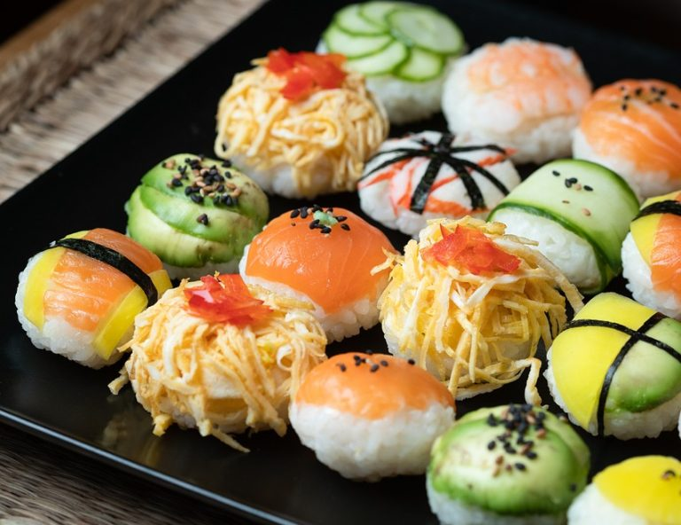
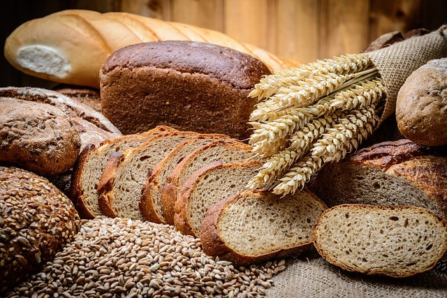
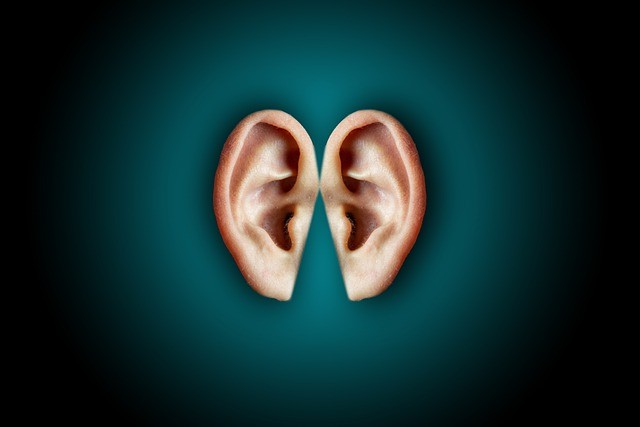
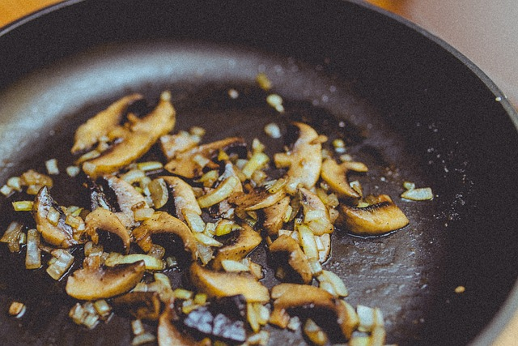
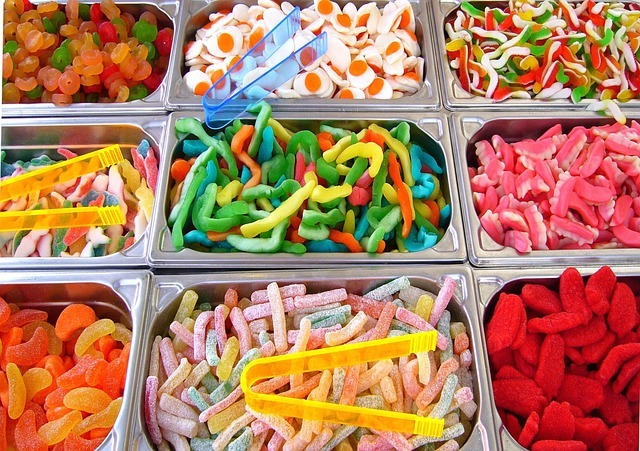
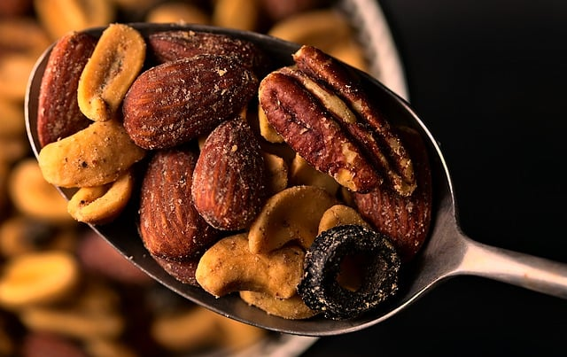

El hambre es una sensación compleja que no solo involucra al estómago, sino también a nuestros cinco sentidos. En este artículo, exploraremos cómo cada uno de los sentidos corporales juega un papel crucial en la percepción del hambre y la alimentación, respaldado por los últimos estudios. Descubre cómo estos sentidos afectan tus hábitos alimenticios y cómo puedes utilizar este conocimiento para mejorar tu salud.

## ¿Qué es el Hambre?

El hambre es una señal biológica que indica la necesidad de nutrientes y energía. Aunque comúnmente se asocia con la sensación de vacío en el estómago, esta experiencia es mucho más compleja e involucra la interacción de varios sentidos y señales hormonales.

## El hambre y los 5 sentidos corporales

### 1.- El hambre visual:

¿No te ha pasado alguna vez que estás tan a gusto viendo una serie, y en el intermedio hay un anuncio de comida que te hace levantarte e ir a la cocina a por algo de comer? Pues bien, este es el tipo de hambre visual. 1 segundo antes de ver el anuncio, ni siquiera pensábamos en comida, pero ahora parece que tenemos que comer urgentemente. Los colores, formas y presentación de los alimentos pueden desencadenar el deseo de comer incluso antes de que tengamos hambre física. Estudios han demostrado que los alimentos con colores vibrantes y presentaciones atractivas pueden aumentar el apetito. ¿Crees que este hambre es real?

### 2.- El hambre olfativo:

Seguro que más de una vez has ido caminando, y al pasar por la panadería de tu barrio te ha llegado el olor a pan recién hecho. ¿Qué ha sucedido con tu hambre? Seguramente incluso estabas recién desayunada, pero el olor te ha parecido irresistible. ¿Cuántas veces has entrado a comprar pan u otra cosa, sólo por el olor que has percibido? Seguro que muchas veces. Aquí has experimentado el hambre olfativa. El olfato tiene un poder significativo para influir en el hambre. Aromas agradables de alimentos pueden activar las glándulas salivales y preparar el sistema digestivo para la ingesta de alimentos. Un estudio encontró que ciertos olores, como el de la canela y la vainilla, pueden aumentar el deseo de comer.

### 3.- El hambre auditivo:

El oído también juega un papel en la percepción del hambre. Los sonidos relacionados con la comida, como el crujido de un bocadillo o el chisporroteo de los alimentos en la sartén, pueden aumentar el apetito. Un estudio destacó que los sonidos ambientales en los restaurantes pueden influir en la cantidad de comida consumida.
Estás en casa, por ejemplo, en el portátil viendo, leyendo, escribiendo... haciendo algo que suelas hacer. De repente escuchas por la ventana que da al patio interior un ruido de cubiertos y platos. ¿Qué piensas en ese momento? Seguro que, en gran cantidad de ocasiones, ni te habías dado cuenta de la hora que era, o quizás ni es la hora en la que comes habitualmente, pero... Más de una vez acudes a la cocina a coger algo que te calme. ¿No es cierto? Tal vez alguien que está a tu lado en el transporte público está comiendo algo. ¿No te entran ganas de comer a ti también? Estás experimentando hambre auditiva.

## El hambre y los 5 sentidos corporales

### 4\. Hambre del gusto:

Es el comer por puro placer. Ni siquiera tienes hambre, simplemente piensas en la sensación de placer que te aportará el sabor de ese alimento. Un placer vanal y pasajero. ¿Sueles comer por placer más que por necesidad real? Este tipo de hambre es de los más recurrentes. Caemos fácilmente en él. Un ejemplo es cuando después de comer "necesitas" algo dulce.

### 5.- El hambre táctil:

Por último, tenemos el hambre del tacto. Este hambre es el que se activa cuando pensamos en las texturas de los alimentos. Por ejemplo, unos snacks crujientes, un flan cremoso... Por eso, en muchos productos, aparece este tipo de información, para despertar nuestra hambre táctil. Yogures cremosos, snacks crujientes, frutos secos tostados... ¿Verdad que suenan más apetecibles con este "apellido"?

¿Estás preparad@ para tomar consciencia y elegir la forma en que te alimentas?

Como puedes observar, tenemos gran cantidad de señales. Éstas nos llevan a comer compulsivamente, sin siquiera tener un hambre real. Por eso te invito a que hagas un ejercicio práctico; cuando tengas hambre, sé consciente y averigua de dónde viene ese hambre, si viene de algún sentido corporal, y de cuál. Relaciónalo con los estímulos que estés recibiendo. Y lo más importante: elije si ese estímulo va a controlarte o si vas a ser tú quien controle tus acciones.

Nos vemos en el camino 🙂

Si quieres saber más sobre nutrición y vida sana, [suscríbete a mi canal](https://www.youtube.com/user/nutriclubweb) y sigue mi página de [Facebook](https://www.facebook.com/clubdenutricion.es/). Visita la sección de blog [aquí](/blog/).
