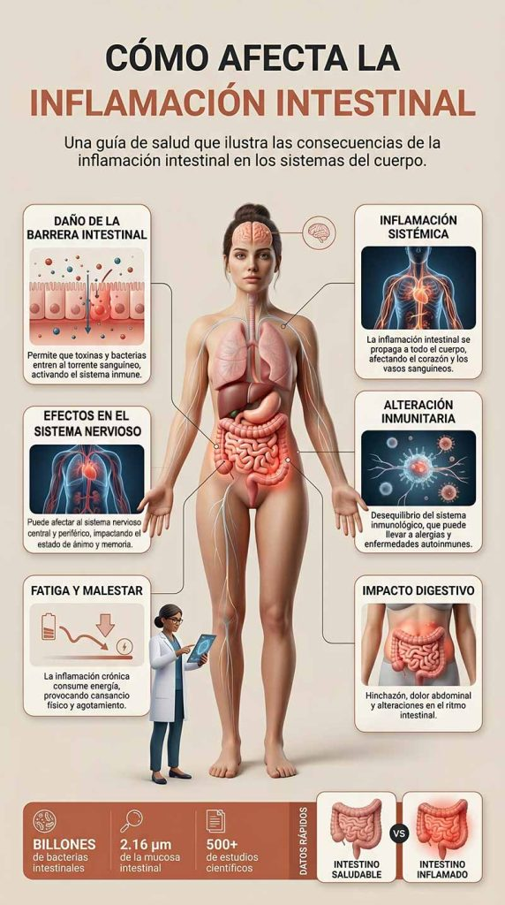

Descubre la inflamación intestinal, síntomas y tratamiento natural, junto con sus principales causas y los mejores métodos para aliviarla y mejorar tu salud digestiva.

## Introducción

La inflamación intestinal es un problema digestivo cada vez más frecuente que puede afectar a personas de cualquier edad o sexo. Se manifiesta a través de síntomas como dolor abdominal, diarrea, hinchazón, fatiga y malestar general, que pueden llegar a interferir en la calidad de vida diaria.

En este artículo vamos a analizar de forma clara cuáles son las principales causas de la inflamación intestinal y, sobre todo, qué estrategias naturales pueden ayudarte a reducirla y mejorar tu salud digestiva de manera efectiva.

## Qué vas a aprender

En este artículo descubrirás cuáles son las principales causas de la inflamación intestinal y cómo identificarlas en tu día a día. Además, aprenderás qué estrategias naturales pueden ayudarte a reducirla, incluyendo cambios en la alimentación, el uso de suplementos específicos y la adopción de hábitos de vida que favorezcan una mejor salud digestiva.

## ¿Qué es la inflamación intestinal?

La inflamación intestinal es una alteración del sistema digestivo que ocurre cuando la mucosa del intestino se irrita o se inflama. Este proceso puede afectar a la digestión normal y provocar síntomas como dolor abdominal, diarrea, hinchazón, gases, fatiga y sensación de malestar general.

Aunque en algunos casos puede ser puntual, cuando se mantiene en el tiempo puede estar relacionada con una mala alimentación, el estrés crónico, infecciones intestinales o determinadas enfermedades digestivas. Por eso, identificar su origen es clave para poder abordarla de forma adecuada y mejorar la salud intestinal de manera efectiva.

## Síntomas de la inflamación intestinal

Los síntomas pueden variar en intensidad y presentación de una persona a otra

Los síntomas de la inflamación intestinal pueden ser muy diversos y no siempre se presentan de la misma forma en todos los casos. Entre los más frecuentes se encuentran el dolor abdominal, la diarrea, la hinchazón, la fatiga, las molestias digestivas y la pérdida de apetito.

En situaciones más avanzadas o cuando la inflamación es más intensa, pueden aparecer signos de alerta como sangre en las heces, fiebre o dolor abdominal severo. En estos casos, es importante prestar atención y valorar una evaluación médica para descartar complicaciones o patologías digestivas más serias.

## Cómo afecta la inflamación intestinal al cuerpo

La inflamación intestinal no se limita al sistema digestivo

La inflamación intestinal no solo afecta al intestino, sino que puede tener repercusiones en todo el organismo.

Cuando el proceso inflamatorio se mantiene en el tiempo, puede dañar la mucosa intestinal y alterar su función de barrera, lo que favorece el paso de sustancias no deseadas al torrente sanguíneo.

Este desequilibrio puede generar una respuesta inflamatoria sistémica que impacta en distintos tejidos y órganos, contribuyendo a síntomas como fatiga persistente, malestar general o empeoramiento de otras condiciones de salud.

Además, la inflamación intestinal también puede alterar el sistema inmunológico, reduciendo su eficacia y aumentando la susceptibilidad a infecciones y otros desequilibrios inmunitarios.

Por este motivo, cuidar la salud intestinal no solo es importante para la digestión, sino para el bienestar general del organismo.

## Relación entre la inflamación intestinal y la microbiota

La microbiota es clave para la salud digestiva e inmunitaria

La microbiota intestinal es el conjunto de microorganismos que viven de forma natural en el intestino y desempeñan un papel fundamental en la salud digestiva.

Su función principal no se limita solo a la digestión, sino que también participa en la absorción de nutrientes, la producción de ciertas vitaminas y la regulación del sistema inmunológico.

Cuando existe inflamación intestinal, este equilibrio se puede ver alterado.

A esta situación se le conoce como disbiosis, y puede provocar una reducción de bacterias beneficiosas y un aumento de microorganismos potencialmente perjudiciales.

Este desequilibrio en la microbiota puede contribuir a empeorar los síntomas digestivos, aumentar la inflamación y favorecer la aparición de problemas de salud a medio y largo plazo.

Por ello, mantener una microbiota equilibrada es un factor clave en la prevención y el manejo de la inflamación intestinal.

## Soluciones naturales para reducir la inflamación intestinal

Existen distintos enfoques naturales que pueden ayudar a mejorar la salud intestinal y reducir la inflamación

La inflamación intestinal puede mejorar significativamente cuando se aplican cambios sostenidos en el estilo de vida. No existe una única solución, sino un conjunto de hábitos que, combinados, ayudan a reducir la inflamación, mejorar la microbiota y favorecer una mejor función digestiva.

A continuación, te mostramos las principales estrategias naturales respaldadas por la evidencia científica.

### Alimentación antiinflamatoria

Una dieta rica en alimentos frescos como frutas, verduras, legumbres y grasas saludables ayuda a reducir la inflamación intestinal. Es clave evitar ultraprocesados, azúcares añadidos y grasas trans.

### Ejercicio moderado

El ejercicio moderado mejora la motilidad intestinal y reduce el estrés, contribuyendo a un entorno antiinflamatorio en el organismo.

### Probióticos y microbiota intestinal

Los probióticos pueden ayudar a equilibrar la microbiota intestinal en casos de disbiosis. Su efecto depende de la cepa y del caso concreto.

### Sueño reparador

Dormir entre 7 y 8 horas favorece la regulación hormonal y reduce procesos inflamatorios. La falta de sueño puede empeorar la salud digestiva.

### Gestión del estrés

El estrés crónico puede aumentar la inflamación intestinal a través del eje intestino-cerebro. Técnicas como respiración, meditación o yoga ayudan a mejorar los síntomas.

### Reducción de alimentos proinflamatorios

Reducir ultraprocesados, azúcares y grasas trans ayuda a disminuir la inflamación intestinal y mejorar el equilibrio digestivo.

## Preguntas frecuentes

¿Qué es la inflamación intestinal?

La inflamación intestinal es una respuesta del sistema digestivo cuando la mucosa del intestino se irrita o se altera. Puede afectar a la digestión normal y provocar síntomas como dolor abdominal, hinchazón, diarrea, gases o fatiga. En algunos casos puede ser puntual, pero cuando se mantiene en el tiempo puede indicar un desequilibrio intestinal o la presencia de una patología digestiva que requiere evaluación.

¿Cuáles son las causas de la inflamación intestinal?

Las causas pueden ser variadas y, en muchos casos, se combinan entre sí. Las más frecuentes incluyen una alimentación rica en ultraprocesados y pobre en fibra, el estrés crónico, infecciones intestinales, intolerancias alimentarias y alteraciones de la microbiota intestinal (disbiosis). También puede estar asociada a enfermedades digestivas como el síndrome de intestino irritable o enfermedades inflamatorias intestinales.

¿Cómo puedo reducir la inflamación intestinal?

La reducción de la inflamación intestinal suele requerir un enfoque global. Los pilares principales incluyen una alimentación antiinflamatoria, la reducción de alimentos ultraprocesados, la gestión del estrés, el descanso adecuado y el ejercicio moderado. En algunos casos, el uso de probióticos puede ayudar a mejorar el equilibrio de la microbiota, aunque su eficacia depende de cada situación individual.

¿Cuánto tiempo tarda en reducir la inflamación intestinal?

El tiempo de mejoría varía según la causa y el estado de cada persona. En casos leves relacionados con la dieta o el estrés, los síntomas pueden mejorar en pocos días o semanas al introducir cambios adecuados. Sin embargo, cuando existe un problema crónico o una alteración de la microbiota más profunda, la recuperación puede requerir varias semanas o incluso meses de tratamiento y ajustes progresivos en el estilo de vida.

¿La inflamación intestinal siempre es peligrosa?

No siempre. En muchos casos es una respuesta puntual del organismo a la alimentación, el estrés o infecciones leves. Sin embargo, si los síntomas son persistentes, intensos o incluyen señales como sangre en heces o fiebre, es importante consultar con un profesional de la salud.

¿Los probióticos sirven para todos los casos?

No necesariamente. Los probióticos pueden ser útiles en casos de disbiosis intestinal, pero su efecto depende del tipo de cepa, la dosis y la condición específica de cada persona. Por eso, no siempre son una solución universal.

## conclusión

La inflamación intestinal es un problema digestivo frecuente que puede provocar síntomas como dolor abdominal, diarrea, hinchazón y malestar general. Aunque puede resultar molesta e incluso limitante, en muchos casos es posible mejorarla mediante cambios en el estilo de vida.

Una alimentación equilibrada, la reducción de alimentos ultraprocesados, la gestión del estrés, el ejercicio regular y el descanso adecuado son estrategias clave para favorecer la salud intestinal. En algunos casos, los probióticos pueden ser un apoyo adicional para mejorar el equilibrio de la microbiota.

Aun así, si los síntomas persisten, se intensifican o aparecen señales de alarma, es fundamental consultar con un profesional de la salud para identificar la causa y recibir un tratamiento adecuado.
