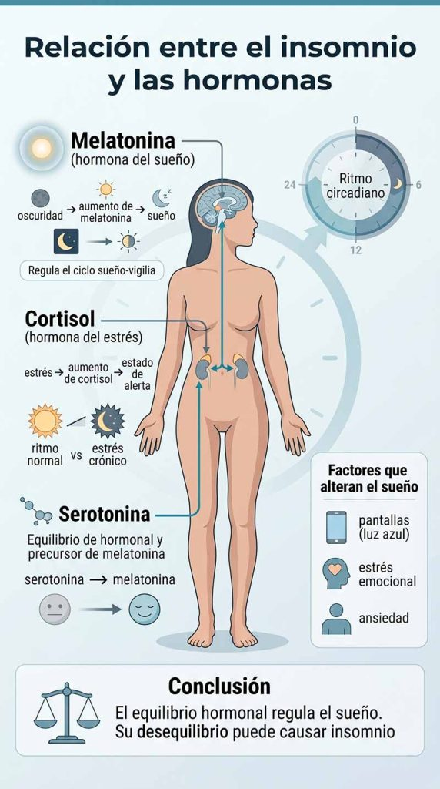

Descubre qué causa el insomnio, cuáles son sus síntomas más frecuentes y cómo mejorar la calidad del sueño con hábitos y soluciones naturales respaldadas por la ciencia.

## Introducción

El insomnio es uno de los trastornos del sueño más frecuentes y puede afectar de forma significativa a la salud física y mental. La dificultad para dormir, los despertares nocturnos o la sensación de no descansar correctamente suelen estar relacionados con factores como el estrés, la ansiedad, los cambios hormonales o unos hábitos de sueño poco saludables.

Además de provocar cansancio y falta de energía, dormir mal de forma continuada también puede influir en el estado de ánimo, la concentración y la calidad de vida. Por eso, identificar las causas del insomnio es fundamental para mejorar el descanso y recuperar un sueño reparador.

En este artículo descubrirás cuáles son los síntomas más comunes del insomnio, qué factores pueden desencadenarlo y qué soluciones naturales pueden ayudarte a dormir mejor cada noche.

## Qué vas a aprender

En este artículo descubrirás qué es el insomnio, cuáles son sus principales causas y qué síntomas pueden indicar un problema en la calidad del sueño. Además, aprenderás cómo afectan el estrés, la ansiedad, los hábitos diarios y el estilo de vida al descanso nocturno.

También conocerás estrategias naturales y prácticas para dormir mejor, incluyendo técnicas de relajación, hábitos saludables, cambios en la alimentación y consejos para crear un entorno adecuado que favorezca un sueño profundo y reparador.

## ¿Qué es el insomnio?

Definición y explicación del insomnio

El insomnio es un trastorno del sueño que se caracteriza por la dificultad para conciliar el sueño, mantenerlo durante la noche o despertarse demasiado temprano sin poder volver a dormir. Como resultado, la persona no consigue un descanso reparador, lo que afecta directamente a su energía, concentración y bienestar general durante el día.

Este problema puede aparecer de forma puntual (insomnio agudo), generalmente relacionado con situaciones de estrés, cambios en la rutina, preocupaciones o eventos vitales concretos. Sin embargo, cuando se mantiene en el tiempo durante semanas o incluso meses, se considera insomnio crónico, una condición que puede tener un impacto importante en la salud física y mental.

El insomnio no tiene una única causa, sino que suele ser el resultado de varios factores combinados. Entre los más comunes se encuentran el estrés continuado, la ansiedad, la depresión y un estilo de vida poco saludable. También influyen de manera significativa los hábitos de sueño, como horarios irregulares, el uso excesivo de pantallas antes de dormir, el consumo de cafeína o la falta de una rutina nocturna adecuada.

En muchos casos, el insomnio funciona como una respuesta del cuerpo y la mente a un estado de activación constante, en el que el sistema nervioso no consigue “desconectar” por completo. Esto dificulta la transición natural hacia el sueño y provoca un descanso superficial o fragmentado.

Comprender qué es el insomnio y cómo se manifiesta es el primer paso para poder abordarlo de forma efectiva. A partir de ahí, es posible identificar sus desencadenantes y aplicar estrategias que ayuden a recuperar un patrón de sueño más estable y reparador.

## Síntomas del insomnio

Signos y síntomas del insomnio

Los síntomas del insomnio pueden manifestarse de distintas formas y no afectan únicamente a la noche, sino también al rendimiento y bienestar durante el día.

Uno de los signos más comunes es la dificultad para conciliar el sueño, es decir, tardar mucho tiempo en dormirse a pesar de tener cansancio. También es frecuente despertarse varias veces durante la noche o despertarse demasiado temprano sin conseguir volver a dormir.

Otro síntoma característico es la sensación de sueño poco reparador, como si el descanso no hubiera sido suficiente, incluso después de haber pasado varias horas en la cama. Esto suele ir acompañado de fatiga persistente, falta de energía y somnolencia durante el día.

A nivel cognitivo, el insomnio puede provocar dificultad para concentrarse, problemas de memoria y menor capacidad de atención, lo que afecta al rendimiento laboral o académico. Es habitual también experimentar una sensación de “mente nublada” o lentitud mental.

En el plano emocional, el insomnio puede influir directamente en el estado de ánimo.

Muchas personas presentan irritabilidad, cambios de humor, mayor sensibilidad al estrés e incluso síntomas de ansiedad. En algunos casos, cuando el problema se prolonga en el tiempo, también puede contribuir a estados depresivos o a empeorar trastornos emocionales ya existentes.

En conjunto, estos síntomas reflejan cómo el insomnio no es solo un problema nocturno, sino una condición que impacta en múltiples áreas de la vida diaria.

## Cómo afecta el insomnio al cuerpo

Impacto del insomnio en la salud

El insomnio no solo provoca una mala noche de sueño, sino que tiene efectos directos y acumulativos sobre la salud física y mental.

A corto plazo, uno de los impactos más evidentes es la fatiga constante, que se traduce en sensación de agotamiento incluso después de descansar.

Esta falta de energía suele ir acompañada de somnolencia diurna, menor rendimiento y dificultad para mantener un nivel óptimo de actividad.

A nivel cognitivo, el insomnio afecta de forma significativa a la concentración, la memoria y la capacidad de tomar decisiones.

El cerebro no logra recuperarse correctamente durante la noche, lo que genera una sensación de lentitud mental y reduce la productividad en las tareas cotidianas.

En el plano emocional, la falta de sueño altera el equilibrio del sistema nervioso, aumentando la irritabilidad, la sensibilidad al estrés y la aparición de ansiedad.

Con el tiempo, esta desregulación puede contribuir a un estado de ánimo más inestable e incluso favorecer síntomas depresivos.

Cuando el insomnio se mantiene en el tiempo, sus efectos van más allá del bienestar diario y pueden influir en la salud metabólica y cardiovascular.

Diversos estudios han relacionado la falta crónica de sueño con un mayor riesgo de desarrollar hipertensión, resistencia a la insulina, diabetes tipo 2 y aumento de peso u obesidad.

Esto ocurre porque el sueño es clave en la regulación hormonal, el metabolismo y la recuperación del organismo.

En conjunto, el insomnio no debe considerarse un problema menor, ya que su impacto afecta tanto al funcionamiento diario como a la salud a largo plazo si no se aborda de forma adecuada.

## Relación entre el insomnio y las hormonas

Cómo las hormonas pueden afectar el sueño

El sueño está regulado por un delicado equilibrio hormonal que influye directamente en la calidad y duración del descanso.

Cuando este sistema se altera, pueden aparecer dificultades para dormir, despertares nocturnos o un sueño poco reparador.

Una de las hormonas más importantes en este proceso es la **melatonina**, conocida como la “hormona del sueño”.

Su función principal es regular el ciclo sueño-vigilia, indicando al organismo cuándo es el momento de descansar.

Esta hormona se produce en mayor cantidad cuando disminuye la luz ambiental, especialmente por la noche, favoreciendo la somnolencia y la conciliación del sueño.

Sin embargo, la exposición excesiva a pantallas o luz artificial antes de dormir puede reducir su producción y dificultar el inicio del sueño.

Por otro lado, el **cortisol**, conocido como la hormona del estrés, también juega un papel clave.

En condiciones normales, sus niveles son más altos por la mañana para ayudarnos a estar activos y disminuyen por la noche para facilitar el descanso.

No obstante, cuando existe estrés crónico o ansiedad, el cortisol puede mantenerse elevado durante la noche, lo que genera un estado de alerta que dificulta conciliar el sueño o provoca despertares frecuentes.

Además, otras hormonas como la serotonina también influyen en el equilibrio del sueño, ya que actúan como precursoras de la melatonina y participan en la regulación del estado de ánimo.

Por este motivo, alteraciones emocionales como la ansiedad o la depresión pueden impactar directamente en la calidad del descanso.

En conjunto, el insomnio no solo depende de hábitos o factores externos, sino también de un complejo sistema hormonal que, cuando se desequilibra, puede alterar profundamente el ciclo natural del sueño.

## Soluciones para el insomnio

Estrategias para dormir mejor de forma natural

Dormir bien no depende solo de “intentar relajarse”, sino de construir una serie de hábitos diarios que ayuden al cuerpo a regular su propio ritmo de sueño.

Cuando el sistema nervioso está equilibrado y el entorno es adecuado, el descanso mejora de forma progresiva y natural. A continuación, verás estrategias prácticas y efectivas para reducir el insomnio y mejorar la calidad del sueño.

### Establece un horario de sueño regular

Ir a la cama y despertarse a la misma hora todos los días ayuda a regular el ritmo circadiano. Esta consistencia entrena al cuerpo para reconocer cuándo es momento de dormir y cuándo es momento de activarse, mejorando progresivamente la calidad del sueño.

### Crea un entorno de sueño saludable

El dormitorio debe favorecer el descanso: oscuro, silencioso y con una temperatura agradable. Una cama cómoda y un buen colchón también son claves. Reducir estímulos externos ayuda al cerebro a entrar en modo de descanso más fácilmente.

### Practica técnicas de relajación

Técnicas como la respiración profunda, la meditación o el yoga ayudan a reducir la activación mental y física.

Estas prácticas disminuyen el estrés acumulado del día y facilitan la transición hacia el sueño.

### Evita la cafeína y el alcohol

La cafeína puede mantenerse activa en el organismo durante horas, dificultando la conciliación del sueño. El alcohol, aunque puede generar somnolencia inicial, altera las fases profundas del descanso. Evitarlos en las horas previas a dormir mejora significativamente la calidad del sueño.

### Mantén una rutina de ejercicio regular

El ejercicio ayuda a reducir el estrés y mejora la calidad del sueño profundo. Sin embargo, es recomendable evitar entrenamientos intensos justo antes de acostarse, ya que pueden activar demasiado el sistema nervioso.

### Reduce el uso de pantallas antes de dormir

La luz azul de móviles, tablets y televisores puede inhibir la producción de melatonina, dificultando el sueño. Reducir su uso al menos 1 hora antes de dormir ayuda a preparar al cerebro para el descanso.

### Busca ayuda profesional si el insomnio persiste

Si el insomnio se mantiene en el tiempo, es importante acudir a un profesional de la salud. Un médico o terapeuta puede identificar causas subyacentes y diseñar un plan personalizado para mejorar el sueño de forma efectiva.

## Preguntas frecuentes

¿Cuánto sueño necesito?

La cantidad de sueño recomendada depende de la edad, pero en adultos lo habitual es entre **7 y 9 horas por noche**. Sin embargo, no solo importa la cantidad, sino también la calidad del sueño. Dormir de forma continua y profunda es clave para una buena recuperación física y mental.

¿Qué es la apnea del sueño?

La apnea del sueño es un trastorno en el que la respiración se interrumpe de forma repetida durante la noche. Estas pausas pueden provocar despertares frecuentes, sueño poco reparador y somnolencia diurna. Es una condición que debe ser diagnosticada y tratada por un profesional sanitario.

¿Qué es la narcolepsia?

La narcolepsia es un trastorno neurológico que afecta al control del sueño y la vigilia. Se caracteriza por una somnolencia excesiva durante el día y episodios repentinos de sueño incontrolable, incluso en situaciones cotidianas.

¿Qué es el síndrome de piernas inquietas?

El síndrome de piernas inquietas es una alteración neurológica que provoca una necesidad irresistible de mover las piernas, especialmente en reposo o durante la noche. Esta sensación puede dificultar la conciliación del sueño y afectar a su calidad.

¿El insomnio puede desaparecer por sí solo?

El insomnio ocasional puede mejorar cuando desaparece el factor que lo provoca, como el estrés puntual o un cambio de rutina. Sin embargo, cuando se vuelve persistente, es importante identificar la causa y aplicar cambios en los hábitos o buscar ayuda profesional.

¿Qué hábitos empeoran el insomnio?

El uso de pantallas antes de dormir, el consumo de cafeína o alcohol por la tarde-noche, los horarios de sueño irregulares y un nivel alto de estrés pueden empeorar significativamente el insomnio.

¿Cuándo debo preocuparme por el insomnio?

Se recomienda consultar con un profesional cuando el insomnio dura varias semanas, afecta al rendimiento diario o provoca síntomas como fatiga intensa, ansiedad o problemas de concentración.

## conclusión

El insomnio es un trastorno del sueño muy frecuente que puede afectar de forma importante a la energía, el estado de ánimo y la calidad de vida en general. Aunque sus causas pueden ser variadas, desde el estrés hasta los malos hábitos de sueño, en la mayoría de los casos es posible mejorar significativamente la situación con cambios progresivos en el estilo de vida.

Adoptar una rutina de sueño estable, cuidar el entorno en el que duermes y reducir factores que alteran el descanso, como la cafeína, el alcohol o el uso de pantallas antes de dormir, puede marcar una gran diferencia. Del mismo modo, incorporar técnicas de relajación ayuda a calmar el sistema nervioso y facilita la conciliación del sueño de forma natural.

En definitiva, mejorar el insomnio no suele depender de una única solución, sino de la combinación de varios hábitos saludables aplicados de forma constante. Con pequeños cambios sostenidos en el tiempo, es posible recuperar un sueño reparador y despertar con mayor vitalidad cada día.
