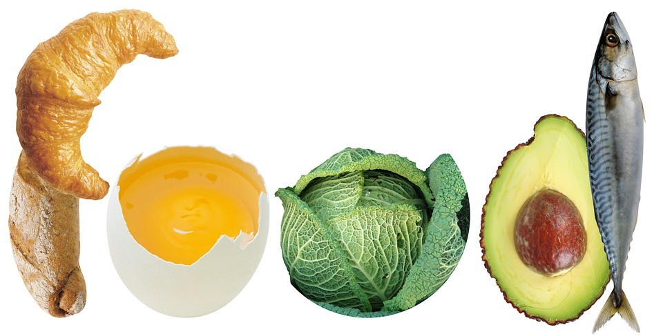
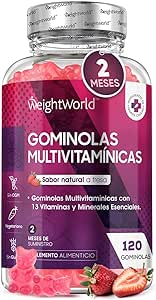

Los macronutrientes y micronutrientes son esenciales para el funcionamiento del cuerpo humano. Los macronutrientes son nutrientes que el cuerpo necesita en grandes cantidades para obtener energía y mantener la estructura corporal. Los micronutrientes, por otro lado, son necesarios en menores cantidades pero son cruciales para el correcto funcionamiento de los procesos metabólicos y el mantenimiento de la salud general. Ambos tipos de nutrientes son vitales para el crecimiento, desarrollo y bienestar del organismo.

### MACRONUTRIENTES:

Los macronutrientes son los nutrientes que tu cuerpo necesita en grandes cantidades para crecer y tener energía. Son como el combustible que hace que tu cuerpo funcione bien. Hay tres tipos principales de macronutrientes:

1. **Carbohidratos**: Son como la gasolina para tu cuerpo, te dan energía rápida para moverte y pensar. Los encuentras en cosas como pan, frutas y pasta.
2. **Proteínas**: Ayudan a construir y reparar todo en tu cuerpo, como los músculos. Están en alimentos como carne, huevos y frijoles.
3. **Grasas**: No todas las grasas son malas. Las buenas te dan energía y ayudan a tu cuerpo a funcionar. Las encuentras en alimentos como aguacates, nueces y aceite de oliva.

Así que, los macronutrientes son súper importantes para que puedas moverte, pensar y estar saludable.

## MICRONUTRIENTES:

Los micronutrientes son nutrientes que tu cuerpo necesita en pequeñas cantidades, pero son súper importantes para que todo funcione bien. Aunque no los necesitas en grandes cantidades como los macronutrientes, son esenciales para tu salud. Hay dos tipos principales de micronutrientes:

1. **Vitaminas**: Son como pequeñas ayudantes que mantienen tu cuerpo funcionando correctamente. Te ayudan a ver bien, a tener energía y a que tu sistema inmunológico sea fuerte. Las encuentras en frutas, verduras y productos lácteos.
2. **Minerales**: Son como pequeños constructores que mantienen tus huesos fuertes y ayudan a que tu corazón lata correctamente. Están en alimentos como carnes, cereales y vegetales.

Aunque son pequeñitos, los micronutrientes son esenciales para que tu cuerpo funcione correctamente.

### [Recomendamos: Gominolas Multivitamínicas](https://amzn.to/45Fw0Qm)

¡Cuida tu salud de una manera deliciosa! Estas pequeñas delicias no solo son una forma divertida y sabrosa de asegurarte de que estás obteniendo las vitaminas y minerales esenciales que tu cuerpo necesita, sino que también son ideales para toda la familia.

[Comprar](https://amzn.to/45Fw0Qm)

Puedes ver el vídeo a continuación:

YouTube

Nos vemos en el camino 🙂

Si quieres saber más sobre nutrición y vida sana, [suscríbete a mi canal](https://www.youtube.com/user/nutriclubweb) y sigue mi página de [Facebook](https://www.facebook.com/clubdenutricion.es/). Visita la sección de blog [aquí](/blog/).
