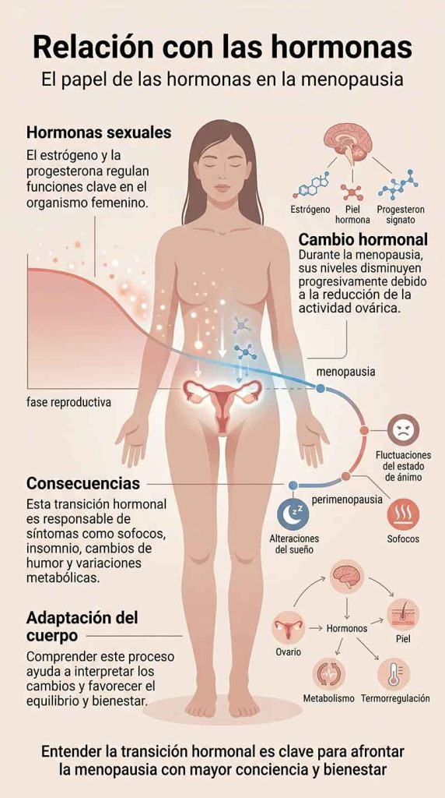

Descubre todo sobre la menopausia: síntomas, fases, cambios hormonales y cómo afecta a tu cuerpo, además de estrategias naturales para afrontar esta etapa de forma saludable

#### Tabla de contenidos

01. [Introducción](/menopausia-sintomas-cambios-hormonales/#elementor-toc__heading-anchor-0)

02. [Qué vas a aprender](/menopausia-sintomas-cambios-hormonales/#elementor-toc__heading-anchor-1)

03. [¿Qué es la menopausia?](/menopausia-sintomas-cambios-hormonales/#elementor-toc__heading-anchor-2)

04. [Síntomas de la menopausia](/menopausia-sintomas-cambios-hormonales/#elementor-toc__heading-anchor-3)

05. [Cómo afecta la menopausia a tu cuerpo](/menopausia-sintomas-cambios-hormonales/#elementor-toc__heading-anchor-4)

06. [Relación con las hormonas](/menopausia-sintomas-cambios-hormonales/#elementor-toc__heading-anchor-5)

07. [Soluciones para la menopausia](/menopausia-sintomas-cambios-hormonales/#elementor-toc__heading-anchor-6)

    1. [Terapia de reemplazo hormonal](/menopausia-sintomas-cambios-hormonales/#elementor-toc__heading-anchor-7)

    2. [Tratamiento de los síntomas](/menopausia-sintomas-cambios-hormonales/#elementor-toc__heading-anchor-8)

    3. [Hábitos de vida saludables](/menopausia-sintomas-cambios-hormonales/#elementor-toc__heading-anchor-9)

    4. [Apoyo emocional y psicológico](/menopausia-sintomas-cambios-hormonales/#elementor-toc__heading-anchor-10)

    5. [Suplementos y salud ósea](/menopausia-sintomas-cambios-hormonales/#elementor-toc__heading-anchor-11)

    6. [Apoyo social](/menopausia-sintomas-cambios-hormonales/#elementor-toc__heading-anchor-12)
08. [Preguntas frecuentes](/menopausia-sintomas-cambios-hormonales/#elementor-toc__heading-anchor-13)

09. [conclusión](/menopausia-sintomas-cambios-hormonales/#elementor-toc__heading-anchor-14)

10. [Artículos relacionados](/menopausia-sintomas-cambios-hormonales/#elementor-toc__heading-anchor-15)

    1. [La perimenopausia puede empezar antes de lo esperado: estas son sus primeras señales](/menopausia-sintomas-cambios-hormonales/#elementor-toc__heading-anchor-16)

    2. [Ultraprocesados y salud digestiva: nueva alerta](/menopausia-sintomas-cambios-hormonales/#elementor-toc__heading-anchor-17)

    3. [Dieta cetogénica y salud cerebral: qué dice la ciencia sobre Alzheimer y Parkinson](/menopausia-sintomas-cambios-hormonales/#elementor-toc__heading-anchor-18)

    4. [El sueño profundo: la hormona natural que ayuda a regenerar músculo, metabolismo y cerebro](/menopausia-sintomas-cambios-hormonales/#elementor-toc__heading-anchor-19)

    5. [Colesterol alto: por qué el LDL aislado podría no contar toda la historia clínica](/menopausia-sintomas-cambios-hormonales/#elementor-toc__heading-anchor-20)
11. [¿Sientes que tu energía sube y baja constantemente?](/menopausia-sintomas-cambios-hormonales/#elementor-toc__heading-anchor-21)

## Introducción

La menopausia es una etapa natural en la vida de la mujer que, aunque forma parte del proceso de envejecimiento, a menudo se vive con incertidumbre debido a los cambios físicos y hormonales que la acompañan.

Durante esta transición, el cuerpo experimenta variaciones en los niveles hormonales que pueden influir en el estado de ánimo, el sueño, el metabolismo y el bienestar general, dando lugar a distintos síntomas que no siempre se reconocen con facilidad.

En este artículo encontrarás una guía clara para entender qué es la menopausia, cuáles son sus fases, los síntomas más habituales y cómo puede afectar al cuerpo, junto con información útil para afrontar esta etapa con mayor equilibrio y bienestar.

## Qué vas a aprender

En este artículo descubrirás los fundamentos de la menopausia y cómo esta etapa influye en el cuerpo y el bienestar de la mujer.

Aprenderás a identificar sus síntomas más comunes, entender las distintas fases por las que pasa el organismo y comprender qué cambios hormonales están implicados en este proceso.

Además, encontrarás una visión práctica sobre cómo afrontar sus efectos en el día a día, con estrategias que pueden ayudarte a vivir esta etapa con mayor equilibrio y calidad de vida.

## ¿Qué es la menopausia?

Definición y explicación del proceso

La menopausia es una etapa natural en la vida de la mujer que marca el cese permanente de la menstruación. Se produce cuando los ovarios reducen de forma progresiva su actividad y dejan de liberar óvulos, además de disminuir la producción de hormonas como el estrógeno y la progesterona.

Este cambio hormonal no ocurre de forma repentina, sino que forma parte de un proceso gradual que da paso al final de la etapa fértil y al inicio de una nueva fase en la que el cuerpo experimenta diferentes adaptaciones.

Estos cambios pueden influir en múltiples sistemas del organismo, afectando al metabolismo, el estado de ánimo, el sueño y el bienestar general.

## Síntomas de la menopausia

Identificar los cambios en tu cuerpo

Los síntomas de la menopausia pueden variar mucho de una mujer a otra, tanto en intensidad como en duración, ya que cada organismo responde de forma diferente a los cambios hormonales.

Entre los más frecuentes se encuentran los sofocos, la sudoración nocturna, los cambios de humor y la irritabilidad, así como la sequedad vaginal y las alteraciones en el sueño.

También es común que algunas mujeres noten dificultad para concentrarse, pequeños fallos de memoria, molestias articulares y cambios en el metabolismo que pueden influir en el peso corporal y en los niveles de energía.

Reconocer estas señales es importante para comprender mejor esta etapa y poder afrontarla con mayor bienestar.

## Cómo afecta la menopausia a tu cuerpo

Efectos a corto y largo plazo

La menopausia provoca una serie de cambios hormonales que pueden influir en diferentes sistemas del organismo, tanto a corto como a largo plazo.

En las primeras etapas, es común notar alteraciones en el sueño, cambios en el estado de ánimo, sofocos o fluctuaciones en los niveles de energía.

Estos síntomas están relacionados con la disminución progresiva de hormonas como el estrógeno.

Con el tiempo, la menopausia también puede tener impacto en la salud ósea, aumentando el riesgo de pérdida de densidad ósea, así como en el sistema cardiovascular, debido a los cambios metabólicos y hormonales.

Además, algunas mujeres pueden experimentar mayor vulnerabilidad emocional o cambios en el bienestar psicológico.

Comprender estos efectos ayuda a adoptar hábitos y estrategias que favorezcan un mejor equilibrio y cuidado de la salud en esta etapa.

## Relación con las hormonas

El papel de las hormonas en la menopausia

Las hormonas sexuales, especialmente el estrógeno y la progesterona, desempeñan un papel fundamental en el funcionamiento del organismo femenino a lo largo de la vida.

Durante la menopausia, los niveles de estas hormonas comienzan a disminuir de forma progresiva debido a la reducción de la actividad ovárica.

Este cambio es el principal responsable de muchos de los síntomas asociados a esta etapa, como los sofocos, las alteraciones del sueño, los cambios de humor o las variaciones en el metabolismo.

Comprender cómo se produce esta transición hormonal ayuda a interpretar mejor los cambios del cuerpo y a buscar estrategias que favorezcan un mayor equilibrio y bienestar durante esta fase.

## Soluciones para la menopausia

Manejar los síntomas y mejorar la calidad de vida

La menopausia es una etapa natural, pero sus síntomas pueden abordarse con diferentes enfoques que ayudan a mejorar el bienestar físico y emocional.

### Terapia de reemplazo hormonal

En algunos casos, la terapia hormonal puede ser una opción para aliviar síntomas como los sofocos o la sequedad vaginal, ya que ayuda a compensar la disminución de estrógenos. Su uso debe ser siempre supervisado por un profesional de la salud.

### Tratamiento de los síntomas

Existen distintos tratamientos médicos que pueden ayudar a controlar síntomas específicos como los cambios de humor, los sofocos o las molestias vaginales, dependiendo de cada caso.

### Hábitos de vida saludables

Mantener una alimentación equilibrada, realizar ejercicio de forma regular y gestionar el estrés son pilares fundamentales para mejorar la adaptación del cuerpo a esta etapa y reducir la intensidad de los síntomas.

### Apoyo emocional y psicológico

El acompañamiento emocional, ya sea a través de familiares, amigos o profesionales de la salud mental, puede ser muy útil para gestionar los cambios emocionales que pueden aparecer durante la menopausia.

### Suplementos y salud ósea

Algunos nutrientes como el calcio y la vitamina D pueden contribuir al mantenimiento de la salud ósea, ayudando a prevenir problemas como la pérdida de densidad ósea.

### Apoyo social

Formar parte de grupos de apoyo o espacios donde compartir experiencias puede ayudar a normalizar esta etapa y aportar una mayor sensación de comprensión y acompañamiento.

## Preguntas frecuentes

¿Qué es la menopausia prematura?

La menopausia prematura ocurre cuando el cese de la menstruación se produce antes de los 40 años. Puede estar relacionada con factores genéticos, enfermedades autoinmunes, tratamientos médicos o causas desconocidas, y suele implicar un inicio más temprano de los cambios hormonales asociados a esta etapa.

¿Cómo afecta la menopausia a la salud ósea?

La disminución de estrógenos durante la menopausia puede reducir la densidad ósea, aumentando el riesgo de osteoporosis y fracturas. Por ello, es importante cuidar la alimentación, asegurar un buen aporte de calcio y vitamina D, y mantener hábitos de vida saludables.

¿Existenalternativas naturales para manejar los síntomas?

Sí, algunos cambios en el estilo de vida pueden ayudar a mejorar los síntomas de la menopausia. Entre ellos destacan una alimentación equilibrada, el ejercicio regular, la gestión del estrés y el descanso adecuado. En algunos casos, también pueden utilizarse suplementos bajo supervisión profesional.

¿La menopausia puede afectar la relación de pareja?

Sí, los cambios hormonales pueden influir en aspectos como la libido, el estado de ánimo o la energía, lo que puede afectar la dinámica de pareja. La comunicación, el apoyo mutuo y la comprensión suelen ser clave para adaptarse a esta etapa de forma positiva.

## conclusión

La menopausia es una etapa natural en la vida de la mujer que forma parte del proceso de envejecimiento y que implica una serie de cambios hormonales inevitables.

Aunque puede venir acompañada de síntomas y desafíos físicos o emocionales, comprender qué está ocurriendo en el cuerpo, reconocer sus fases y entender sus efectos es clave para afrontarla con mayor tranquilidad y equilibrio.

Con el enfoque adecuado, hábitos saludables y el acompañamiento necesario, es posible mejorar el bienestar y adaptarse a esta etapa de forma más consciente y saludable.
