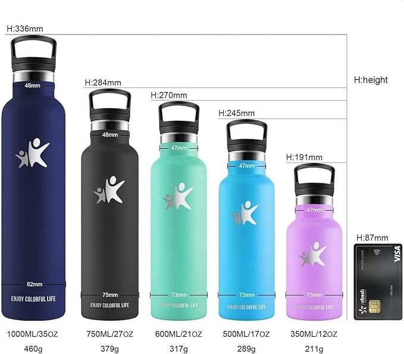

## Información acerca de qué es y cómo aumentarlo

**Metabolismo** ¿Qué es?

En pocas palabras, es la velocidad con la que nuestros organismo quema calorías, para realizar las funciones básicas de vida. Es por eso, que si es muy lento, quema menos calorías de lo normal, y por lo tanto, le costará mucho bajar de peso o mantenerlo. En el caso contrario, al ser rápido, quema más calorías, y por lo tanto será más fácil mantener un peso saludable.

### Mitos sobre el metabolismo:

### ¿CÓMO AUMENTAR EL METABOLISMO?

Se puede aumentar de varias formas.

#### 1\. Hacer ejercicio regularmente

El ejercicio, especialmente el entrenamiento con pesas y el cardio, ayuda a quemar calorías y a mantener o aumentar la masa muscular. Más músculo significa un metabolismo más rápido, porque los músculos queman más calorías que la grasa, incluso cuando estás en reposo.

#### 2\. Consumir suficiente proteína

Comer proteínas (como carne, pescado, huevos, granos, y nueces) en cada comida puede aumentar temporalmente tu metabolismo porque tu cuerpo usa más energía para digerirlas en comparación con las grasas o los carbohidratos. Además, la proteína ayuda a mantener la masa muscular.

#### 3\. Beber agua fría

El agua fría puede aumentar tu metabolismo porque tu cuerpo gasta energía (calorías) para calentar el agua hasta tu temperatura corporal. Además, mantenerse hidratado ayuda a tu cuerpo a funcionar de manera óptima.

##### [TIP: Botella de agua termo](https://amzn.to/3VKCytP)

¡Hazte con tu botella termo y lleva tu agua fría siempre contigo, para mantener un metabolismo activo.

[Comprar](https://amzn.to/3VKCytP)

#### 4\. Bebe café o té verde

Tanto el té verde como el café contienen cafeína, que puede aumentar temporalmente tu metabolismo. El té verde también tiene antioxidantes llamados catequinas, que pueden trabajar junto con la cafeína para mejorar el efecto quema-grasas.

#### 5\. Incorporar picante en las comidas

Los alimentos picantes, como los chiles, contienen capsaicina, una sustancia que puede aumentar el metabolismo al elevar ligeramente la temperatura corporal y acelerar el gasto energético.

#### 6\. Evitar las dietas muy bajas en calorías

Comer muy pocas calorías puede reducir tu metabolismo. Tu cuerpo entra en «modo de ahorro» porque piensa que no hay suficiente comida disponible, por lo que quema menos calorías. Es mejor comer suficiente para mantenerte lleno y nutrido.

#### 7\. Hacer actividades físicas durante el día

No necesitas estar en el gimnasio para moverte más. Caminar, subir escaleras, y hacer tareas domésticas también ayudan a quemar calorías y mantener tu metabolismo activo. ¡Cada movimiento cuenta!

#### 8\. Evitar el estrés

El estrés puede hacer que tu cuerpo libere una hormona llamada cortisol, que puede ralentizar tu metabolismo y llevarte a comer más. Encontrar formas de relajarte, como meditar, practicar yoga, o simplemente tomar un respiro, puede ser muy beneficioso.

4\. Dormir lo suficiente

No dormir lo suficiente puede ralentizar tu metabolismo y hacerte sentir más hambriento, lo que podría llevar a comer en exceso. Dormir bien mantiene tu cuerpo y tu metabolismo en equilibrio.

##### [TIP: Máquina de ruido blanco](https://amzn.to/45oRelD)

¿Sabías que existen unos aparatos que simulan el ruido blanco? El ruido blanco ayuda a mejorar el sueño y la concentración al enmascarar sonidos molestos del entorno. ¡Mejora tu sueño ahora!

[Comprar](https://amzn.to/45oRelD)

Y tú, ¿tienes algún truco para estimular el _metabolismo_? Compártelo con nosotras.

Puedes ver el vídeo haciendo clic [aquí](https://www.youtube.com/watch?v=Zm4jz4uR12c):

Nos vemos en el camino 🙂

Si quieres saber más sobre nutrición y vida sana, [suscríbete a mi canal](https://www.youtube.com/user/nutriclubweb) y sigue mi página de [Facebook](https://www.facebook.com/clubdenutricion.es/). Visita la sección de blog [aquí](/blog/).
