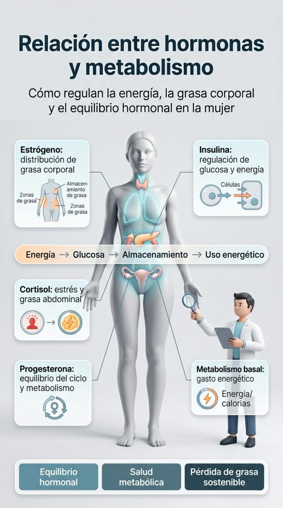

Aprende cómo las hormonas y el metabolismo afectan la pérdida de grasa femenina y qué hábitos pueden ayudarte a adelgazar de forma saludable

## Introducción

La pérdida de grasa femenina es un proceso complejo en el que intervienen múltiples factores físicos, hormonales y metabólicos. Aunque muchas veces se asocia únicamente con la alimentación o el ejercicio, la realidad es que el cuerpo de la mujer responde de forma diferente según la edad, el ciclo menstrual, el nivel de estrés, la calidad del descanso o incluso determinados cambios hormonales.

Hormonas como el estrógeno, la progesterona, la insulina o el cortisol pueden influir directamente en cómo el organismo almacena energía, regula el apetito y utiliza la grasa corporal como fuente de combustible. Por eso, muchas mujeres experimentan etapas en las que adelgazar resulta más sencillo y otras en las que la pérdida de grasa parece estancarse, incluso manteniendo hábitos similares.

Además, el metabolismo femenino no es estático. Cambia con el paso del tiempo y puede verse afectado por factores como el sedentarismo, la falta de masa muscular, las dietas demasiado restrictivas, el estrés crónico o alteraciones hormonales. Comprender estos mecanismos es fundamental para evitar enfoques extremos y construir hábitos sostenibles que favorezcan la salud y la composición corporal a largo plazo.

A diferencia de las soluciones rápidas o las dietas milagro, una pérdida de grasa saludable debe centrarse en mejorar la relación con la alimentación, optimizar el descanso, mantener una actividad física regular y cuidar el equilibrio hormonal.

El objetivo no debería ser únicamente bajar de peso, sino mejorar la salud metabólica, preservar la masa muscular y favorecer el bienestar físico y emocional.

En este artículo descubrirás cómo influyen las hormonas y el metabolismo en la pérdida de grasa femenina, qué factores pueden dificultar el proceso y qué hábitos pueden ayudarte a adelgazar de forma más efectiva, saludable y sostenible.

## Qué vas a aprender

En este artículo descubrirás cómo funciona realmente la pérdida de grasa femenina y por qué factores como las hormonas, el metabolismo y el estilo de vida pueden influir tanto en los resultados. Comprender estos procesos puede ayudarte a adoptar hábitos más efectivos y sostenibles, evitando errores comunes que muchas veces dificultan adelgazar de forma saludable.

Aprenderás cuáles son las principales causas hormonales y metabólicas relacionadas con el aumento de grasa corporal o la dificultad para perder peso, cómo influyen hormonas como el estrógeno, la insulina o el cortisol, y qué papel tienen la alimentación, el ejercicio, el descanso y el estrés en el metabolismo femenino.

También veremos estrategias prácticas para favorecer una pérdida de grasa saludable, mejorar la composición corporal y apoyar el equilibrio hormonal mediante hábitos realistas y sostenibles. El objetivo es que entiendas mejor cómo responde el cuerpo femenino y qué cambios pueden ayudarte a adelgazar de forma más eficaz sin recurrir a dietas extremas o soluciones temporales.

## ¿Qué es la pérdida de grasa femenina?

Definición y explicación

La pérdida de grasa femenina es el proceso mediante el cual el cuerpo reduce la cantidad de grasa corporal almacenada como fuente de energía. Aunque muchas veces se confunde con “perder peso”, no son exactamente lo mismo. El peso corporal puede variar por cambios en líquidos, masa muscular o incluso factores hormonales, mientras que la pérdida de grasa se centra específicamente en disminuir el tejido adiposo y mejorar la composición corporal.

En las mujeres, este proceso está estrechamente relacionado con el funcionamiento hormonal y metabólico. Hormonas como el estrógeno, la progesterona, la insulina o el cortisol pueden influir en la forma en la que el cuerpo almacena grasa, regula el apetito y utiliza la energía. Por ello, la pérdida de grasa femenina puede comportarse de manera diferente según la etapa de la vida, el ciclo menstrual, el nivel de estrés o los hábitos diarios.

Además de las hormonas, existen otros factores que pueden afectar la capacidad del cuerpo para perder grasa, como la genética, la edad, la calidad del sueño, la alimentación, el nivel de actividad física y el estado de salud general. Por ejemplo, el sedentarismo, las dietas muy restrictivas o el estrés crónico pueden alterar el metabolismo y dificultar el proceso de adelgazar de forma saludable.

También es importante entender que el cuerpo femenino tiende de forma natural a almacenar un mayor porcentaje de grasa corporal que el masculino debido a funciones biológicas y reproductivas. Esto no significa que perder grasa sea imposible, sino que el organismo femenino requiere estrategias adaptadas y sostenibles que respeten sus necesidades hormonales y metabólicas.

Una pérdida de grasa saludable no busca únicamente reducir números en la báscula, sino mejorar la salud metabólica, preservar la masa muscular y favorecer el bienestar físico y emocional. Por eso, el enfoque más efectivo suele combinar alimentación equilibrada, entrenamiento adecuado, descanso de calidad y hábitos sostenibles a largo plazo.

## Síntomas de la pérdida de grasa femenina

Signos y síntomas comunes

La pérdida de grasa femenina puede producir diferentes cambios físicos y metabólicos en el cuerpo. Cuando el proceso se realiza de forma saludable, es habitual notar una reducción progresiva del peso corporal, cambios en la composición corporal y una disminución de la grasa acumulada.

Entre los síntomas más comunes se encuentran la pérdida de peso, la reducción de medidas corporales y una mayor definición muscular. Algunas mujeres también pueden experimentar cambios en el apetito, variaciones en los niveles de energía o una menor retención de líquidos.

Sin embargo, cuando la pérdida de grasa es demasiado rápida o se basa en dietas muy restrictivas, pueden aparecer síntomas como fatiga, debilidad, irritabilidad o pérdida de masa muscular. Esto suele ocurrir cuando el cuerpo no recibe suficientes nutrientes, descanso o energía para mantenerse de forma equilibrada.

Además, factores hormonales como el estrés, el cortisol o los cambios en el ciclo menstrual también pueden influir en cómo responde el organismo durante el proceso de adelgazamiento. Por eso, una pérdida de grasa saludable debe centrarse no solo en bajar de peso, sino también en mantener la masa muscular, el equilibrio hormonal y el bienestar general.

## Cómo afecta la pérdida de grasa femenina al cuerpo

Impacto en la salud y el bienestar

La pérdida de grasa femenina puede tener efectos positivos en la salud cuando se realiza de forma progresiva y bien estructurada, ya que mejora la composición corporal, la sensibilidad a la insulina y los marcadores metabólicos.

Sin embargo, cuando el proceso es demasiado agresivo o se basa en restricciones prolongadas, también puede generar efectos no deseados en el organismo.

Uno de los principales impactos de una pérdida de grasa mal gestionada es la reducción de la masa ósea, especialmente si existe una baja disponibilidad de energía durante mucho tiempo.

Esto puede afectar a la salud ósea a medio y largo plazo si no se acompaña de una alimentación adecuada y un entrenamiento bien planificado.

También puede producirse una alteración del metabolismo. El cuerpo, ante un déficit energético prolongado, tiende a adaptarse reduciendo el gasto calórico, lo que puede ralentizar el proceso de pérdida de grasa y dificultar el mantenimiento de los resultados a largo plazo.

En algunos casos, una pérdida de grasa excesiva o muy rápida puede influir negativamente en el equilibrio hormonal, afectando al ciclo menstrual, los niveles de energía o la recuperación física.

Esto es especialmente relevante en mujeres con un bajo porcentaje de grasa corporal o con dietas muy restrictivas.

Además, cuando no se cuida el estilo de vida global (alimentación, descanso y entrenamiento), puede aumentar el riesgo de problemas metabólicos o de enfermedades crónicas a largo plazo, especialmente si el proceso no es sostenible o genera estrés fisiológico constante.

Por otro lado, es importante destacar que una pérdida de grasa bien planificada puede tener el efecto contrario: mejorar la salud cardiovascular, reducir el riesgo de enfermedades metabólicas y favorecer el bienestar general.

Por eso, el enfoque debe centrarse siempre en la sostenibilidad, el equilibrio hormonal y la salud metabólica, más allá del simple objetivo estético.

## Relación con hormonas y metabolismo

La conexión entre las hormonas y el metabolismo

Las hormonas desempeñan un papel fundamental en la regulación del metabolismo y, por tanto, en la pérdida de grasa femenina. Son mensajeros químicos que influyen en cómo el cuerpo utiliza la energía, cómo almacena la grasa y cómo responde al hambre, el estrés y el ejercicio físico.

Hormonas como el estrógeno, la progesterona, la insulina, el cortisol e incluso la testosterona participan en este equilibrio. El estrógeno, por ejemplo, puede influir en la distribución de la grasa corporal, mientras que la insulina regula el uso de la glucosa y el almacenamiento de energía. El cortisol, conocido como la hormona del estrés, puede favorecer la acumulación de grasa abdominal cuando se mantiene elevado de forma crónica.

Cuando estos niveles hormonales están equilibrados, el metabolismo funciona de manera más eficiente, facilitando la utilización de la grasa como fuente de energía. Sin embargo, alteraciones hormonales —debidas al estrés, la falta de sueño, una mala alimentación o cambios fisiológicos— pueden ralentizar el metabolismo y dificultar la pérdida de grasa.

En el caso de la mujer, estas fluctuaciones hormonales son especialmente relevantes debido a procesos naturales como el ciclo menstrual, el embarazo o la menopausia, que pueden modificar temporalmente la forma en la que el cuerpo responde al ejercicio y la alimentación.

Por eso, entender la relación entre hormonas y metabolismo es clave para abordar la pérdida de grasa femenina de forma más estratégica, evitando enfoques extremos y priorizando hábitos que favorezcan el equilibrio hormonal y la salud metabólica a largo plazo.

## Soluciones para la pérdida de grasa femenina

Estrategias prácticas para lograr una pérdida de grasa saludable

Lograr una pérdida de grasa femenina efectiva no depende de una única acción, sino de la combinación de varios hábitos sostenibles. El objetivo no es hacer cambios extremos, sino construir una rutina equilibrada que favorezca el metabolismo, el equilibrio hormonal y el bienestar general a largo plazo.

### Ejercicio regular

El entrenamiento de fuerza combinado con ejercicio cardiovascular ayuda a aumentar el gasto energético, mejorar la composición corporal y mantener la masa muscular, clave para un metabolismo activo.

### Suplementación natural

Algunos suplementos como la vitamina D, el omega-3 o el magnesio pueden apoyar funciones metabólicas, hormonales y de recuperación, siempre como complemento de una base sólida de hábitos.

### Dieta equilibrada

Una alimentación basada en alimentos reales como proteínas magras, frutas, verduras y carbohidratos integrales ayuda a estabilizar la energía, mejorar la saciedad y favorecer el equilibrio metabólico.

### Sueño adecuado

Dormir bien es fundamental para regular hormonas como la leptina y el cortisol, mejorar la recuperación y mantener un metabolismo eficiente.

### Gestión del estrés

El estrés crónico puede dificultar la pérdida de grasa al alterar hormonas clave. Técnicas como la meditación, el yoga o la respiración consciente ayudan a mejorar el equilibrio hormonal.

### Monitoreo del progreso

Registrar avances permite ajustar estrategias, mantener la motivación y evitar estancamientos, enfocando el proceso en la constancia más que en la perfección.

## Preguntas frecuentes

⏳ ¿Cuánto tiempo se tarda en notar resultados?

El tiempo para notar resultados en la pérdida de grasa femenina varía mucho según el punto de partida, la constancia y el estilo de vida. En general, los primeros cambios visibles suelen aparecer entre las 2 y 4 semanas si existe un déficit calórico moderado y hábitos consistentes.

Sin embargo, los cambios más importantes —como la mejora en la composición corporal, la reducción de grasa localizada o el aumento de energía— suelen observarse a partir de las 6 a 12 semanas.

Es importante entender que el proceso no es lineal: puede haber semanas de mayor progreso y otras de estancamiento, especialmente por la influencia de las hormonas, el ciclo menstrual o el estrés.

⚠️ ¿Es seguro perder grasa rápidamente?

Perder grasa demasiado rápido no suele ser recomendable, especialmente en mujeres. Las estrategias muy agresivas (dietas extremadamente bajas en calorías o exceso de ejercicio) pueden provocar pérdida de masa muscular, alteraciones hormonales, fatiga y problemas en el ciclo menstrual.

Una pérdida de grasa saludable suele situarse en torno al 0,5%–1% del peso corporal por semana. Este ritmo permite mantener la masa muscular, proteger el metabolismo y favorecer resultados más sostenibles a largo plazo.

El objetivo no debería ser adelgazar lo más rápido posible, sino crear un proceso estable que no comprometa la salud hormonal ni el bienestar general.

🏋️‍♀️ ¿Cuál es el mejor ejercicio para perder grasa?

No existe un único “mejor ejercicio”, pero la combinación más efectiva para la pérdida de grasa femenina suele ser el entrenamiento de fuerza junto con actividad cardiovascular.

El entrenamiento de fuerza es clave porque ayuda a mantener y aumentar la masa muscular, lo que mejora el metabolismo basal. Por otro lado, el cardio contribuye a aumentar el gasto calórico y mejorar la salud cardiovascular.

Actividades como caminar a diario, el entrenamiento con pesas, el HIIT moderado o incluso el pilates pueden ser muy eficaces si se realizan de forma constante.

Lo más importante no es el tipo de ejercicio en sí, sino la constancia y la progresión a lo largo del tiempo.

🥗 ¿Es importante la dieta en la pérdida de grasa?

Sí, la dieta es uno de los factores más importantes en la pérdida de grasa femenina, ya que es la base que determina el balance energético del cuerpo.

No se trata solo de comer menos, sino de comer mejor. Una alimentación equilibrada que incluya proteínas suficientes, grasas saludables, carbohidratos de calidad y micronutrientes ayuda a regular el metabolismo, controlar el apetito y mantener la masa muscular.

Además, una buena alimentación influye directamente en el equilibrio hormonal, lo que puede facilitar o dificultar la pérdida de grasa según el caso.

🧬 ¿Por qué me cuesta más perder grasa como mujer?

Las mujeres tienen un entorno hormonal más complejo, influenciado por el ciclo menstrual, el estrógeno y la progesterona. Estos factores pueden afectar la retención de líquidos, el apetito y la forma en la que el cuerpo utiliza la grasa como energía.

🔁 ¿Se puede perder grasa localizada?

No es posible reducir grasa de forma localizada con ejercicio específico. La pérdida de grasa ocurre de forma global, aunque algunas zonas pueden tardar más en reducirse debido a factores hormonales y genéticos.

😴 ¿El sueño afecta a la pérdida de grasa?

Sí, dormir mal puede alterar hormonas como la leptina, la grelina y el cortisol, lo que aumenta el apetito, reduce la sensibilidad a la insulina y dificulta la pérdida de grasa.

🧠 ¿El estrés puede impedir adelgazar?

El estrés crónico puede elevar el cortisol, una hormona que en niveles altos favorece el almacenamiento de grasa abdominal y puede dificultar la pérdida de grasa.

## conclusión

La pérdida de grasa femenina es un proceso complejo en el que intervienen factores hormonales, metabólicos, emocionales y de estilo de vida. No se trata únicamente de reducir calorías o aumentar el ejercicio, sino de entender cómo funciona el cuerpo femenino y cómo responde a cada uno de estos estímulos a lo largo del tiempo.

Cuando se tiene una visión más global del proceso —incluyendo el papel de hormonas como el estrógeno, la insulina o el cortisol, así como la importancia del descanso, la alimentación y la gestión del estrés— es mucho más fácil diseñar estrategias efectivas y sostenibles. Esto permite evitar enfoques extremos que pueden comprometer la salud o generar un efecto rebote.

La clave está en construir hábitos realistas que se puedan mantener en el tiempo: una alimentación equilibrada, actividad física regular, descanso adecuado y una buena gestión del estrés. Estos pilares no solo favorecen la pérdida de grasa, sino que también mejoran la salud metabólica y el bienestar general.

En definitiva, la paciencia y la constancia son fundamentales. La pérdida de grasa femenina no es un proceso lineal ni inmediato, pero con el enfoque adecuado es posible lograr resultados duraderos sin poner en riesgo la salud.
