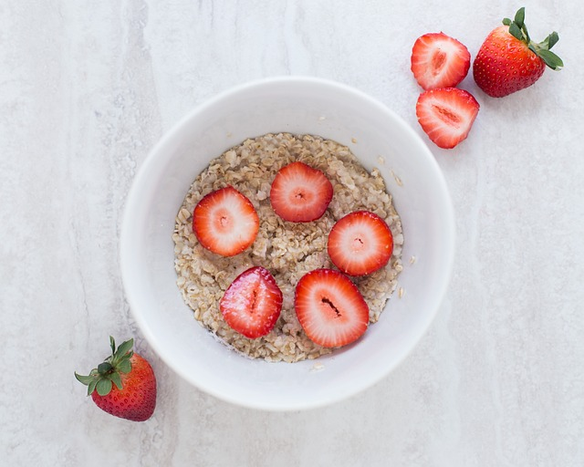

## La Importancia de Tomar Fibra a Diario: ¡Tu Cuerpo Te Lo Agradecerá!

## ¿Qué es la Fibra?

La fibra es un tipo de carbohidrato que se encuentra en los alimentos de origen vegetal. A diferencia de otros carbohidratos, la fibra no se digiere ni se absorbe en el intestino delgado. En cambio, pasa relativamente intacta a través del estómago, el intestino delgado y el colon, y fuera del cuerpo.

## ¿Porqué Tomar Fibra Todos los Días?

1\. Ayuda a Mantener Tu Digestión Saludable

La fibra actúa como una escoba que limpia tu sistema digestivo. Esto significa que ayuda a mover los alimentos a través de tu intestino y evita el estreñimiento. ¡Nadie quiere sentirse hinchado o con dolor de barriga!

2\. Mantiene Tu Corazón Feliz

Comer fibra regularmente puede ayudar a mantener tu corazón sano. Esto se debe a que puede reducir los niveles de colesterol malo en tu sangre. Menos colesterol malo significa un corazón más fuerte y menos riesgo de enfermedades del corazón.

3\. Controla Tu Azúcar en la Sangre

La fibra ayuda a regular los niveles de azúcar en la sangre. Esto es especialmente importante para prevenir enfermedades como la diabetes. Cuando comes fibra, el azúcar de los alimentos se absorbe más lentamente, manteniendo tus niveles de energía estables.

4\. Te Ayuda a Sentirte Lleno

La fibra te hace sentir lleno por más tiempo. Esto puede ser muy útil para mantener un peso saludable, ya que te ayuda a evitar comer en exceso. Cuando te sientes lleno, es más fácil decir «no» a las golosinas no saludables.

Productos recomendados

## ¿Cuánta Fibra Necesitas?

La cantidad de fibra que necesitas varía según tu edad:

- **Niños (1 a 8 años)**: Necesitan entre 19 y 25 gramos de fibra al día.
- **Niñas y Niños (9 a 18 años)**: Necesitan entre 26 y 38 gramos de fibra al día, dependiendo de su edad y género.
- **Adultos (19 a 50 años)**: Las mujeres necesitan alrededor de 25 gramos de fibra al día, y los hombres necesitan aproximadamente 38 gramos al día.
- **Mayores de 51 años**: Las mujeres necesitan alrededor de 21 gramos de fibra al día, y los hombres necesitan aproximadamente 30 gramos al día.

Ahora que ya sabes porqué es tomar fibra, ajusta tu ingesta según estos valores para mantenerte sano y lleno de energía a cualquier edad.

## Consejos para Aumentar tu Consumo de Fibra

- **Desayuna con Fibra**: Dependiendo de tu estilo de vida, usar fibra psyllium o avena por la mañana es una manera deliciosa de empezar el día con fibra.
- **Come Frutas con Cáscara**: Las cáscaras de las frutas tienen mucha fibra. Lávate bien las frutas y cómelas con cáscara siempre que sea posible.
- **Añade Verduras a Cada Comida**: Intenta incluir una porción de verduras en cada comida del día. Las ensaladas son una forma fácil y deliciosa de hacerlo.
- **Snacks Saludables**: Opta por nueces, semillas o palitos de zanahoria para tus meriendas.

Productos recomendados

## Conclusión

¡Recuerda que una dieta rica en fibra no solo te ayudará a sentirte bien, sino que también mantendrá tu corazón, tu digestión y tus niveles de energía en perfecto estado!

¡Así que no olvides llenar tu plato con frutas, verduras, granos enteros y legumbres, y disfruta de los beneficios de una dieta rica en fibra!

Puedes ver el [vídeo explicativo](https://www.youtube.com/watch?v=s81c6mlBgno) a continuación:

Nos vemos en el camino 🙂

Si quieres saber más sobre nutrición y vida sana, [suscríbete a mi canal](https://www.youtube.com/user/nutriclubweb) y sigue mi página de [Facebook](https://www.facebook.com/clubdenutricion.es/). Visita la sección de blog [aquí](/blog/).
