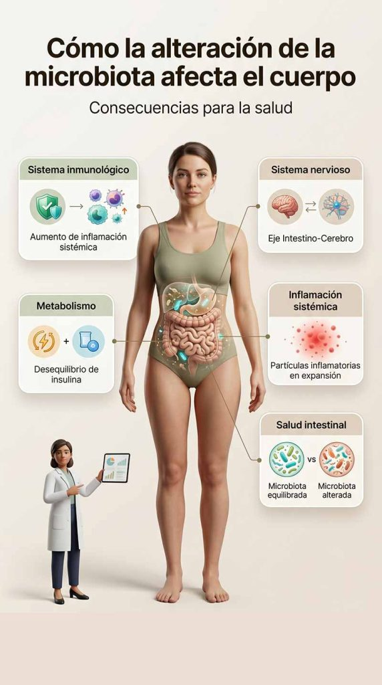

Descubre cómo los probióticos y la alimentación influyen en la microbiota intestinal y pueden mejorar tu salud digestiva, inmunológica y general

## Introducción

La **salud intestinal** es un aspecto cada vez más relevante dentro del bienestar general, especialmente por su relación con la digestión, el sistema inmunológico y el equilibrio de la microbiota intestinal.

En un contexto donde cada vez son más frecuentes los trastornos digestivos, comprender cómo la alimentación influye en el intestino se vuelve fundamental. En este sentido, los **probióticos** y la **microbiota intestinal** están estrechamente relacionados y desempeñan un papel clave en el equilibrio del organismo.

## Qué vas a aprender

En este artículo descubrirás de forma clara y práctica cómo mejorar tu salud intestinal a través de la alimentación y el uso de probióticos.

En concreto, aprenderás:

- Los principales beneficios de los probióticos para la salud intestinal
- Cómo actúan los probióticos en la microbiota intestinal
- La relación entre alimentación, digestión y equilibrio intestinal
- Estrategias prácticas para mejorar tu microbiota de forma natural
- Soluciones basadas en hábitos diarios para favorecer una mejor salud digestiva

## ¿Qué son los probióticos?

Definición y explicación

Los **probióticos** son microorganismos vivos, principalmente bacterias beneficiosas, que aportan efectos positivos a la salud cuando se consumen en cantidades adecuadas. Se encuentran de forma natural en alimentos fermentados o en forma de suplementos específicos.

Su principal función es contribuir al equilibrio de la **microbiota intestinal**, favoreciendo una flora intestinal saludable. Este equilibrio es fundamental para el correcto funcionamiento del sistema digestivo y también para el sistema inmunológico, ya que una gran parte de las defensas del organismo están relacionadas con el intestino.

Además, los probióticos pueden ayudar a mejorar la digestión, optimizar la absorción de nutrientes y apoyar la respuesta del organismo frente a microorganismos potencialmente dañinos.

En conjunto, mantener una microbiota equilibrada a través de probióticos y una alimentación adecuada es clave para promover una salud digestiva y general más estable.

## Síntomas de la alteración de la microbiota

Señales de que algo no está bien

Cuando la **microbiota intestinal** pierde su equilibrio, el organismo puede manifestar una serie de señales que reflejan un posible estado de disbiosis. Estos síntomas pueden afectar tanto al sistema digestivo como al bienestar general.

Entre los signos más frecuentes se incluyen la hinchazón abdominal, la presencia de gases, episodios de diarrea o estreñimiento, dolor o molestias abdominales y sensación de fatiga o cansancio persistente.

En algunos casos, estos síntomas pueden aparecer de forma puntual, pero cuando se mantienen en el tiempo o se repiten con frecuencia, pueden indicar un desequilibrio en la microbiota intestinal que conviene evaluar.

Si estos síntomas son persistentes, es recomendable consultar con un profesional de la salud para identificar la causa y aplicar un enfoque adecuado que ayude a restaurar el equilibrio intestinal.

## Cómo la alteración de la microbiota afecta el cuerpo

Consecuencias para la salud

La alteración de la **microbiota intestinal** no se limita únicamente al sistema digestivo.

Cuando se produce un desequilibrio prolongado, puede afectar a múltiples sistemas del organismo debido a la estrecha conexión entre el intestino, el sistema inmunológico, el metabolismo y el sistema nervioso.

Uno de los principales impactos se observa en el sistema inmunológico, ya que una microbiota alterada puede favorecer procesos inflamatorios y aumentar la susceptibilidad a infecciones o a enfermedades de origen autoinmune.

Además, existe una relación directa entre la microbiota intestinal y el sistema nervioso a través del eje intestino-cerebro. Por ello, su desequilibrio puede estar asociado a cambios en el estado de ánimo, mayor estrés, ansiedad o alteraciones del bienestar emocional.

A nivel metabólico, una microbiota alterada también puede influir en el aumento de peso, la resistencia a la insulina y el desarrollo de enfermedades crónicas como la obesidad o la diabetes tipo 2.

Por todo ello, mantener un equilibrio adecuado de la microbiota intestinal es fundamental para proteger la salud global y prevenir alteraciones a largo plazo.

## Relación con hormonas y metabolismo

La conexión entre la microbiota y el sistema endocrino

La **microbiota intestinal** desempeña un papel esencial en la regulación del sistema endocrino y del metabolismo. A través de su interacción con el organismo, influye en procesos hormonales clave que afectan al equilibrio energético, el apetito y la gestión de la glucosa.

Cuando la microbiota intestinal se encuentra en equilibrio, contribuye a una correcta señalización hormonal y a un metabolismo más eficiente. Sin embargo, un estado de disbiosis puede alterar esta comunicación, afectando la producción y sensibilidad de diferentes hormonas.

Entre ellas destacan la **insulina**, relacionada con el control de la glucosa en sangre, y otras hormonas implicadas en el apetito y la saciedad. Un desequilibrio prolongado de la microbiota puede contribuir a problemas metabólicos como la resistencia a la insulina, el aumento de peso o alteraciones en la regulación del hambre.

También se ha observado una posible relación entre la microbiota intestinal y condiciones hormonales como el síndrome de ovario poliquístico (SOP), donde el equilibrio intestinal puede influir en la inflamación y en la regulación hormonal.

En conjunto, la relación entre microbiota, hormonas y metabolismo es bidireccional: lo que ocurre en el intestino influye en el sistema hormonal, y los cambios hormonales también pueden modificar la composición de la microbiota.

## Soluciones para mejorar la salud intestinal

Acciones prácticas para un bienestarintestinal óptimo

Mejorar la salud intestinal y restaurar el equilibrio de la **microbiota intestinal** es posible a través de hábitos diarios sostenibles. La combinación de una alimentación adecuada, un buen descanso, la gestión del estrés y una correcta hidratación puede marcar una gran diferencia en la digestión y el bienestar general.

A continuación, te mostramos las principales estrategias para favorecer un intestino más saludable.

### Incorpora alimentos ricos en fibra

La fibra alimentaria es esencial para el equilibrio de la microbiota intestinal, ya que actúa como “alimento” para las bacterias beneficiosas. Consumir frutas, verduras, legumbres y cereales integrales favorece una mejor digestión y contribuye a un tránsito intestinal regular.

### Mejora la calidad del sueño

Dormir entre 7 y 8 horas de calidad es fundamental para la regeneración del organismo y el equilibrio intestinal. Un mal descanso puede alterar la microbiota y afectar al metabolismo y la inmunidad.

### Reduce el estrés crónico

El estrés prolongado puede alterar el eje intestino-cerebro y afectar negativamente a la microbiota intestinal. Incorporar técnicas como la meditación, el yoga, la respiración consciente o el ejercicio físico puede ayudar a reducir su impacto.

### Incorpora probióticos en tu dieta

Los alimentos fermentados y los suplementos probióticos pueden ayudar a restaurar el equilibrio de la microbiota intestinal, especialmente tras el uso de antibióticos o en casos de disbiosis.

### Mantén una buena hidratación

El agua es clave para la digestión, la absorción de nutrientes y el tránsito intestinal. Una correcta hidratación ayuda a prevenir el estreñimiento y favorece el funcionamiento óptimo del sistema digestivo.

### Reduce alimentos ultraprocesados

Los alimentos ultraprocesados suelen ser pobres en fibra y ricos en azúcares y aditivos, lo que puede alterar el equilibrio de la microbiota intestinal. Reducir su consumo favorece una dieta más equilibrada y saludable.

Pequeños cambios en tu alimentación y estilo de vida pueden tener un gran impacto en tu microbiota intestinal y en tu salud general a largo plazo.

## Preguntas frecuentes

¿Qué son los prebióticos y en qué se diferencian de los probióticos?

Los **prebióticos** son fibras no digeribles que sirven de alimento para las bacterias beneficiosas de la microbiota intestinal. Mientras que los probióticos son microorganismos vivos, los prebióticos ayudan a que estos crezcan y se mantengan en equilibrio.

Ambos trabajan de forma complementaria para favorecer una microbiota saludable.

¿Cuánto tiempo tarda en notarse el efecto de los probióticos?

El tiempo puede variar según la persona, el estado de la microbiota y el tipo de probiótico. En algunos casos, se pueden notar cambios en la digestión en pocos días, mientras que en otros puede tardar varias semanas.

La constancia y una buena alimentación son clave para obtener mejores resultados.

¿Son seguros los probióticos para todo el mundo?

En general, los probióticos son seguros para la mayoría de las personas sanas. Sin embargo, en personas con enfermedades graves, sistemas inmunológicos debilitados o condiciones médicas específicas, es recomendable consultar con un profesional de la salud antes de tomarlos.

¿Cómo saber si necesito un suplemento de probióticos?

No siempre es necesario tomar suplementos. En muchos casos, una alimentación rica en alimentos fermentados y fibra es suficiente para mantener una microbiota equilibrada.

Un suplemento puede ser útil en situaciones concretas como después de un tratamiento con antibióticos, episodios de disbiosis o bajo recomendación profesional.

Cuidar la microbiota intestinal es una estrategia a largo plazo: entender cómo funciona es el primer paso para mejorar tu salud digestiva y tu bienestar general.

## conclusión

La **salud intestinal** es un pilar fundamental del bienestar general, ya que influye directamente en la digestión, el sistema inmunológico, el metabolismo y otros procesos esenciales del organismo. En este contexto, los **probióticos** y el equilibrio de la **microbiota intestinal** desempeñan un papel clave.

A lo largo del día a día, pequeños cambios en la alimentación y en los hábitos pueden tener un impacto significativo en la salud digestiva. Incorporar alimentos ricos en fibra, incluir fuentes naturales de probióticos, mejorar el descanso y reducir el estrés son estrategias sencillas pero muy efectivas para favorecer el equilibrio intestinal.

Además, en determinados casos, los suplementos de probióticos pueden ser un apoyo adicional para restaurar la microbiota, siempre dentro de un enfoque adecuado y personalizado.

En definitiva, cuidar la microbiota intestinal no solo ayuda a mejorar la digestión, sino que también contribuye a reducir el riesgo de alteraciones metabólicas y problemas relacionados con la salud general.

Una microbiota intestinal equilibrada es la base de una buena salud digestiva, y el primer paso hacia un bienestar más completo y duradero.
