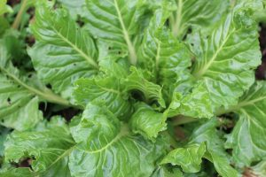

# PROPIEDADES DE LA ACELGA

## Las propiedades de la acelga para el organismo

La acelga es una hortaliza de hoja verde originaria en el Mediterráneo con multitud de propiedades. Esta hortaliza se cultiva durante todo el año, pero la mejor época es desde otoño a primavera. La acelga proviene de la misma familia que la remolacha, betarrada y el betabel, la diferencia es que en la acelga lo que se aprovecha es la hoja y no la raíz.

### Beneficios de la acelga

A continuación podrás ver todas las propiedades de la acelga, que son muchas. La acelga es un alimento que sólo aporta cosas buenas, por lo que deberíamos utilizarlas de forma habitual en nuestra cocina.

01. Aporta gran cantidad de calcio, por lo que es beneficiosa para unos huesos sanos.Propiedades de la acelga. La acelga es una hortaliza de hoja verde originaria en el Mediterráneo. La acelga se cultiva durante todo el año, pero la mejor época es desde otoño a primavera
02. Gran contenido en hierro, ideal para evitar problemas de anemia.
03. Alto contenido en Vitamina C, importante en la prevención de gripes y resfriados, y un gran antioxidante aliado para fortalecer el sistema inmune.
04. Contiene mucha fibra para un correcto movimiento intestinal, y por consiguiente, evitar el estreñimiento.
05. Ayuda a controlar el colesterol.
06. Tiene un alto contenido en carotenoides.
07. Previene la osteoporosis.
08. Contiene folatos, que colaboran en la formación de glóbulos blancos, rojos y anticuerpos para un correcto funcionamiento del sistema inmune.
09. También son ricas en agua, que nos ayudan a mantener la hidratación del organismo.
10. Contiene potasio, que ayuda a cuidar nuestros músculos y el sistema inmunológico.
11. También aporta yodo, que es imprescindible para el buen funcionamiento de la glándula tiroides.
12. La acelga es rica en vitamina A, que es muy beneficiosa para la piel, el cabello, la visión, el esqueleto y el sistema inmunológico
13. Ayuda a combatir infecciones.
14. Previene la aparición de hemorroides.
15. Tiene propiedades diuréticas.

Como puedes leer, la acelga es una hortaliza con múltiples beneficios para el organismo, por lo que deberíamos de incluirla en nuestra dieta habitual.

Gracias por leer el artículo. Espero que te haya resultado interesante.

Recuerda que puedes suscribirte a mi canal de [YouTube aquí.](https://www.youtube.com/user/nutriclubweb)

Nos vemos pronto 🙂

#### Por favor, deja tu comentario, nos gustaría saber tu opinión.
