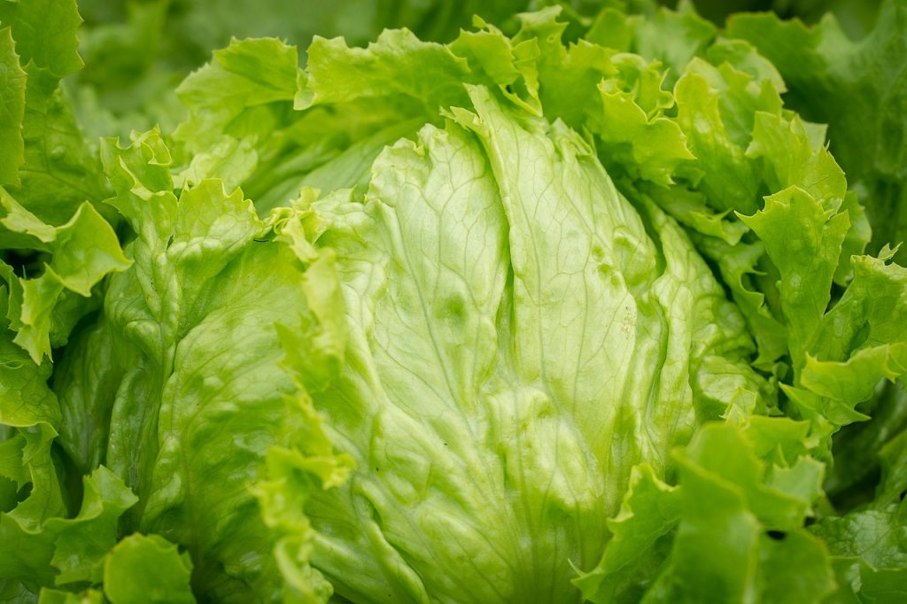

## Las Propiedades de la Lechuga para el Organismo: Beneficios y Composición Nutricional

La lechuga es uno de los vegetales más consumidos en el mundo, y no es solo por su sabor fresco y versatilidad en la cocina. Este vegetal tiene una composición nutricional impresionante y múltiples beneficios para la salud. En este artículo, exploraremos las propiedades de la lechuga, sus beneficios y su valor nutricional. Además, te daremos algunas ideas de productos y cómo incorporarlos en tu dieta diaria.

## Cuáles son las propiedades de la lechuga

Propiedades de la lechuga. La lechuga es una hortaliza muy utilizada para preparar ensaladas, y otros acompañamientos, pero… ¿sabemos qué beneficios aporta a nuestro organismo?

## Composición Nutricional de la Lechuga

### Vitaminas y Minerales

- **Contiene hierro:** muy importante para la formación de glóbulos rojos, ayuda a combatir la anemia, que produce cansancio y apatía, entre otras cosas.
- **Gran cantidad de betacaroteno**: Disminuye los síntomas del asma, previene el cáncer, las enfermedades del corazón, degeneración macular, el alzheimer, la depresión, epilepsia…
- **Contiene vitaminas A, C, E y del grupo B:** Antioxidantes, mejora la piel y la vista, y a luchar contra infecciones.
- **Aporta minerales alcalinos.**

### RECOMENDAMOS

### Baja en Calorías

- **Es baja en calorías:** Nos ayuda a controlar las calorías que consumimos, y por lo tanto, una gran aliada en la pérdida de peso. Una buena ensalada con gran cantidad de lechuga, nos ayudará a saciarnos y complementará nuestra ingesta de vitaminas.

### Fibra dietética e hidratación

- **Fibra**: que puede ayudar a prevenir problemas digestivos como el estreñimiento.
- **Hidrata el organismo:** aporta gran cantidad de agua, indispensable para un correcto funcionamiento.
- **Ayuda a eliminar líquidos:** ayuda con los líquidos retenidos.

## Beneficios de la Lechuga para la Salud

### Mejora la Salud Digestiva

El alto contenido de fibra en la lechuga ayuda a mejorar la digestión y a mantener el sistema digestivo saludable. La fibra también puede ayudar a prevenir problemas digestivos como el estreñimiento.

### Apoya la Salud Ósea

La vitamina K y el calcio presentes en la lechuga son esenciales para la salud ósea. Estos nutrientes ayudan a fortalecer los huesos y a prevenir enfermedades como la osteoporosis.

### Contribuye a la Hidratación

La lechuga tiene un alto contenido de agua, lo que ayuda a mantener el cuerpo hidratado. Esto es especialmente beneficioso durante los meses de calor o en climas cálidos.

### Promueve la Salud Cardiovascular

El potasio presente en la lechuga ayuda a regular la presión arterial, lo que contribuye a una mejor salud cardiovascular. Además, la fibra y los antioxidantes también juegan un papel en la reducción del riesgo de enfermedades del corazón.

### Ayuda en el Control del Peso

Debido a su bajo contenido calórico y alto contenido de fibra y agua, la lechuga es un excelente alimento para quienes buscan controlar su peso. Ayuda a crear una sensación de saciedad sin añadir muchas calorías a la dieta.

## Cómo Incorporar la Lechuga en tu Dieta

### Ideas de Recetas con Lechuga

- **Ensaladas Frescas**: Combina lechuga con otros vegetales, frutas, nueces y una proteína magra como pollo o tofu.
- **Wraps de Lechuga**: Usa hojas de lechuga como envoltorio para tus ingredientes favoritos. Pruébalo como sustituto del pan en hamburguesas, además de estar riquísimo, eliminamos el pan, que es un ultraprocesado.
- **Smoothies Verdes**: Añade lechuga a tus batidos para aumentar su contenido nutricional sin afectar el sabor.

¿Todavía te estás pensando si tomar lechuga como acompañamiento a tus comidas?

Puedes ver el [vídeo](https://www.youtube.com/watch?v=LF_pF7r7pO8) a continuación:

Nos vemos en el camino 🙂

Si quieres saber más sobre nutrición y vida sana, [suscríbete a mi canal](https://www.youtube.com/user/nutriclubweb) y sigue mi página de [Facebook](https://www.facebook.com/clubdenutricion.es/). Visita la sección de blog [aquí](/blog/).
