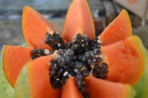

## Beneficios y propiedades de la papaya

_**Propiedades de la papaya.**_ La papaya es una fruta tropical que se da todo el año. Es una baya y suele pesar de media 1 kg y medir sobre los 30 centímetros.

### La papaya tiene grandes propiedades y beneficios para nuestros organismo:

01. **Combate el estreñimiento**. Es una gran aliada para mantener un correcto funcionamiento intestinal, y ayuda a tener una buena digestión.
02. Tiene **propiedades analgésicas**, lo que ayuda a disminuir determinadas dolencias, se puede usar de forma externa en golpes y contusiones y desinflama.
03. Es **anticancerígena y alcalinizante**. Ayuda a eliminar los deshechos evitando la creación de células anómalas. También ayuda a eliminar la acidez del organismo, esto es importante, ya que, un estado ácido es propicio para diferentes tipos de patologías, por lo tanto, nos ayuda a evitarlas.
04. **Contiene potasio, magnesio y vitaminas del grupo B**. Nos aporta nutrientes esenciales que ayudan a un correcto funcionamiento del organismo.
05. Contiene **gran cantidad de fibra**, lo que hace que el cuerpo absorba menos grasas de las que ingerimos, además de aumentar la masa fecal, lo que ayuda a evitar el estreñimiento.
06. **Elimina parásitos intestinales**.
07. **Desintoxica**. Tiene propiedades desintoxicantes, por lo que, nos ayuda a que el organismo funcione mejor.
08. Además es **antioxidante**, esto supone que retarda el envejecimiento de las células.
09. Al aportar potasio y tener muy pocas calorías, **ayuda a eliminar líquidos**, por lo que nos ayuda a bajar de peso.
10. **Mejora la capacidad reproductiva masculina**, ésta suele deberse a la deficiencia de vitamina C, y la papaya, al aportar grandes cantidades de esta vitamina, ayuda con este problema.
11. **Alivia las diarreas**. La papaya es un regulador intestinal, ya que funciona tanto en caso de diarreas, como de estreñimiento.
12. **Contiene propiedades contra los daños provocados por el alcohol** gracias a los antioxidantes que aporta y a que es un protector del estómago y el esófago

##### Puedes [ver el vídeo](https://www.youtube.com/watch?v=_pzYcMr8YL0) relacionado pulsando la imagen:

Gracias por leer el artículo. Espero que te haya resultado interesante.

Recuerda que puedes suscribirte a mi canal de [YouTube aquí.](https://www.youtube.com/user/nutriclubweb)

Nos vemos pronto 🙂

#### Por favor, deja tu comentario, nos gustaría saber tu opinión.
