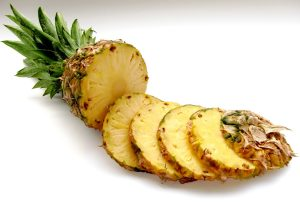

## Propiedades de la piña tropical

Beneficios y propiedades de la piña tropical. Hoy les traigo información, además de un vídeo acerca de una fruta tropical muy consumida, la piña.

La **piña tropical**, originaria de Brasil y Paraguay, hoy en día, se consume en todo el mundo debido a sus _propiedades beneficiosas para el organismo_. Lo mejor es tomarla natural, recién cortada de la pieza de fruta. También la hay en formato de conserva, si nos decidimos por esta última, que sea en su propio jugo, nunca en almíbar, ya que le estaremos añadiendo azúcares que ningún bien van a hacer a nuestro organismo.

Propiedades:

01. Nos ayuda a **alcalinizar el organismo** evitando la acidez del organismo y la proliferación de daño en el mismo.
02. Ayuda a **regular los niveles de azúcar en sangre**. Los azúcares que contiene son de asimilación lenta, por lo que nos dan una energía constante a lo largo de bastante tiempo, sin tener grandes subidas de azúcar en sangre.
03. **Mejora la circulación**, ya que tiene efecto anticoagulante.
04. **Ayuda en problemas de la piel**.
05. Es muy **rica en vitaminas,** especialmente la vitamina C y contiene gran cantidad de **minerales**.
06. Tiene propiedades **diuréticas** que nos ayudan a eliminar líquidos retenidos, así como toxinas y deshechos  a través de de la orina.
07. Ayuda en la **quema de grasas** y contiene muy **pocas calorías**, por lo que está especialmente recomendada en personas con sobrepeso y celulitis.
08. Es **antiinflamatoria** y se recomienda en casos de artritis y gota.
09. Contiene gran cantidad de **fibra**, lo que nos ayudará con el tránsito intestinal, combatiendo el estreñimiento.
10. Favorece la **absorción del hierro**, por lo tanto es una gran aliada contra la anemia.
11. Su acción diurética ayuda a **combatir afecciones** como catarros, reumatismo e hipertensión.

Como puedes leer, la piña es una fruta fantástica que debería estar en nuestra dieta **habitual**, ya que sólo contiene beneficios.

Recuerda: Siempre que puedas compra la fruta como tal, o en su defecto en su jugo.

##### Te recomiendo ver el vídeo de las [propiedades de la piña](https://www.youtube.com/watch?v=QsTKF7v3VHk) 🙂

Gracias por leer el artículo. Espero que te haya resultado interesante.Recuerda que puedes suscribirte a mi canal de [YouTube aquí.](https://www.youtube.com/user/nutriclubweb) Nos vemos pronto ?

#### Por favor, deja tu comentario, nos gustaría saber tu opinión.
