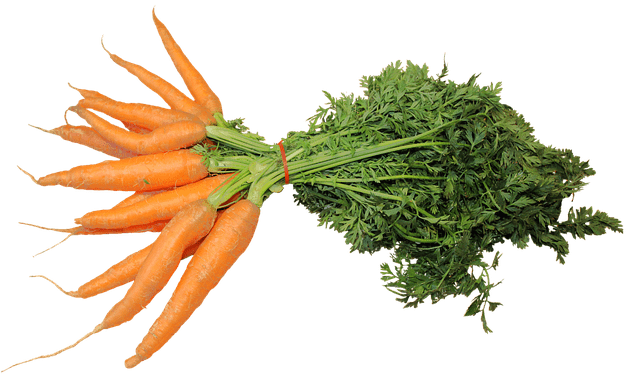
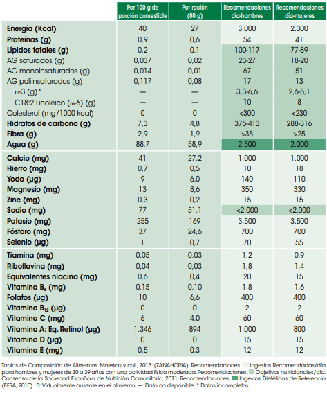

## Las propiedades de la zanahoria

Te traemos nueva información y un vídeo acerca de las zanahorias y sus beneficios. La zanahoria pertenece a la familia de las hortalizas, tiene muy pocas calorías (apenas 41 kcal por 100 gr) y muy rica en nutrientes.

Son muy versátiles a la hora de cocinar, por lo que podemos hacer gran cantidad de comidas diferentes. Desde primeros platos como cremas vegetales, hasta postres como tartas de zanahoria, pasando por pistos, salsas y acompañamientos, tanto crudos como cocinados de diferentes formas.

Las zanahorias se pueden tomar tanto crudas como cocinadas. Guisadas, al vapor, en forma de bastón, al wok, ralladas en ensalada… de cualquier forma son una buena elección.

### [Recomendamos: Rallador multiusos](https://amzn.to/3RHhUZg)

Descubre el rallador multiusos que hace que preparar tus zanahorias sea rápido y sencillo. Ideal para ensaladas, guarniciones y más. ¡Haz de tu cocina un lugar más práctico y eficiente! 🍽️✨

[Comprar](https://amzn.to/3RHhUZg)

## Propiedades que tiene la zanahoria:

1. Fuente de calcio, potasio y hierro, para mantener un organismo sano.
2. Mejora la lactancia, ideal para mujeres embarazadas.
3. Desintoxica el hígado.
4. Mejora la visión.
5. Potente anticancerígeno.
6. Mejora el cabello, tomarla a diario mejora el estado y crecimiento del mismo.
7. Fuente de fibra, vitaminas, minerales, antioxidantes naturales y baja en grasas.

En definitiva; un alimento que no puede faltar en nuestra [alimentación](/nutricion/).

## Composición Nutricional de la Zanahoria

Puedes ver el vídeo haciendo clic:

Nos vemos en el camino 🙂

Si quieres saber más sobre nutrición y vida sana, [suscríbete a mi canal](https://www.youtube.com/user/nutriclubweb) y sigue mi página de [Facebook](https://www.facebook.com/clubdenutricion.es/). Visita la sección de blog [aquí](/blog/).
