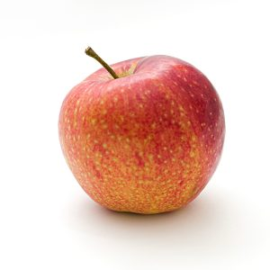

## Beneficios y propiedades de las manzanas

Propiedades de las manzanas. La manzana es una fruta con muchas propiedades beneficiosas para el organismo. Además contiene muy pocas calorías y se puede tomar de diferentes formas. Las manzanas están disponibles en una amplia variedad de tipos, y es fácil encontrarlas a lo largo de todo el año.

A continuación podemos ver la información nutricional de las manzanas, por unidad de 154 gr de producto (media de una manzana de tamaño normal):

### Las manzanas tienen una gran cantidad de propiedades y beneficios nutricionales:

# 

1. Son ricas en vitaminas y minerales.
2. Ayudan a mejorar la digestión, por lo que son perfectas comerlas como postre.
3. Ayudan a reducir la hipertensión.
4. Facilitan la absorción de calcio, por lo que son beneficiosas en personas con problemas óseos y deportistas.
5. Son alcalinizantes, por lo que ayudan a eliminar el ambiente ácido del organismo, que es muy perjudicial para la salud.
6. Ayuda a eliminar el mal aliento.
7. Limpia el organismo.
8. Es rica en fibras, por lo que son un gran aliado contra el estreñimiento.

Las manzanas son un alimento versátil que se puede tomar de formas variadas:

1. Añadiéndolas a ensaladas.
2. Como postre.
3. Entre horas.
4. Mezclada con queso fresco batido.
5. Al horno con canela y endulzante light.

Puedes ver el vídeo informativo a [continuación](https://www.youtube.com/watch?v=6N-mpdRyT70):

Gracias por leer el artículo. Espero que te haya resultado interesante.

Recuerda que puedes suscribirte a mi canal de [YouTube aquí.](https://www.youtube.com/user/nutriclubweb)

Nos vemos pronto 🙂

#### Por favor, deja tu comentario, nos gustaría saber tu opinión.
