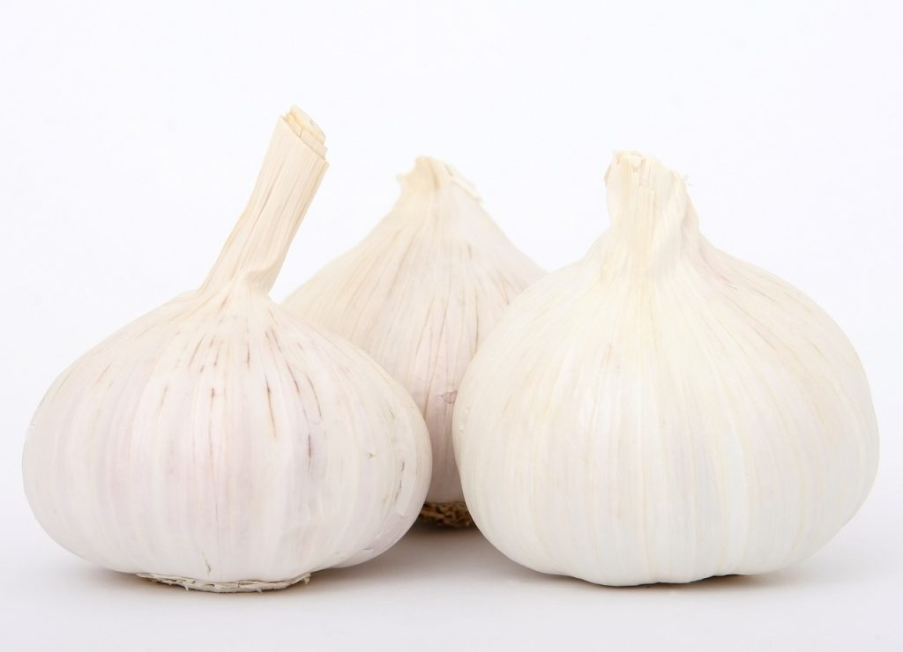

## Propiedades del Ajo: El Superalimento que No Puede Faltar

### ¿Qué es el Ajo?

Las propiedades del ajo, son muchas y variadas. El ajo es un ingrediente que todos tenemos, o deberíamos tener, en nuestra despensa. Tiene muchas aplicaciones gastronómicas, y es indispensable en gran cantidad de recetas. Aparte de dar sabor a nuestros platos, el ajo aporta grandes beneficios a nuestros organismo. ¡Vamos a descubrirlas!

## Propiedades del Ajo: ¿Por Qué es Tan Especial?

### 1\. Refuerza el Sistema Inmunológico

El ajo es como un escudo protector para nuestro cuerpo. Contiene compuestos que ayudan a combatir virus y bacterias, manteniéndonos sanos y fuertes. Comer ajo puede ayudar a prevenir resfriados y otras enfermedades.

### 2\. Es Bueno para el Corazón

El ajo ayuda a mantener el corazón saludable. Puede reducir la presión arterial y los niveles de colesterol malo, lo que significa que tu corazón tendrá menos problemas para bombear sangre por todo tu cuerpo. ¡Un corazón feliz es un cuerpo feliz!

### 3\. Propiedades Antioxidantes

El ajo está lleno de antioxidantes, que son como pequeños guerreros que protegen nuestras células del daño. Estos antioxidantes pueden ayudar a prevenir enfermedades y mantener nuestro cuerpo funcionando correctamente.

### 4\. Ayuda a la Digestión

El ajo puede ayudar a que tu estómago funcione mejor. Mejora la digestión y puede prevenir problemas como el estreñimiento. Además, el ajo puede ayudar a mantener el equilibrio de bacterias buenas en tu intestino.

### 5\. Propiedades Antiinflamatorias

El ajo tiene propiedades antiinflamatorias, lo que significa que puede ayudar a reducir la inflamación en el cuerpo. Esto es útil para personas que tienen dolores o condiciones inflamatorias, como la artritis.

## ¿Cómo Incorporar el Ajo en tu Dieta?

En Crudo

Puedes añadir ajo crudo a tus ensaladas o salsas. El ajo crudo tiene un sabor fuerte, pero es la forma más potente de obtener todos sus beneficios.

Cocinado

El ajo también es delicioso cuando se cocina. Puedes añadirlo a tus platos favoritos como sopas, guisos, o salteados. Solo recuerda no cocinarlo demasiado, para que no pierda sus propiedades saludables.

En Polvo

El ajo en polvo es una forma práctica de añadir sabor y beneficios del ajo a tus comidas. Puedes espolvorearlo sobre verduras, carnes o incluso en palomitas de maíz.

En cápsulas

Tomar ajo en cápsulas es la forma más fácil de tomarlas. Además existen cápsulas sin olor, para evitar sabores no deseados.

#### RECOMENDAMOS

### Curiosidades Sobre el Ajo

##### Un Remedio Antiguo

El ajo ha sido usado como medicina desde hace miles de años. En el antiguo Egipto, Grecia y Roma, las personas ya conocían las propiedades del ajo y lo usaban para tratar diversas enfermedades.

##### Un Ingrediente Mágico

En muchas culturas, el ajo se considera un ingrediente mágico. Algunas personas creen que puede ahuyentar a los malos espíritus y proteger el hogar.

### ¿Sabías Que...?

- El ajo pertenece a la misma familia que las cebollas y los puerros.
- Al cortar o machacar el ajo, se libera un compuesto llamado alicina, que es responsable de sus beneficios para la salud.
- Comer perejil después del ajo puede ayudar a eliminar el olor fuerte de tu aliento.

Las propiedades del ajo lo convierten en un superalimento que no puede faltar en tu dieta. Refuerza el sistema inmunológico, es bueno para el corazón, tiene propiedades antioxidantes y antiinflamatorias, y ayuda a la digestión. Incorporar el ajo en tus comidas es una manera fácil y deliciosa de mejorar tu salud.

Así que, la próxima vez que veas una receta con ajo, ¡no dudes en añadirlo y disfrutar de todos sus beneficios! ¡Tu cuerpo te lo agradecerá!

Ver [vídeo](https://youtu.be/dhO4Zv1Lsyg) de las propiedades del ajo:

Nos vemos en el camino 🙂

Si quieres saber más sobre nutrición y vida sana, [suscríbete a mi canal](https://www.youtube.com/user/nutriclubweb) y sigue mi página de [Facebook](https://www.facebook.com/clubdenutricion.es/). Visita la sección de blog [aquí](/blog/).
