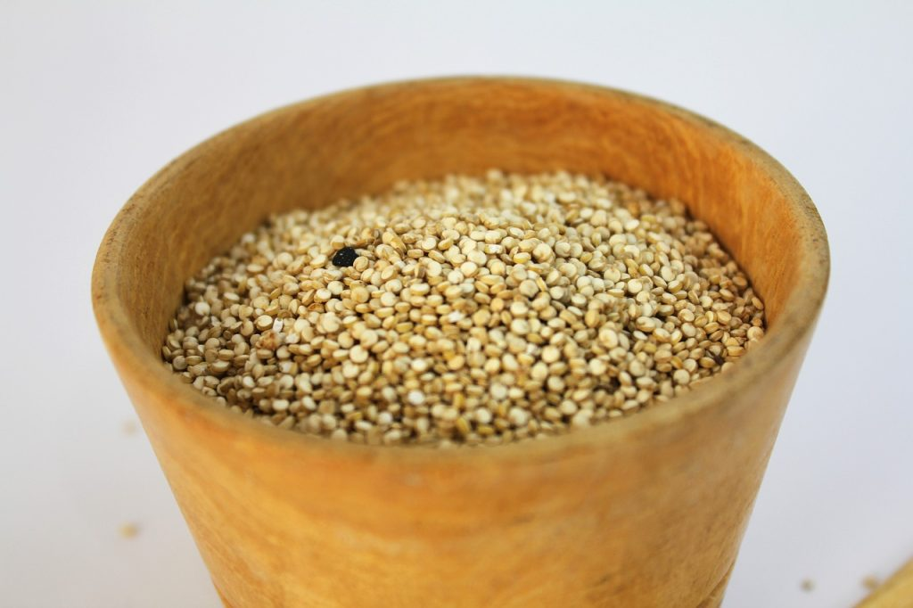

# PROPIEDADES DEL AMARANTO

## Las propiedades del amaranto en el organismo.

El amaranto, un antiguo grano con una rica historia en la nutrición humana, ha resurgido en la alimentación moderna gracias a sus impresionantes propiedades y beneficios para la salud. En este artículo, exploraremos en profundidad qué hace al amaranto un superalimento, detallando su composición nutricional y los múltiples beneficios que aporta al organismo. También te daremos ideas de productos relacionados para mejorar tu dieta.

## Composición Nutricional del Amaranto

El amaranto es muy rico en proteínas, mucho más que otros granos como el trigo o el centeno. No tiene glúten, por lo que está permitido su consumo a personas celíacas. Contiene una gran cantidad de fibra dietética, además es una excelente fuente de nutrientes esenciales. A continuación, desglosamos su composición nutricional:

### Proteínas de Alta Calidad

El amaranto contiene proteínas completas, que proporcionan todos los aminoácidos esenciales que el cuerpo necesita. Esto es raro en los alimentos vegetales y lo convierte en una excelente opción para vegetarianos y veganos.

### Vitaminas y Minerales

El amaranto es rico en varias vitaminas y minerales, incluyendo:

- **Hierro**: Fundamental para la producción de glóbulos rojos y prevención de la anemia.
- **Magnesio**: Importante para la función muscular y nerviosa.
- **Fósforo**: Necesario para la formación de huesos y dientes.
- **Manganeso**: Contribuye a la formación de huesos y la coagulación sanguínea.
- **Vitaminas del complejo B**: Cruciales para el metabolismo energético.

### Fibra Dietética

La fibra es esencial para la salud digestiva. El amaranto contiene una alta cantidad de fibra, que ayuda a regular el tránsito intestinal y prevenir el estreñimiento.

### Antioxidantes

El amaranto es una fuente rica en antioxidantes, que combaten el estrés oxidativo en el cuerpo y pueden reducir el riesgo de enfermedades crónicas.

## Beneficios del Amaranto para la Salud

### Mejora la Salud Digestiva

Gracias a su alto contenido de fibra, el amaranto puede mejorar la salud digestiva, promoviendo una digestión eficiente y regular.

### Apoya la Salud Cardiovascular

El amaranto puede ayudar a reducir los niveles de colesterol gracias a sus propiedades antioxidantes y contenido de fibra. Estudios recientes han mostrado que el consumo regular de amaranto puede contribuir a la salud cardiovascular.

### Control del Azúcar en Sangre

El índice glucémico del amaranto es bajo, lo que significa que no causa picos rápidos en los niveles de azúcar en sangre. Esto lo hace ideal para personas con diabetes o aquellos que buscan controlar sus niveles de glucosa.

### Fortalece el Sistema Inmunológico

Las vitaminas y minerales presentes en el amaranto, como el zinc y el hierro, son fundamentales para un sistema inmunológico fuerte y saludable.

## Cómo Incorporar el Amaranto en tu Dieta

### Ideas de Recetas con Amaranto

- **Porridge de Amaranto**: Cocido con leche o leche vegetal, y acompañado de frutas frescas.
- **Ensaladas**: Añadir amaranto cocido a tus ensaladas para un extra de proteínas y fibra.
- **Barritas Energéticas**: Preparar barritas caseras mezclando amaranto con miel y frutos secos.

Ensalada de amaranto, aguacate y cherrys

### Productos Recomendados

Para aquellos interesados en incorporar el amaranto en su dieta, aquí te dejamos algunas recomendaciones de productos:

- **Harina de Amaranto**: Ideal para panadería y repostería.
- **Granos de Amaranto Orgánico**: Perfectos para cocinar y añadir a diversas recetas.
- **Barritas de Amaranto**: Una opción práctica para un snack saludable.

A continuación un breve [vídeo](https://www.youtube.com/watch?v=HaBUfnIG--I) sobre las propiedades de este magnífico alimento.

Nos vemos en el camino 🙂

Si quieres saber más sobre nutrición y vida sana, [suscríbete a mi canal](https://www.youtube.com/user/nutriclubweb) y sigue mi página de [Facebook](https://www.facebook.com/clubdenutricion.es/). Visita la sección de blog [aquí](/blog/).
