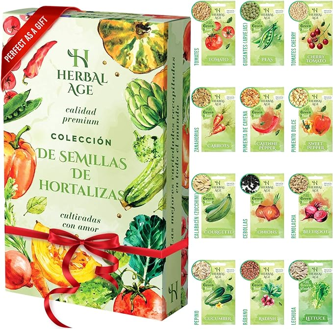
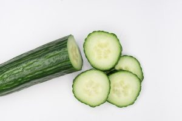
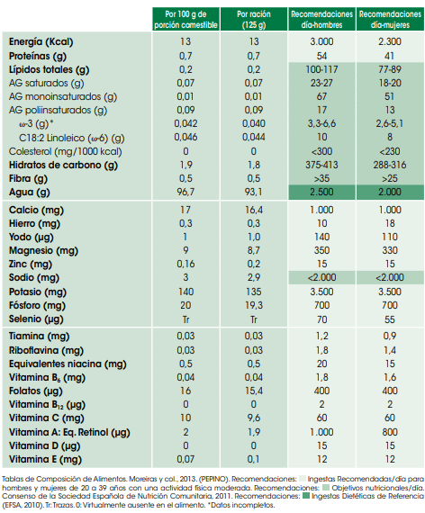

## Las propiedades del pepino en el organismo

Hoy te traemos un vídeo en el que veremos las propiedades del pepino. Esta hortaliza es indispensable en ensaladas y gazpachos. Los hay de diferentes variedades, algunos más dulces que otros. Los hay incluso con sabor parecido al melón, éstos son de los más dulces.

El pepino es una hortaliza compuesta por un 97% de agua que se utiliza principalmente para la elaboración de ensaladas, sopas y encurtidos. También utilizado en cosmética por sus propiedades beneficiosas para la piel.

#### [¿Hacemos un huerto urbano?](https://amzn.to/3KOlUD8)

¡Cultiva tu salud y tu felicidad plantando tus propios pepinos! 🌱🥒 Es fácil, divertido y una excelente manera de conectar con la naturaleza. ¡Anímate a comenzar tu propio huerto hoy mismo! 🌿🌞

[Comprar](https://amzn.to/3KOlUD8)

### PROPIEDADES DEL PEPINO:

1. Es bueno para el corazón, ya que previene enfermedades cardíacas.
2. Elimina líquidos retenidos, gracias a su función diurética, por lo que es maravillosa para equilibrar la retención de los mismos.
3. Mejora la vista por su contenido en Vitaminas que la benefician.
4. Alto contenido en fibra que favorece el tránsito intestinal. Gracias a esto, podemos evitar el estreñimiento y sus complicaciones.
5. Contiene vitaminas B6 y B12 ambas  esenciales para el metabolismo, la formación de células sanguíneas, el funcionamiento del sistema nervioso y el mantenimiento de la salud en general. Es importante asegurarse de consumir suficientes cantidades de estas vitaminas a través de la dieta o suplementos si es necesario.
6. Es refrescante, es por eso que se usa tanto a nivel interno, en ensaladas, como a nivel externo, en el contorno de ojos para refrescar la piel.
7. Tiene efecto saciante, por lo que ayuda a controlar el peso.

> TIP:
> Si usas pepino en tus ensaladas, aumentas el agua que consumes y la saciedad del plato.
> Además, aportarás muy pocas calorías, y un alto valor nutricional.
>
> Club DeNutrición [Tuit](https://twitter.com/intent/tweet?text=TIP%3A%0ASi+usas+pepino+en+tus+ensaladas%2C+aumentas+el+agua+que+consumes+y+la+saciedad+del+plato.+%0AAdem%C3%A1s%2C+aportar%C3%A1s+muy+pocas+calor%C3%ADas%2C+y+un+alto+valor+nutricional.++%E2%80%94+Club+DeNutrici%C3%B3n&via=nutriclubonline)

#### Composición nutricional del Pepino

#### [Para ver el vídeo haz clic en la imagen:](https://youtu.be/qV8-9BzO57M)

Nos vemos en el camino 🙂

Si quieres saber más sobre nutrición y vida sana, [suscríbete a mi canal](https://www.youtube.com/user/nutriclubweb) y sigue mi página de [Facebook](https://www.facebook.com/clubdenutricion.es/). Visita la sección de blog [aquí](/blog/).
