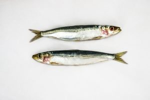
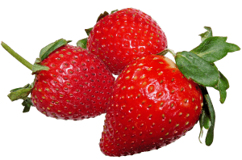

La dieta cetogénica, también conocida como dieta keto, es un plan de alimentación que se enfoca en reducir el consumo de carbohidratos y aumentar el consumo de grasas saludables. El objetivo principal de esta dieta es poner al cuerpo en un estado de cetosis, en el que el cuerpo utiliza las grasas como fuente de energía en lugar de los carbohidratos. Pero, ¿qué alimentos están permitidos en la dieta keto? A continuación, te presentamos una guía completa de los alimentos que puedes incluir en tu dieta keto.

## Alimentos ricos en grasas saludables

Los alimentos ricos en grasas saludables son la base de la dieta keto. Estos alimentos proporcionan la energía necesaria para que el cuerpo funcione correctamente. Algunos ejemplos de alimentos ricos en grasas saludables incluyen:

- Aceites vegetales como el aceite de oliva, el aceite de coco y el de aguacate
- Nueces y semillas como las almendras, las nueces de macadamia y las semillas de chía
- Pescados grasos como el salmón y la caballa
- Carnes grasas como la carne de cerdo y la carne de ternera
- Quesos grasos como el queso cheddar y el queso parmesano

## Proteínas magras y ricas en omega-3

Las proteínas magras y ricas en omega-3 son esenciales para la dieta keto. Estos alimentos ayudan a construir y reparar los tejidos del cuerpo, y también proporcionan una fuente de energía. Algunos ejemplos de proteínas magras y ricas en omega-3 incluyen:

- Pescados magros como el bacalao, la merluza o la tilapia
- Carnes magras como la carne de pollo y la carne de ternera
- Huevos y productos lácteos como el yogur griego
- Frutos del mar como las gambas, sepias, el cangrejo…

## Vegetales bajos en carbohidratos

Aunque la dieta keto se enfoca en reducir el consumo de carbohidratos, hay algunos vegetales que son bajos en carbohidratos y pueden ser incluidos en la dieta. Algunos ejemplos de vegetales bajos en carbohidratos incluyen:

- Lechugas y espinacas
- Pimientos y pepinos
- Cebollas (en cantidad controlada) y ajo
- Setas y champiñones

## Frutas bajas en carbohidratos

Al igual que los vegetales, hay algunas frutas que son bajas en carbohidratos y pueden ser incluidas en la dieta keto. Las únicas frutas permitidas en este estilo de alimentación son:

- Frutos rojos:
  - Fresas o frutillas
  - Arándanos
  - Moras
  - Frambuesas

## Alimentos procesados permitidos

Si bien es recomendable enfocarse en alimentos frescos y naturales, hay algunos alimentos procesados que pueden ser incluidos en la dieta keto. Algunos ejemplos de alimentos procesados permitidos incluyen:

- Quesos y productos lácteos bajos en carbohidratos
- Carnes procesadas como el salami y el chorizo (de vez en cuando)
- Pescados enlatados como el atún y el salmón
- Mezclas de proteínas y grasas como las barras de proteínas y los batidos de suero bajos en carbohidratos

Recuerda que, aunque estos alimentos procesados pueden ser incluidos en la dieta keto, es importante leer las etiquetas y asegurarte de que no contengan carbohidratos adicionales o ingredientes no permitidos.

## Conclusión

La dieta keto puede parecer restrictiva al principio, pero hay una variedad de alimentos deliciosos y saludables que pueden ser incluidos en la dieta. Al enfocarte en alimentos ricos en grasas saludables, proteínas magras y ricas en omega-3, y vegetales y frutas bajos en carbohidratos, puedes mantener una dieta keto saludable y equilibrada. Recuerda leer las etiquetas y asegurarte de que los alimentos procesados que elijas no contengan carbohidratos adicionales o ingredientes no permitidos.

Nos vemos en el camino 🙂

Si quieres saber más sobre nutrición y vida sana, [suscríbete a mi canal](https://www.youtube.com/user/nutriclubweb) y sigue mi página de [Facebook](https://www.facebook.com/clubdenutricion.es/). Visita la sección de blog [aquí](/blog/).

**Aviso importante:**

La información proporcionada en esta página tiene únicamente fines informativos y educativos. No está destinada a sustituir el consejo, diagnóstico o tratamiento médico profesional. Siempre consulta con un médico u otro profesional de la salud cualificado cualquier duda que tengas sobre una condición médica o tratamiento.

El uso de esta página y de la información contenida en ella es bajo tu propio riesgo. No asumimos responsabilidad alguna por decisiones que tomes basándote en el contenido de este sitio web.
