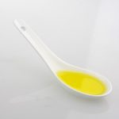

Esta receta es ideal para almuerzos o cenas completas, recuerda que cada comida debe estar compuesta por una variedad equilibrada de nutrientes que cumplan con los requerimientos keto. Veamos cómo elaborar esta receta keto de Ensalada de Pollo y Aguacate:

### Ingredientes:

- 1 pechuga de pollo a la parrilla
- 1 aguacate maduro
- 2 tazas de hojas verdes al gusto (lechugas, espinacas…)
- 1/2 taza de tomates cherry
- 1/4 taza de cebolla morada
- 2 cucharadas de aceite de oliva virgen extra
- Sal y pimienta al gusto

### Preparación de Ingredientes:

- Cortar la pechuga de pollo a la parrilla en cubos
- Cortar el aguacate maduro en cubos
- Mezclar las hojas verdes elegidas y bien lavadas
- Cortar por la mitad los tomates cherry
- Cortar en rodajas finas la cebolla morada

## Receta: Ensalada de Pollo y Aguacate

### Preparación:

- En un bol grande, combinar las hojas verdes, los tomates cherry y la cebolla morada.
- Añadir el pollo y el aguacate en cubos.
- Rociar con el aceite de oliva, sal y pimienta.
- Mezclar bien y servir inmediatamente.

Nos vemos en el camino 🙂

Si quieres saber más sobre nutrición y vida sana, [suscríbete a mi canal](https://www.youtube.com/user/nutriclubweb) y sigue mi página de [Facebook](https://www.facebook.com/clubdenutricion.es/). Visita la sección de blog [aquí](/blog/).
