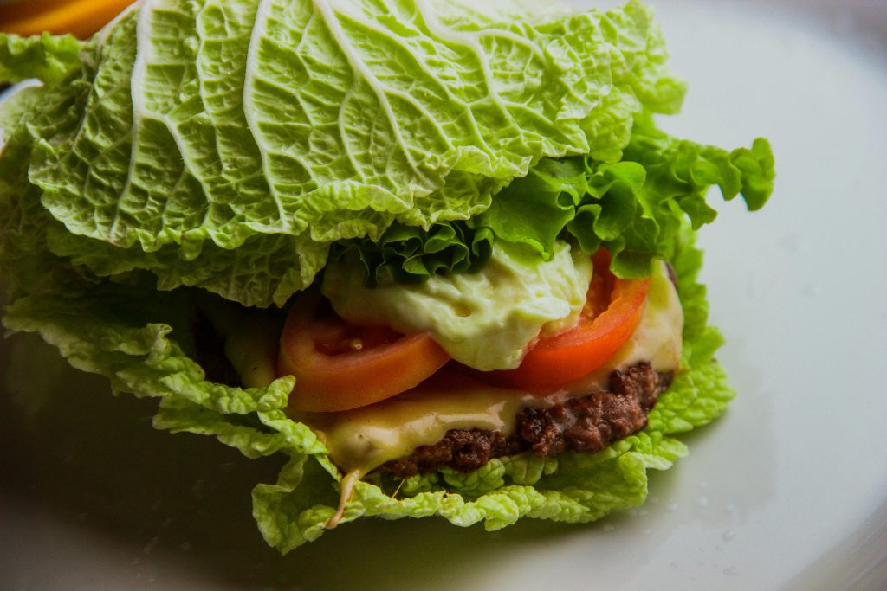

## Receta keto: Tacos de Carne Molida y Queso

Veamos cómo elaborar esta receta keto Tacos de Carne Molida y Queso.  Una receta deliciosa ideal para tomar en el almuerzo o la cena. En este caso, vamos a sustituir las tortillas de trigo por hojas de lechuga. ¡Atrévete a probarlos quedan deliciosos y muy jugosos!

### Ingredientes

- 450 gr de carne molida o 2 tazas. Puedes elegir la que más te guste entre pollo, cerdo o ternera.
- 1 cucharada de aceite de oliva
- 1 cucharada de comino en polvo
- 1 cucharada de pimentón
- Sal y pimienta al gusto
- Hojas de lechuga romana o cualquier otra con hojas grandes
- 1/2 taza de queso rallado (lo puedes rallar en el momento)
- Salsa (mayonesa, alioli, aguacate o mostaza dijon)

## Receta keto: Tacos de Carne Molida y Queso

### Preparación

- Calentar el aceite de oliva en una sartén a fuego medio.
- Añadir la carne molida y cocinar hasta que esté dorada.
- Condimentar la cerne con comino, pimentón, sal y pimienta.
- Preparar «barcas» de lechuga para rellenarlas.
- Colocar la carne cocida en las hojas de lechuga.
- Espolvorear con queso rallado y añadir salsa al gusto.
- Servir inmediatamente.
- Disfrutar de este manjar.

Nos vemos en el camino 🙂

Si quieres saber más sobre nutrición y vida sana, [suscríbete a mi canal](https://www.youtube.com/user/nutriclubweb) y sigue mi página de [Facebook](https://www.facebook.com/clubdenutricion.es/). Visita la sección de blog [aquí](/blog/).
