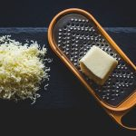
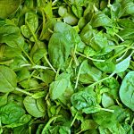

Veamos cómo elaborar esta receta keto Tortilla de Espinacas, Champiñones y Queso. Una receta fácil, rápida y deliciosa, ideal para desayuno o cena.

### Ingredientes:

- 3 huevos
- 1 taza de espinacas frescas
- 1/2 taza de champiñones en rodajas
- 1/4 taza de queso rallado (cheddar o mozzarella)
- Sal y pimienta al gusto
- 1 cucharada de mantequilla

## Receta keto: Tortilla Espinacas Champiñones y Queso

### Preparación:

- Batir enérgicamente los huevos en un bol y mezclarlos con la sal y la pimienta.
- Calentar hasta derretir la mantequilla en una sartén a fuego medio.
- Añadir los champiñones y cocinar hasta que estén suaves y bien dorados.
- Agregar las espinacas y cocinar hasta que se marchiten, no dejar de revolver en ningún momento.
- Ahora toca verter los huevos batidos en la sartén, esparciéndolos bien por toda la superficie y cocinar hasta que se cuajen.
- Por último, espolvorear el queso rallado sobre la tortilla, doblar, sellar y servir. Puedes comerla caliente o tibia.

## Receta keto: Tortilla Espinacas Champiñones y Queso

Nos vemos en el camino 🙂

Si quieres saber más sobre nutrición y vida sana, [suscríbete a mi canal](https://www.youtube.com/user/nutriclubweb) y sigue mi página de [Facebook](https://www.facebook.com/clubdenutricion.es/). Visita la sección de blog [aquí](/blog/).
