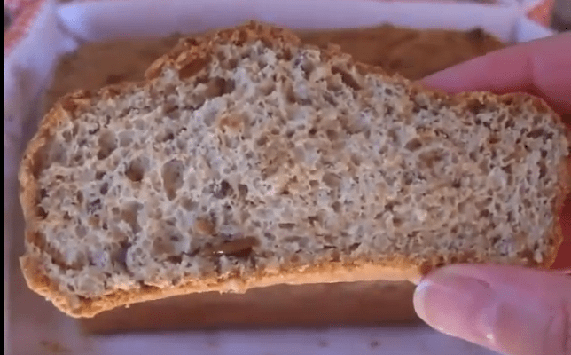

## RECETA PAN DE PROTEINAS

## Receta pan de proteínas con efecto quemagrasas.

Hoy te traigo una sencilla receta pan de proteínas para que puedas hacer en casa, de manera muy fácil, este pan, sin casi nada de carbohidratos. Además, debido a su composición, tiene efecto quemagrasas. Una gran alternativa al pan industrial, muy bueno, sano y con grandes beneficios nutricionales. Además Apto para dieta Keto.

INGREDIENTES:

- 125 gr de lino dorado molido, o 10 cucharadas de lino entero que moleremos.
- Una cucharadita de sal.
- Una cucharadita de bolero\* de jengibre (opcional).
- Un sobre de levadura
- 10 claras de huevo
- Semillas al gusto

## Ingredientes:

### REALIZACIÓN RECETA PAN DE PROTEÍNAS:

01. Lo primero que hacemos es encender el horno para que se vaya calentando.
02. Si tenemos el lino molido, pesamos 150 grs, si no, molemos 10 cucharadas.
03. Cuando las semillas estén bien molidas, las ponemos en un bol para hacer la mezcla (yo la hago directamente en el molde, ya que es bastante hondo y no salpica al mezclar.
04. Añadimos la sal, la cucharadita de bolero y el sobre de levadura. Mezclamos para que se integre y quede un color uniforme.
05. Añadimos las claras y removemos, al cabo de unos minutos, veremos como al entrar en contacto con el líquido, el lino se vuelve una masa con textura.
06. Si nos gustan y queremos, podemos añadir semillas. Yo he puesto algunas de lino, chía, pipas de girasol, calabaza y sésamo. Mezclar bien
07. Si lo deseas puedes poner algunas también en la parte superior, para que queden por fuera del pan.
08. Meter en el horno, en rejilla media si tu horno es grande o inferior si es pequeño, (para que no te pase como a mi y se te quemen un poco las semillas :-O)
09. Sacar tras 20-35 minutos. Dependiendo del horno, tardará más o menos, tienes que pinchar y cuando salga totalmente limpio y seco, sacas el molde y lo dejas enfriar. Ahora puedes desmoldarlo y probarlo. (A mi al desmoldarlo me quedó por abajo un poco «sudado» por lo que le di la vuelta y lo puse 5 minutitos más).
10. Cortar rodajas y disfrutar.

Este pan es idea para tomar a media mañana o por la tarde. Tiene un gran poder saciante por la cantidad de proteínas que lo componen, además es 100% apto en dieta keto o cetogénica.

\*El bolero es un saborizante sin calorías de muchos sabores.

Puedes [ver el vídeo](https://www.youtube.com/watch?v=gxGYOXQnOxY) paso a paso de la receta más abajo:

Nos vemos en el camino 🙂

Si quieres saber más sobre nutrición y vida sana, [suscríbete a mi canal](https://www.youtube.com/user/nutriclubweb) y sigue mi página de [Facebook](https://www.facebook.com/clubdenutricion.es/). Visita la sección de blog [aquí](/blog/).
