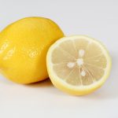
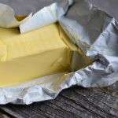
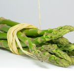

Te damos todas las claves para realizar esta receta de Salmón al Horno con Espárragos, ideal para una cena deliciosa o un almuerzo acompañado de hojas verdes en abundancia. ¿Te atreves? Atento a la siguiente información para elaborarla:

### Ingredientes:

- 2 filetes de salmón
- 1 manojo de espárragos
- 2 cucharadas de mantequilla derretida
- 1 limón, en rodajas
- Sal y pimienta al gusto

### Preparación de ingredientes:

En primer lugar, vamos a derretir la mantequilla, lo podemos hacer en el microondas, dando calor de 20 en 20 segundos hasta que esté completamente líquida.

En segundo lugar, debemos cortar el limón en rodajas finas.

## Receta: Salmón al Horno con Espárragos

### Instrucciones:

- Precalentar el horno a 200°C (400°F).
- Colocar los filetes de salmón y los espárragos en una bandeja para hornear.
- Rociar con mantequilla derretida, sal y pimienta.
- Colocar rodajas de limón sobre el salmón.
- Hornear durante 15-20 minutos, hasta que el salmón esté bien cocido.
- Servir caliente.

Nota: también se puede realizar en freidora de aire (Air Fryer) siguiendo las mismas instrucciones, pero vigilando el tiempo, ya que al ser un electrodoméstico más pequeño, suele tardar menos en cocinar. Por lo tanto, si utilizas la freidora, ¡Estate atenta, no dejes que se te pase!

Nos vemos en el camino 🙂

Si quieres saber más sobre nutrición y vida sana, [suscríbete a mi canal](https://www.youtube.com/user/nutriclubweb) y sigue mi página de [Facebook](https://www.facebook.com/clubdenutricion.es/). Visita la sección de blog [aquí](/blog/).
