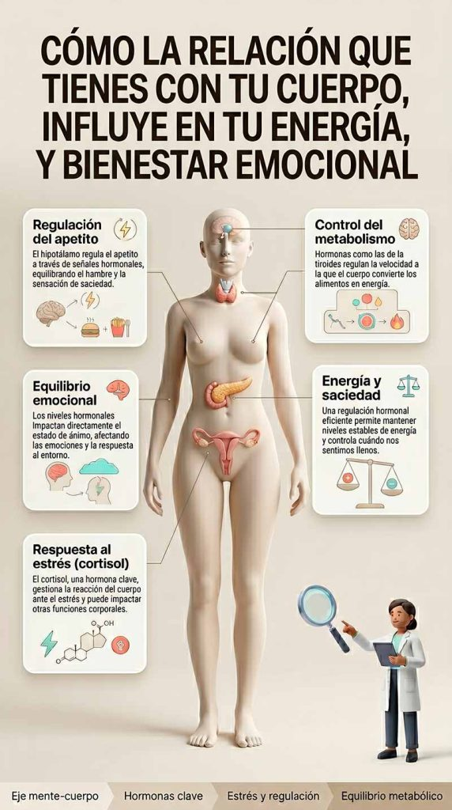

Aprende a desarrollar una relación más consciente, saludable y equilibrada con tu cuerpo para mejorar tu bienestar físico, mental y emocional

## Introducción

La relación con el cuerpo es un pilar fundamental del bienestar integral, aunque a menudo se pasa por alto. No se trata únicamente de aceptación estética, sino de la forma en la que nos percibimos, nos hablamos y nos relacionamos con nosotros mismos en el día a día.

Cuando existe una conexión saludable con el cuerpo, se favorecen la autoestima, la estabilidad emocional y la toma de decisiones más conscientes. Sin embargo, cuando esta relación es negativa o conflictiva, pueden aparecer inseguridad, comparación constante, estrés y desconexión corporal.

Por esta razón, aprender a construir una relación más amable, realista y respetuosa con el cuerpo no es solo un objetivo estético, sino un proceso profundo de salud mental, emocional y física.

En esta guía descubrirás qué es realmente la relación con el cuerpo, cómo se forma, qué factores la afectan y qué puedes hacer para mejorarla de forma progresiva y sostenible.

## Qué vas a aprender

A lo largo de este contenido vas a entender:

- Qué significa realmente tener una buena o mala relación con el cuerpo
- Cómo influye en tu autoestima, emociones y hábitos diarios
- Qué factores pueden deteriorarla con el tiempo
- Cómo identificar señales de alerta en tu forma de pensar y comportarte
- Y, sobre todo, qué estrategias puedes aplicar para mejorarla de forma práctica

## ¿Qué es la relación con el cuerpo?

Definición y concepto

La relación con el cuerpo hace referencia a la forma en la que percibimos, interpretamos y nos relacionamos con nuestro propio cuerpo a nivel físico, mental y emocional. No se limita únicamente a la apariencia, sino que también incluye cómo lo cuidamos, cómo lo escuchamos y cómo respondemos a sus necesidades diarias.

Esta relación se construye a lo largo de la vida y está influenciada por múltiples factores, como la educación, las experiencias personales, el entorno social y los mensajes culturales sobre el cuerpo y la belleza. Por ello, puede ser más positiva o más conflictiva dependiendo de estos condicionantes.

Cuando existe una relación saludable con el cuerpo, se favorece una mayor estabilidad emocional, una mejor autoestima y hábitos de vida más equilibrados. En cambio, una relación negativa puede generar desconexión, malestar emocional, insatisfacción constante e incluso afectar a la salud mental y física.

En definitiva, la relación con el cuerpo es un componente clave del bienestar integral, ya que influye directamente en cómo nos sentimos, cómo nos comportamos y cómo vivimos nuestro día a día.

## Síntomas de una relación disfuncional con el cuerpo

Señales de alerta

Una relación disfuncional con el cuerpo no siempre se manifiesta de forma evidente, pero sí deja señales claras en los pensamientos, emociones y comportamientos cotidianos. Identificar estos síntomas es fundamental para tomar conciencia del problema y empezar a cambiar la forma en la que te relacionas contigo mismo.

En muchos casos, estas señales aparecen de forma progresiva y se normalizan con el tiempo, lo que dificulta reconocer que existe un malestar de fondo.

* * *

Entre los síntomas más frecuentes se encuentran la crítica constante hacia el propio cuerpo y la autoexigencia excesiva, que generan una sensación permanente de insatisfacción. También es habitual la preocupación constante por la apariencia física, lo que puede afectar a la autoestima y al bienestar emocional.

Asimismo, pueden aparecer niveles elevados de ansiedad y estrés relacionados con la imagen corporal, especialmente en situaciones sociales o al compararse con otras personas. Esta tensión emocional puede llegar a influir en el estado de ánimo general y en la calidad de vida.

Por otro lado, es común desarrollar conductas de evitación, como evitar espejos, fotografías o actividades en las que el cuerpo esté expuesto. Este tipo de comportamiento refuerza la desconexión corporal y limita la libertad personal.

**Reconocer estas señales no es un motivo de juicio, sino una oportunidad para empezar a reconstruir una relación más sana, consciente y respetuosa con tu cuerpo.**

## Cómo afecta la relación con el cuerpo a nuestra salud y bienestar

Consecuencias de una relación disfuncional

Una relación disfuncional con el cuerpo puede tener un impacto significativo en la salud y el bienestar general.

No se trata solo de la imagen corporal, sino de cómo esta relación influye en el estado emocional, en los hábitos diarios y en la forma de vivir el propio cuerpo.

En muchos casos, esta relación puede contribuir al desarrollo de ansiedad, estados de ánimo bajos e incluso síntomas depresivos, especialmente cuando existe una preocupación constante por la apariencia física o una autoexigencia elevada.

Además, también puede influir en la relación con la comida y con los hábitos de alimentación, generando patrones poco saludables o una desconexión de las señales internas del cuerpo como el hambre o la saciedad.

A nivel físico, el estrés mantenido en el tiempo puede afectar al descanso, a los niveles de energía y al equilibrio general del organismo, ya que cuerpo y mente están directamente conectados.

Por último, esta forma de relación también puede impactar en la autoestima, la seguridad personal y la forma de relacionarse con los demás, condicionando la confianza en uno mismo en distintos contextos sociales.

## Relación con las hormonas y el metabolismo

Conexión entre el cuerpo y las hormonas

El cuerpo y el sistema hormonal están estrechamente conectados, ya que las hormonas actúan como mensajeros químicos que regulan funciones esenciales como el metabolismo, el apetito,

Además, también influyen directamente en el estado de ánimo, el estrés y el equilibrio emocional.

Cuando la relación con el cuerpo es saludable, el organismo tiende a funcionar de forma más estable, favoreciendo una mejor regulación de estas funciones.

Sin embargo, cuando existe una relación disfuncional marcada por el estrés, la autoexigencia o la desconexión corporal, este equilibrio puede verse alterado.

En estos casos, el sistema hormonal puede responder al estrés sostenido, lo que impacta en la forma en la que el cuerpo gestiona la energía, las señales de hambre y saciedad y la recuperación general del organismo.

Esta interacción entre lo emocional y lo fisiológico refleja cómo la percepción que tenemos de nuestro cuerpo puede influir también en procesos biológicos fundamentales.

## Soluciones para mejorar la relación con el cuerpo

Estrategias para cultivar una relación más saludable, consciente y positiva

Mejorar la relación con el cuerpo requiere práctica, paciencia y un cambio progresivo en la forma de pensar, sentir y actuar. No se trata de perfección, sino de aprendizaje continuo y de pequeñas acciones diarias que, con el tiempo, generan una transformación profunda en el bienestar físico y emocional.

A continuación, encontrarás estrategias prácticas que te ayudarán a reconectar con tu cuerpo desde un lugar más respetuoso, equilibrado y consciente.

### Práctica de la autocompasión

La autocompasión consiste en tratarte con amabilidad en lugar de crítica constante. Implica aceptar tus imperfecciones, reducir la autoexigencia y aprender a hablarte de una forma más respetuosa. Este cambio en el diálogo interno es clave para disminuir el malestar corporal y fortalecer la autoestima.

### Alimentación consciente e intuitiva

Escuchar las señales del hambre, la saciedad y las necesidades reales del cuerpo ayuda a reducir la ansiedad relacionada con la comida. La alimentación intuitiva fomenta una relación más libre, equilibrada y respetuosa con el propio cuerpo.

### Autoexploración y autoconocimiento corporal

Conocerte mejor implica identificar tus pensamientos, emociones y patrones relacionados con tu cuerpo. Este proceso te permite entender de dónde vienen ciertas inseguridades y empezar a transformarlas de forma consciente.

### Actividad física consciente y placentera

El movimiento debe ser una forma de cuidado, no de castigo. Realizar actividades físicas que disfrutes ayuda a mejorar la energía, la autoestima y la conexión con el cuerpo. El objetivo es sentirte bien, no cumplir estándares externos.

### Técnicas de relajación y regulación del estrés

Prácticas como la respiración consciente, la meditación o el yoga ayudan a reducir el estrés y a mejorar la conexión cuerpo-mente. Al disminuir la activación constante del sistema nervioso, es más fácil escuchar las señales del cuerpo y recuperar el equilibrio emocional.

### Búsqueda de apoyo y entorno saludable

Rodearte de personas o comunidades que promuevan una relación sana con el cuerpo puede facilitar el cambio. El apoyo externo ayuda a reducir el aislamiento, cuestionar creencias limitantes y reforzar hábitos más positivos.

## Preguntas frecuentes

¿Cómo puedo empezar a mejorar mi relación con el cuerpo?

Empezar no requiere cambios drásticos, sino pequeñas acciones conscientes en el día a día. El primer paso es tomar conciencia de cómo te hablas a ti mismo y detectar si existe crítica constante o autoexigencia excesiva. A partir de ahí, puedes comenzar a introducir hábitos como el autocuidado, la reducción de la comparación y la atención a las señales de tu cuerpo.

¿Qué es la autocompasión y cómo puedo practicarla?

La autocompasión es la capacidad de tratarte con amabilidad, comprensión y respeto, especialmente en momentos de dificultad o insatisfacción corporal. Practicarla implica cambiar el diálogo interno crítico por uno más equilibrado, aceptar la imperfección y entender que tu valor no depende de tu apariencia física.

¿Cómo puedo reducir la crítica y la autoexigencia?

Reducir la crítica interna comienza por identificar los pensamientos automáticos negativos y cuestionarlos. Es útil sustituirlos por mensajes más realistas y amables. Además, trabajar la flexibilidad mental, el descanso y el autocuidado ayuda a disminuir la presión constante hacia uno mismo.

¿Qué es la inteligencia emocional y cómo ayuda en este proceso?

La inteligencia emocional es la capacidad de reconocer, comprender y gestionar las propias emociones. En la relación con el cuerpo, permite identificar cómo te sientes respecto a tu imagen corporal, regular el malestar emocional y responder de forma más consciente en lugar de reaccionar desde la crítica o la ansiedad.

¿Por qué es tan importante la relación con el cuerpo?

Porque influye directamente en la autoestima, la salud mental, los hábitos diarios y el bienestar general. Una relación saludable con el cuerpo no solo mejora cómo te sientes contigo mismo, sino también cómo te relacionas con los demás y cómo gestionas tu vida cotidiana.

¿Se puede mejorar la relación con el cuerpo aunque lleve años siendo negativa?

Sí, es totalmente posible. Aunque lleves tiempo con una relación complicada con tu cuerpo, esta no es fija ni definitiva. Con práctica, conciencia y apoyo adecuado, se pueden modificar patrones de pensamiento y comportamiento para construir una relación más sana y equilibrada.

## conclusión

La relación con el cuerpo es un aspecto clave del bienestar físico, mental y emocional. Influye en la forma en la que nos sentimos con nosotros mismos, en cómo gestionamos nuestras emociones y en la calidad de nuestros hábitos diarios.

A lo largo de este contenido hemos visto cómo esta relación puede verse afectada por múltiples factores y cómo, en muchos casos, puede derivar en insatisfacción, autoexigencia o desconexión corporal. Sin embargo, también hemos comprendido que es posible transformarla mediante la consciencia, el autocuidado y el trabajo emocional.

Aplicar estrategias como la autocompasión, la reducción de la autoexigencia o el desarrollo de una mayor conexión con el cuerpo permite mejorar progresivamente la autoestima, la seguridad personal y el bienestar general.

En definitiva, la relación con el cuerpo no es algo fijo, sino un proceso que se construye día a día. Cada pequeño cambio en la forma de pensar, sentir y actuar suma en la dirección de una vida más equilibrada, consciente y saludable.
