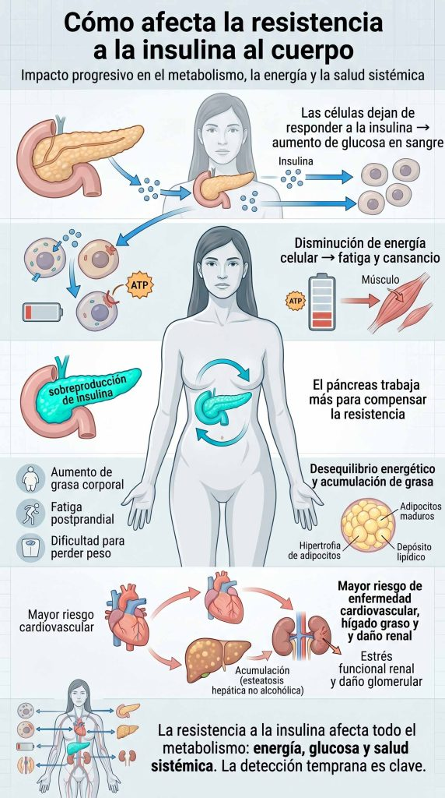

Descubre cómo identificar la resistencia a la insulina, entender por qué aparece y qué estrategias naturales pueden ayudarte a mejorarla y recuperar tu equilibrio metabólico

#### Tabla de contenidos

01. [Introducción](/resistencia-a-la-insulina-sintomas-causas-soluciones-naturales/#elementor-toc__heading-anchor-0)

02. [Qué vas a aprender](/resistencia-a-la-insulina-sintomas-causas-soluciones-naturales/#elementor-toc__heading-anchor-1)

03. [¿Qué es la resistencia a la insulina?](/resistencia-a-la-insulina-sintomas-causas-soluciones-naturales/#elementor-toc__heading-anchor-2)

04. [Síntomas de la resistencia a la insulina](/resistencia-a-la-insulina-sintomas-causas-soluciones-naturales/#elementor-toc__heading-anchor-3)

05. [Cómo afecta la resistencia a la insulina al cuerpo](/resistencia-a-la-insulina-sintomas-causas-soluciones-naturales/#elementor-toc__heading-anchor-4)

06. [Relación con el metabolismo](/resistencia-a-la-insulina-sintomas-causas-soluciones-naturales/#elementor-toc__heading-anchor-5)

07. [🔹 Soluciones naturales para la resistencia a la insulina](/resistencia-a-la-insulina-sintomas-causas-soluciones-naturales/#elementor-toc__heading-anchor-6)

    1. [Cambiar la dieta](/resistencia-a-la-insulina-sintomas-causas-soluciones-naturales/#elementor-toc__heading-anchor-7)

    2. [Reducir el estrés](/resistencia-a-la-insulina-sintomas-causas-soluciones-naturales/#elementor-toc__heading-anchor-8)

    3. [Reducir el sedentarismo](/resistencia-a-la-insulina-sintomas-causas-soluciones-naturales/#elementor-toc__heading-anchor-9)

    4. [Incrementar la actividad física](/resistencia-a-la-insulina-sintomas-causas-soluciones-naturales/#elementor-toc__heading-anchor-10)

    5. [Dormir lo suficiente](/resistencia-a-la-insulina-sintomas-causas-soluciones-naturales/#elementor-toc__heading-anchor-11)

    6. [Aumentar la calidad de los alimentos antiinflamatorios](/resistencia-a-la-insulina-sintomas-causas-soluciones-naturales/#elementor-toc__heading-anchor-12)

    7. [Perder peso de forma saludable](/resistencia-a-la-insulina-sintomas-causas-soluciones-naturales/#elementor-toc__heading-anchor-13)

    8. [Limitar carbohidratos refinados](/resistencia-a-la-insulina-sintomas-causas-soluciones-naturales/#elementor-toc__heading-anchor-14)

    9. [Mantener una buena hidratación](/resistencia-a-la-insulina-sintomas-causas-soluciones-naturales/#elementor-toc__heading-anchor-15)
08. [Preguntas frecuentes](/resistencia-a-la-insulina-sintomas-causas-soluciones-naturales/#elementor-toc__heading-anchor-16)

09. [conclusión](/resistencia-a-la-insulina-sintomas-causas-soluciones-naturales/#elementor-toc__heading-anchor-17)

10. [Artículos relacionados](/resistencia-a-la-insulina-sintomas-causas-soluciones-naturales/#elementor-toc__heading-anchor-18)

    1. [La perimenopausia puede empezar antes de lo esperado: estas son sus primeras señales](/resistencia-a-la-insulina-sintomas-causas-soluciones-naturales/#elementor-toc__heading-anchor-19)

    2. [Ultraprocesados y salud digestiva: nueva alerta](/resistencia-a-la-insulina-sintomas-causas-soluciones-naturales/#elementor-toc__heading-anchor-20)

    3. [Dieta cetogénica y salud cerebral: qué dice la ciencia sobre Alzheimer y Parkinson](/resistencia-a-la-insulina-sintomas-causas-soluciones-naturales/#elementor-toc__heading-anchor-21)

    4. [El sueño profundo: la hormona natural que ayuda a regenerar músculo, metabolismo y cerebro](/resistencia-a-la-insulina-sintomas-causas-soluciones-naturales/#elementor-toc__heading-anchor-22)

    5. [Colesterol alto: por qué el LDL aislado podría no contar toda la historia clínica](/resistencia-a-la-insulina-sintomas-causas-soluciones-naturales/#elementor-toc__heading-anchor-23)
11. [¿Sientes que tu energía sube y baja constantemente?](/resistencia-a-la-insulina-sintomas-causas-soluciones-naturales/#elementor-toc__heading-anchor-24)

## Introducción

La resistencia a la insulina es una alteración metabólica cada vez más frecuente que puede pasar desapercibida durante años, pero que está directamente relacionada con problemas como el aumento de grasa abdominal, la fatiga persistente, el síndrome metabólico y el desarrollo de diabetes tipo 2 si no se aborda a tiempo.

Esta condición ocurre cuando las células del cuerpo dejan de responder correctamente a la insulina, una hormona clave encargada de regular los niveles de glucosa en sangre. Como consecuencia, el organismo necesita producir más insulina para conseguir el mismo efecto, lo que genera un desequilibrio progresivo en el metabolismo de la glucosa.

Entre los factores que más influyen en su aparición se encuentran una alimentación rica en ultraprocesados y azúcares, el sedentarismo, el estrés crónico, la falta de sueño y, en algunos casos, la predisposición genética. Sin embargo, lejos de ser un proceso irreversible, la resistencia a la insulina puede mejorar significativamente con cambios sostenidos en el estilo de vida.

En este artículo vas a entender de forma clara qué es la resistencia a la insulina, cuáles son sus principales síntomas y causas, y qué estrategias naturales han demostrado ser más efectivas para mejorar la sensibilidad a la insulina y recuperar el equilibrio metabólico.

## Qué vas a aprender

En este artículo vas a descubrir de forma clara y práctica:

- **Cuáles son los principales síntomas de la resistencia a la insulina** y cómo identificarlos a tiempo.
- **Qué factores y causas están detrás de la resistencia a la insulina**, desde la alimentación hasta el estilo de vida y el estrés.
- **Qué estrategias y soluciones naturales pueden ayudarte a mejorar la sensibilidad a la insulina** y revertir esta condición de manera progresiva.

## ¿Qué es la resistencia a la insulina?

Entendiendo la resistencia a la insulina

La resistencia a la insulina es una alteración metabólica en la que las células del cuerpo responden de forma insuficiente a la acción de la insulina, una hormona producida por el páncreas que regula los niveles de glucosa en sangre.

En condiciones normales, la insulina actúa como una “llave” que permite que la glucosa entre en las células para ser utilizada como energía. Sin embargo, cuando existe resistencia a la insulina, este mecanismo se vuelve menos eficiente, por lo que la glucosa permanece en el torrente sanguíneo durante más tiempo.

Como respuesta, el páncreas intenta compensar esta falta de sensibilidad produciendo mayores cantidades de insulina. Con el tiempo, este esfuerzo puede no ser suficiente, lo que provoca niveles elevados de glucosa en sangre y un mayor riesgo de desarrollar alteraciones metabólicas como prediabetes o diabetes tipo 2.

## Síntomas de la resistencia a la insulina

Reconocer los síntomas de la resistencia a la insulina

Los síntomas de la resistencia a la insulina pueden ser sutiles al inicio, lo que hace que muchas personas no la identifiquen hasta fases más avanzadas. Sin embargo, el cuerpo suele enviar señales progresivas que reflejan un deterioro en el metabolismo de la glucosa.

Uno de los signos más frecuentes es el **aumento de grasa abdominal**, incluso sin cambios significativos en la dieta. También es común la **fatiga persistente**, especialmente después de las comidas ricas en carbohidratos, así como la **dificultad para concentrarse o sensación de “niebla mental”**.

A nivel físico, pueden aparecer **cambios en la piel**, como acantosis nigricans (zonas más oscuras y engrosadas, especialmente en cuello o axilas), además de una mayor tendencia al acné o desequilibrios cutáneos.

En fases más avanzadas, la resistencia a la insulina puede asociarse con **alteraciones metabólicas más amplias**, como presión arterial elevada, aumento del colesterol LDL, disminución del HDL y un mayor riesgo de enfermedad cardiovascular.

Es importante tener en cuenta que estos síntomas no siempre aparecen todos juntos, y su intensidad puede variar según el estilo de vida, la genética y el grado de sensibilidad a la insulina de cada persona.

## Cómo afecta la resistencia a la insulina al cuerpo

Entendiendo el impacto de la resistencia a la insulina

La resistencia a la insulina tiene un impacto progresivo en el organismo, ya que afecta directamente a la forma en la que el cuerpo gestiona la glucosa y la energía.

Cuando las células dejan de responder adecuadamente a la insulina, el páncreas debe trabajar más para mantener estables los niveles de azúcar en sangre, generando un desequilibrio metabólico sostenido.

A corto plazo, este proceso puede provocar **fatiga, aumento de peso, dificultad para perder grasa y alteraciones en los niveles de energía**, especialmente después de las comidas.

Sin embargo, cuando la resistencia a la insulina se mantiene en el tiempo, las consecuencias pueden ser más serias.

A nivel metabólico, este estado aumenta el riesgo de desarrollar **prediabetes y diabetes tipo 2**, debido a la incapacidad progresiva del organismo para mantener la glucosa en rangos normales.

Además, se asocia con mayor probabilidad de **enfermedad cardiovascular**, ya que suele ir acompañada de hipertensión, aumento del colesterol LDL y triglicéridos elevados.

También puede afectar a órganos clave como el hígado y los riñones, contribuyendo al desarrollo de **hígado graso no alcohólico** y aumentando el riesgo de **enfermedad renal crónica** en fases avanzadas.

En conjunto, la resistencia a la insulina no solo impacta en los niveles de glucosa, sino que influye de forma global en el metabolismo, la energía y la salud cardiovascular, por lo que su detección y abordaje temprano son fundamentales.

## Relación con el metabolismo

La resistencia a la insulina y el metabolismo

La resistencia a la insulina está estrechamente vinculada con el metabolismo, ya que la insulina es una de las hormonas clave en la regulación del uso de la energía en el cuerpo.

El metabolismo es el conjunto de procesos mediante los cuales el organismo transforma los alimentos en energía utilizable.

En este contexto, la glucosa procedente de los carbohidratos es una de las principales fuentes de energía celular, y su entrada en las células depende de la acción de la insulina.

Cuando existe resistencia a la insulina, este mecanismo se vuelve menos eficiente: la glucosa no se transporta adecuadamente hacia las células y permanece elevada en el torrente sanguíneo.

Como consecuencia, el cuerpo entra en un estado de desregulación metabólica que obliga al páncreas a producir más insulina para compensar esta falta de sensibilidad.

Con el tiempo, este desequilibrio puede alterar la forma en la que el organismo utiliza y almacena la energía, favoreciendo la acumulación de grasa, especialmente a nivel abdominal, y contribuyendo a una disminución de la flexibilidad metabólica.

En conjunto, la resistencia a la insulina no solo afecta al control de la glucosa, sino que influye directamente en el funcionamiento global del metabolismo, pudiendo favorecer el desarrollo de alteraciones metabólicas si no se corrige a tiempo

## 🔹 Soluciones naturales para la resistencia a la insulina

Revertir la resistencia a la insulina de forma natural

Adoptar cambios sostenidos en el estilo de vida puede mejorar significativamente la sensibilidad a la insulina y favorecer el equilibrio metabólico. A continuación, te mostramos las estrategias más efectivas.

### Cambiar la dieta

Una alimentación equilibrada es clave para mejorar la sensibilidad a la insulina. Se recomienda priorizar alimentos ricos en fibra, proteínas de calidad y grasas saludables, reduciendo el consumo de ultraprocesados y azúcares añadidos.

### Reducir el estrés

El estrés crónico puede alterar las hormonas implicadas en el metabolismo de la glucosa. Incorporar técnicas como la meditación, la respiración consciente o el yoga ayuda a reducir esta carga fisiológica.

### Reducir el sedentarismo

Permanecer muchas horas sentado empeora la sensibilidad a la insulina. Incorporar movimiento frecuente a lo largo del día mejora el uso de glucosa incluso sin ejercicio intenso.

### Incrementar la actividad física

El ejercicio regular mejora la captación de glucosa por parte de las células y aumenta la sensibilidad a la insulina. Se recomienda realizar al menos 30 minutos diarios de actividad moderada.

### Dormir lo suficiente

Un descanso adecuado es esencial para la regulación hormonal. Dormir entre 7 y 9 horas diarias favorece un mejor control de la glucosa y mejora la función metabólica.

### Aumentar la calidad de los alimentos antiinflamatorios

Una dieta con alimentos antiinflamatorios como verduras, frutos rojos, aceite de oliva y pescado azul ayuda a mejorar el entorno metabólico y la sensibilidad a la insulina.

### Perder peso de forma saludable

En personas con exceso de peso, una reducción progresiva puede mejorar notablemente la sensibilidad a la insulina. Lo ideal es un enfoque sostenible basado en hábitos, no en restricciones extremas.

### Limitar carbohidratos refinados

Reducir el consumo de harinas refinadas y azúcares ayuda a estabilizar los niveles de glucosa. Se recomienda optar por carbohidratos complejos como verduras, frutas y cereales integrales.

### Mantener una buena hidratación

Una hidratación adecuada favorece la función metabólica y el control de la glucosa. Beber suficiente agua durante el día ayuda a mejorar el rendimiento celular.

## Preguntas frecuentes

¿Qué es exactamente la resistencia a la insulina?

La resistencia a la insulina es una alteración metabólica en la que las células dejan de responder correctamente a la insulina, lo que dificulta el uso de la glucosa como fuente de energía y eleva los niveles de azúcar en sangre.

¿Cuáles son los síntomas más comunes de la resistencia a la insulina?

Los síntomas pueden incluir aumento de grasa abdominal, fatiga frecuente, dificultad para perder peso, somnolencia después de comer, “niebla mental” y, en algunos casos, alteraciones en la piel como acantosis nigricans.

¿Cómo se detecta o diagnostica la resistencia a la insulina?

El diagnóstico se realiza mediante análisis de sangre que evalúan la glucosa en ayunas, la insulina basal y otros marcadores metabólicos. En algunos casos, se utiliza el índice HOMA-IR para estimar la sensibilidad a la insulina.

¿La resistencia a la insulina se puede revertir?

Sí. En muchos casos puede mejorar significativamente o revertirse con cambios en el estilo de vida, como una alimentación equilibrada, ejercicio regular, control del estrés, buen descanso y reducción del exceso de peso.

¿Qué complicaciones puede causar la resistencia a la insulina si no se trata?

Si no se aborda, puede progresar a prediabetes y diabetes tipo 2. También se asocia con mayor riesgo de enfermedad cardiovascular, hígado graso no alcohólico, hipertensión y alteraciones del colesterol.

¿Qué hábitos ayudan a mejorar la resistencia a la insulina de forma natural?

Los hábitos más efectivos incluyen mejorar la alimentación, reducir el consumo de azúcares y ultraprocesados, aumentar la actividad física, dormir bien, controlar el estrés y evitar el sedentarismo prolongado.

## conclusión

La resistencia a la insulina es una alteración metabólica cada vez más frecuente que puede influir de forma significativa en la salud general si no se detecta y se aborda a tiempo. Comprender sus síntomas, sus causas y sus posibles consecuencias es el primer paso para poder mejorar la sensibilidad a la insulina y recuperar el equilibrio metabólico.

Afortunadamente, en muchos casos es posible mejorar esta condición mediante cambios sostenidos en el estilo de vida. Una alimentación equilibrada, la práctica regular de ejercicio físico, el control del estrés, un descanso adecuado y la reducción del sedentarismo pueden marcar una diferencia importante en la regulación de la glucosa y en el funcionamiento del metabolismo.

Es importante recordar que cada caso es único y que, ante la sospecha de resistencia a la insulina o síntomas persistentes, lo más recomendable es consultar con un profesional de la salud para una evaluación adecuada y un seguimiento personalizado.

Adoptar hábitos saludables no solo ayuda a mejorar la resistencia a la insulina, sino que también contribuye de forma global a prevenir complicaciones metabólicas y a mejorar la calidad de vida a largo plazo.
