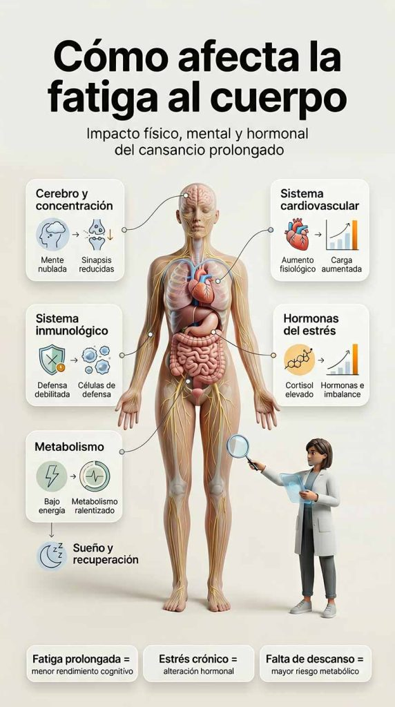

Descubre cómo mejorar tu energía diaria con hábitos saludables y rutinas sostenibles

## Introducción

Incorporar rutinas energéticas en tu día a día puede ayudarte a mejorar tu vitalidad, aumentar la productividad y sentirte mejor tanto física como mentalmente. A través de hábitos simples y sostenibles, es posible mantener niveles de energía más estables durante el día sin depender únicamente de estimulantes o soluciones temporales.

En esta sección encontrarás información práctica sobre rutinas energéticas saludables, descanso, alimentación, movimiento, gestión del estrés y hábitos diarios que favorecen una vida más activa. Además, aprenderás cómo pequeños cambios en tu estilo de vida pueden influir directamente en tu bienestar, concentración y rendimiento diario.

## Qué vas a aprender

En esta sección descubrirás cómo identificar las principales causas de la fatiga física y mental, así como los hábitos que pueden estar afectando tus niveles de energía sin que te des cuenta. Además, aprenderás a crear rutinas energéticas adaptadas a tu estilo de vida para sentirte más activo, concentrado y productivo durante el día.

También encontrarás consejos prácticos para diseñar una rutina matutina que favorezca un despertar con más vitalidad, mejorar tu alimentación con alimentos que ayudan a aumentar la energía de forma natural y aplicar estrategias efectivas para reducir el estrés. Por último, conocerás técnicas para optimizar el descanso y mejorar la calidad del sueño, dos factores fundamentales para mantener una energía estable y sostenible a largo plazo.

## ¿Qué son las rutinas energéticas?

Entendiendo el concepto

Las rutinas energéticas son el conjunto de hábitos y prácticas diarias que ayudan a mejorar, mantener y optimizar los niveles de energía física y mental. Su objetivo principal es favorecer un estado de bienestar más estable, evitando los picos de cansancio y la sensación constante de fatiga durante el día.

Estas rutinas pueden incluir aspectos tan importantes como la alimentación, la hidratación, la actividad física, la calidad del sueño, la exposición a la luz natural y la gestión del estrés. Cuando se aplican de forma constante, contribuyen a mejorar la concentración, el rendimiento diario y la sensación general de vitalidad.

Además, incorporar rutinas energéticas saludables no significa seguir hábitos extremos ni cambios difíciles de mantener. De hecho, pequeños ajustes en el estilo de vida pueden generar grandes mejoras en la energía diaria y en la salud a largo plazo.

Por ejemplo, mantener horarios de descanso regulares, realizar movimiento diario o consumir alimentos ricos en nutrientes son acciones sencillas que ayudan a sostener niveles de energía más equilibrados y naturales. Por esta razón, las rutinas energéticas se han convertido en una herramienta clave para quienes buscan una vida más activa, saludable y productiva.

## Síntomas de la fatiga

Cómo reconocer las señales de falta de energía

La fatiga no siempre se manifiesta únicamente como cansancio físico. En muchos casos, también puede afectar al rendimiento mental, al estado de ánimo y a la capacidad para realizar actividades cotidianas con normalidad. Por eso, identificar sus síntomas a tiempo es fundamental para mejorar los niveles de energía y prevenir un agotamiento más profundo.

Entre los síntomas de fatiga más frecuentes se encuentran la sensación constante de cansancio, la falta de motivación, la baja productividad y la dificultad para mantener la concentración durante el día. Además, muchas personas experimentan niebla mental, irritabilidad, cambios de humor o sensación de agotamiento incluso después de descansar.

También pueden aparecer síntomas físicos como dolores de cabeza, tensión muscular, somnolencia, falta de energía al despertar o necesidad continua de consumir cafeína o azúcar para mantenerse activo. Cuando estos signos se prolongan en el tiempo, suelen indicar que el cuerpo y la mente necesitan cambios en los hábitos diarios.

Las causas de la fatiga pueden estar relacionadas con el estrés, la mala calidad del sueño, una alimentación desequilibrada, el sedentarismo o unas rutinas poco saludables. Por ello, incorporar rutinas energéticas adecuadas puede ayudar a recuperar la vitalidad y mejorar el bienestar físico y mental de forma progresiva y sostenible.

Reconocer estas señales es el primer paso para entender qué factores están afectando tu energía diaria y comenzar a construir hábitos que favorezcan una vida más activa y saludable.

## Cómo afecta la fatiga a nuestro cuerpo

El impacto de la fatiga en la salud física y mental

La fatiga crónica puede afectar mucho más que los niveles de energía diarios.

Cuando el cansancio se mantiene durante largos periodos de tiempo, el cuerpo y la mente comienzan a resentirse, lo que puede influir negativamente en la salud física, emocional y mental.

A nivel mental, la falta de energía suele relacionarse con problemas de concentración, dificultad para tomar decisiones, menor productividad y una mayor sensación de estrés o irritabilidad.

Además, el agotamiento constante puede alterar el estado de ánimo y aumentar la sensación de ansiedad o desmotivación.

Sin embargo, los efectos de la fatiga también pueden manifestarse físicamente.

Diversos estudios han relacionado el cansancio prolongado y la falta de descanso con un mayor riesgo de desarrollar problemas de salud como enfermedades cardiovasculares, hipertensión, obesidad o alteraciones metabólicas relacionadas con la diabetes.

El sistema inmunológico también puede verse afectado.

Cuando el organismo no descansa correctamente o permanece en un estado continuo de estrés y agotamiento, las defensas pueden debilitarse, haciendo que el cuerpo sea más vulnerable a infecciones y enfermedades.

Además, la fatiga sostenida puede alterar hormonas relacionadas con el apetito, el estrés y el sueño, creando un círculo difícil de romper.

Por ejemplo, dormir mal puede aumentar el cansancio, mientras que el exceso de cansancio puede dificultar aún más el descanso de calidad. Por esta razón, adoptar rutinas energéticas saludables resulta fundamental para proteger la salud a largo plazo.

Mejorar el descanso, reducir el estrés, mantener una alimentación equilibrada y realizar actividad física de forma regular son hábitos clave para recuperar energía y mejorar el bienestar general.

## La relación entre energía y hormonas

El papel de las hormonas en nuestros niveles de energía

Las hormonas desempeñan un papel fundamental en la regulación de la energía diaria, el estado de ánimo y la capacidad del cuerpo para responder al estrés. Funcionan como mensajeros químicos que indican al organismo cuándo estar en estado de alerta, cuándo descansar y cómo gestionar los recursos energéticos a lo largo del día.

Entre las hormonas más relacionadas con la energía destacan el cortisol y la adrenalina, que se activan en situaciones de estrés o demanda física y mental. En niveles adecuados, ayudan a mantenernos activos y concentrados. Sin embargo, cuando se mantienen elevadas durante mucho tiempo, pueden provocar sensación de agotamiento, irritabilidad y dificultad para descansar correctamente.

Por otro lado, hormonas como la melatonina están directamente relacionadas con la calidad del sueño, un factor clave para la recuperación energética. Si los ritmos de sueño se alteran, también lo hace la capacidad del cuerpo para regenerarse durante la noche, lo que impacta directamente en la energía del día siguiente.

Además, la insulina influye en la forma en que el cuerpo utiliza la glucosa como fuente de energía, mientras que neurotransmisores como la dopamina están relacionados con la motivación, la concentración y la sensación de bienestar. Cuando estos sistemas no están equilibrados, es habitual experimentar altibajos de energía, cansancio mental o falta de motivación.

El ritmo circadiano también juega un papel clave, ya que regula los ciclos naturales de vigilia y descanso. Cuando este reloj biológico se desajusta —por ejemplo, debido a malos hábitos de sueño o exposición excesiva a pantallas—, la energía diaria se vuelve irregular y menos sostenible.

Por esta razón, mantener un equilibrio hormonal saludable a través de rutinas energéticas adecuadas es esencial. Hábitos como dormir bien, gestionar el estrés, exponerse a la luz natural y mantener una alimentación equilibrada ayudan a estabilizar estos sistemas y favorecen una energía más constante y estable a lo largo del día.

## Soluciones prácticas para aumentar tu energía

Pasa a la acción

Mejorar tus niveles de energía no depende de un único cambio, sino de la combinación de pequeños hábitos diarios que, aplicados de forma constante, pueden transformar por completo tu vitalidad. Estas soluciones prácticas están diseñadas para ayudarte a construir rutinas energéticas más equilibradas, mejorar tu bienestar general y reducir la sensación de fatiga a lo largo del día.

A continuación, encontrarás estrategias sencillas y efectivas que puedes empezar a aplicar desde hoy para aumentar tu energía de forma natural y sostenible.

### Establece una rutina matutina

Comienza tu día con hábitos que activen tu cuerpo y tu mente, como realizar algo de ejercicio suave, meditar unos minutos o disfrutar de una ducha relajante. Una buena rutina matutina ayuda a mejorar el enfoque y a elevar tus niveles de energía desde las primeras horas del día.

### Mantén hidratado

La deshidratación, incluso leve, puede provocar cansancio y falta de concentración. Beber suficiente agua durante el día es clave para mantener una energía estable.

### Haz ejercicio regularmente

La actividad física mejora la circulación, aumenta la oxigenación del cuerpo y contribuye a liberar endorfinas, lo que se traduce en más energía y menos estrés.

### Incorpora alimentos energéticos

Una alimentación equilibrada basada en proteínas, frutas, verduras y cereales integrales ayuda a mantener niveles de energía estables. Evitar los picos de azúcar es clave para prevenir bajones de energía.

### Duerme lo suficiente

Dormir entre 7 y 9 horas de calidad cada noche es esencial para la recuperación del cuerpo y la regulación de la energía. Un buen descanso mejora la concentración, el estado de ánimo y el rendimiento general durante el día.

### Practica técnicas de relajación

El yoga, la meditación o la respiración profunda ayudan a reducir el estrés acumulado y favorecen un estado mental más equilibrado, lo que impacta directamente en tu energía diaria.

## Preguntas frecuentes

¿Cuánto tiempo lleva notar resultados?

Depende de cada persona y de sus hábitos actuales. Sin embargo, muchas personas empiezan a notar mejoras en sus niveles de energía en tan solo 7 a 14 días al aplicar rutinas energéticas básicas como dormir mejor, hidratarse correctamente y mejorar la alimentación. Los cambios más profundos y estables suelen consolidarse tras varias semanas de constancia.

¿Es necesario hacer cambios drásticos?

No. De hecho, los cambios más efectivos suelen ser los más progresivos. Las rutinas energéticas funcionan mejor cuando se integran pequeños hábitos de forma sostenible en el día a día, en lugar de realizar cambios extremos que no se pueden mantener a largo plazo.

¿Qué pasa si tengo una condición médica?

Si tienes una condición médica o una enfermedad crónica, es importante consultar con un profesional de la salud antes de realizar cambios importantes en tu alimentación, ejercicio o hábitos de descanso. Las rutinas energéticas pueden adaptarse a cada persona, pero siempre deben personalizarse en estos casos.

¿Cómo puedo mantener la motivación?

La clave está en empezar con objetivos pequeños y realistas. En lugar de intentar cambiar todo a la vez, es más eficaz incorporar un hábito cada vez. Además, llevar un seguimiento de tus avances y notar mejoras en tu energía diaria ayuda a mantener la motivación a largo plazo.

¿Qué hábitos tienen mayor impacto en la energía diaria?

El sueño de calidad, la alimentación equilibrada, la hidratación y la actividad física regular son los pilares principales. Cuando estos cuatro factores están bien ajustados, la mejora en los niveles de energía suele ser notable y constante.

¿Puedo mejorar mi energía sin tomar estimulantes como la cafeína?

Sí. Aunque la cafeína puede ofrecer un impulso puntual, la energía sostenible depende de hábitos como el descanso adecuado, la gestión del estrés, la nutrición y el movimiento diario. Estos factores ayudan a mantener una energía más estable sin depender de estimulantes.

¿Por qué sigo sintiéndome cansado aunque duerma muchas horas?

Dormir mucho no siempre significa dormir bien. La calidad del sueño es tan importante como la cantidad. Factores como el estrés, una mala higiene del sueño, el uso de pantallas antes de dormir o desequilibrios hormonales pueden afectar la recuperación nocturna y provocar fatiga durante el día.

## conclusión

Aumentar tu energía de forma natural y sostenible es posible cuando empiezas a trabajar en tus hábitos diarios de manera consciente y progresiva. No se trata de hacer cambios radicales, sino de construir rutinas energéticas equilibradas que puedas mantener en el tiempo.

Cada pequeño ajuste cuenta: mejorar el descanso, cuidar la alimentación, moverte más durante el día y gestionar mejor el estrés son acciones que, sumadas, tienen un impacto real en tus niveles de energía y bienestar general.

Con paciencia, constancia y una visión a largo plazo, puedes recuperar vitalidad, mejorar tu rendimiento diario y disfrutar de una vida más activa, equilibrada y saludable.
