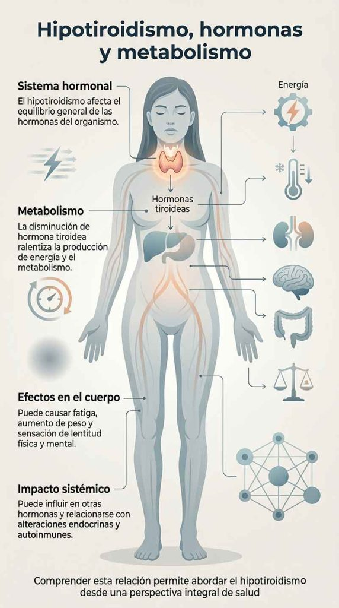

Aprende a identificar los síntomas del hipotiroidismo, entender sus posibles causas y conocer qué cambios en la alimentación, el estilo de vida y el equilibrio hormonal pueden ayudarte a sentirte mejor de forma natural.

#### Tabla de contenidos

01. [Introducción](/sintomas-hipotiroidismo/#elementor-toc__heading-anchor-0)

02. [Qué vas a aprender](/sintomas-hipotiroidismo/#elementor-toc__heading-anchor-1)

03. [Qué es el hipotiroidismo](/sintomas-hipotiroidismo/#elementor-toc__heading-anchor-2)

04. [Síntomas del hipotiroidismo](/sintomas-hipotiroidismo/#elementor-toc__heading-anchor-3)

05. [Cómo afecta el hipotiroidismo al cuerpo](/sintomas-hipotiroidismo/#elementor-toc__heading-anchor-4)

06. [Relación con hormonas y metabolismo](/sintomas-hipotiroidismo/#elementor-toc__heading-anchor-5)

07. [Soluciones naturales para el hipotiroidismo](/sintomas-hipotiroidismo/#elementor-toc__heading-anchor-6)

    1. [Alimentación equilibrada](/sintomas-hipotiroidismo/#elementor-toc__heading-anchor-7)

    2. [Terapia de reemplazo hormonal](/sintomas-hipotiroidismo/#elementor-toc__heading-anchor-8)

    3. [Aporte adecuado de yodo](/sintomas-hipotiroidismo/#elementor-toc__heading-anchor-9)

    4. [Suplementos y apoyo nutricional](/sintomas-hipotiroidismo/#elementor-toc__heading-anchor-10)

    5. [Actividad física regular](/sintomas-hipotiroidismo/#elementor-toc__heading-anchor-11)

    6. [Gestión del estrés](/sintomas-hipotiroidismo/#elementor-toc__heading-anchor-12)
08. [Preguntas Frecuentes](/sintomas-hipotiroidismo/#elementor-toc__heading-anchor-13)

09. [conclusión](/sintomas-hipotiroidismo/#elementor-toc__heading-anchor-14)

10. [Artículos relacionados](/sintomas-hipotiroidismo/#elementor-toc__heading-anchor-15)

    1. [La perimenopausia puede empezar antes de lo esperado: estas son sus primeras señales](/sintomas-hipotiroidismo/#elementor-toc__heading-anchor-16)

    2. [Ultraprocesados y salud digestiva: nueva alerta](/sintomas-hipotiroidismo/#elementor-toc__heading-anchor-17)

    3. [Dieta cetogénica y salud cerebral: qué dice la ciencia sobre Alzheimer y Parkinson](/sintomas-hipotiroidismo/#elementor-toc__heading-anchor-18)

    4. [El sueño profundo: la hormona natural que ayuda a regenerar músculo, metabolismo y cerebro](/sintomas-hipotiroidismo/#elementor-toc__heading-anchor-19)

    5. [Colesterol alto: por qué el LDL aislado podría no contar toda la historia clínica](/sintomas-hipotiroidismo/#elementor-toc__heading-anchor-20)
11. [¿Sientes que tu energía sube y baja constantemente?](/sintomas-hipotiroidismo/#elementor-toc__heading-anchor-21)

## Introducción

El hipotiroidismo es una alteración de la glándula tiroides que afecta a millones de personas en todo el mundo y que, en muchos casos, puede pasar desapercibida durante años. Esta condición se produce cuando la tiroides no genera suficientes hormonas, afectando directamente a funciones esenciales como el metabolismo, los niveles de energía, la temperatura corporal o el estado de ánimo.

Entre sus síntomas más frecuentes se encuentran el cansancio persistente, el aumento de peso, la sensibilidad al frío, la caída del cabello o la dificultad para concentrarse, aunque su intensidad puede variar en cada persona.

En este artículo descubrirás qué es el hipotiroidismo, cuáles son sus posibles causas, cómo reconocer sus síntomas y qué estrategias naturales pueden ayudarte a mejorar el equilibrio hormonal y el bienestar general.

## Qué vas a aprender

En este artículo descubrirás qué es el hipotiroidismo, cuáles son sus causas más frecuentes y cómo puede afectar al metabolismo, la energía y el bienestar general.

También aprenderás a identificar sus síntomas más comunes, conocerás qué factores pueden influir en el funcionamiento de la tiroides y qué estrategias naturales pueden ayudarte a mejorar el equilibrio hormonal.

Además, veremos qué hábitos pueden contribuir a mantener una buena salud tiroidea y favorecer un mejor estado físico y mental a largo plazo.

## Qué es el hipotiroidismo

Definición y explicación

El hipotiroidismo es una alteración hormonal que ocurre cuando la glándula tiroides no produce suficientes hormonas para cubrir las necesidades del organismo. Estas hormonas son esenciales para regular funciones como el metabolismo, la temperatura corporal, los niveles de energía y el funcionamiento de distintos órganos y sistemas.

Cuando la actividad de la tiroides disminuye, el cuerpo tiende a ralentizar muchos de sus procesos, lo que puede dar lugar a síntomas como cansancio persistente, sensibilidad al frío, aumento de peso, caída del cabello, dificultad para concentrarse o problemas de memoria.

Debido a que la tiroides influye en múltiples funciones del organismo, un desequilibrio en su funcionamiento puede afectar de forma significativa al bienestar físico y mental si no se aborda adecuadamente.

## Síntomas del hipotiroidismo

Señales y síntomas comunes

Los síntomas del hipotiroidismo pueden desarrollarse de forma gradual y variar según la persona y el grado de alteración hormonal.

Entre las señales más frecuentes se encuentran la fatiga persistente, la sensibilidad al frío, el aumento de peso, la caída del cabello y la dificultad para concentrarse o recordar información. También pueden aparecer cambios en el estado de ánimo, como apatía, ansiedad o bajo ánimo.

Además, algunas personas experimentan dolor muscular o articular, piel seca, uñas frágiles y una sensación general de falta de energía o lentitud física y mental.

Debido a que muchos de estos síntomas pueden confundirse con otras condiciones o con el estrés diario, el hipotiroidismo puede pasar desapercibido durante bastante tiempo.

## Cómo afecta el hipotiroidismo al cuerpo

Efectos en la salud general

El hipotiroidismo puede influir en múltiples funciones del organismo debido al papel fundamental que desempeñan las hormonas tiroideas en el metabolismo y el equilibrio general del cuerpo.

Cuando la tiroides funciona por debajo de lo normal, muchos procesos corporales tienden a ralentizarse, afectando a la energía, la circulación, el estado de ánimo y la capacidad del organismo para regular distintas funciones.

Si no se trata adecuadamente, el hipotiroidismo puede aumentar el riesgo de desarrollar problemas cardiovasculares, alteraciones en la salud ósea y trastornos relacionados con el bienestar emocional, como ansiedad o depresión. También puede influir en la fertilidad y en el desarrollo del embarazo.

Debido a que sus efectos pueden extenderse a distintos sistemas del cuerpo, identificar y abordar el problema a tiempo es importante para mejorar la calidad de vida y prevenir posibles complicaciones a largo plazo.

## Relación con hormonas y metabolismo

Cómo el hipotiroidismo afecta las hormonas y el metabolismo

El hipotiroidismo no solo afecta a la glándula tiroides, sino también al equilibrio general de las hormonas y al funcionamiento del metabolismo.

Las hormonas tiroideas participan en procesos esenciales como la producción de energía, la regulación de la temperatura corporal, el control del peso y el funcionamiento de distintos órganos. Cuando sus niveles disminuyen, el metabolismo tiende a ralentizarse, lo que puede provocar fatiga, aumento de peso y sensación de lentitud física y mental.

Además, el desequilibrio tiroideo puede influir en otras hormonas del organismo y relacionarse con alteraciones metabólicas y endocrinas. En algunos casos, el hipotiroidismo puede coexistir con otras condiciones hormonales o autoinmunes, afectando aún más al bienestar general.

Comprender esta relación ayuda a entender por qué el hipotiroidismo puede tener un impacto tan amplio en la salud y por qué es importante abordarlo desde una perspectiva integral.

## Soluciones naturales para el hipotiroidismo

Tratamientos y remedios naturales

El tratamiento del hipotiroidismo puede variar según cada persona y el grado de alteración de la función tiroidea. Además del seguimiento médico adecuado, algunos hábitos y enfoques naturales pueden ayudar a mejorar el bienestar general y apoyar el equilibrio hormonal.

### Alimentación equilibrada

Mantener una dieta rica en frutas, verduras, proteínas de calidad, grasas saludables y alimentos integrales puede contribuir al buen funcionamiento del organismo. También es recomendable limitar el consumo de ultraprocesados, azúcares añadidos y grasas de baja calidad.

### Terapia de reemplazo hormonal

En muchos casos, especialmente cuando el hipotiroidismo es más avanzado, puede ser necesario recurrir a tratamiento médico con hormonas tiroideas para compensar la baja producción hormonal de la glándula tiroides.

### Aporte adecuado de yodo

El yodo es un mineral esencial para la producción de hormonas tiroideas. Sin embargo, tanto el exceso como la deficiencia pueden ser perjudiciales, por lo que cualquier suplementación debe realizarse bajo supervisión profesional.

### Suplementos y apoyo nutricional

Algunos nutrientes y compuestos, como la vitamina D, el selenio o ciertas plantas adaptógenas, pueden utilizarse como apoyo en determinados casos. Su uso debe adaptarse siempre a las necesidades individuales.

### Actividad física regular

El ejercicio moderado puede ayudar a mejorar la energía, apoyar el metabolismo y favorecer el bienestar físico y mental. Encontrar un equilibrio entre actividad y descanso es especialmente importante en personas con fatiga.

### Gestión del estrés

El estrés prolongado puede influir negativamente en el equilibrio hormonal y empeorar algunos síntomas. Técnicas como la meditación, el yoga, la respiración consciente o la terapia pueden ayudar a mejorar la regulación del sistema nervioso.

## Preguntas Frecuentes

¿Qué es el hipotiroidismo?

El hipotiroidismo es una alteración hormonal que ocurre cuando la glándula tiroides no produce suficientes hormonas para cubrir las necesidades del organismo. Esto puede ralentizar funciones importantes del cuerpo, como el metabolismo, la producción de energía o la regulación de la temperatura corporal.

¿Cuáles son los síntomas del hipotiroidismo?

Los síntomas pueden variar según la persona, pero los más frecuentes incluyen cansancio persistente, sensibilidad al frío, aumento de peso, caída del cabello, piel seca, dificultad para concentrarse y cambios en el estado de ánimo.

¿Qué causa el hipotiroidismo?

Las causas más comunes incluyen enfermedades autoinmunes como la tiroiditis de Hashimoto, deficiencias nutricionales, alteraciones hormonales, ciertos medicamentos o problemas que afectan directamente a la glándula tiroides.

¿Cómo se diagnostica el hipotiroidismo?

El diagnóstico suele realizarse mediante análisis de sangre que evalúan los niveles de hormonas tiroideas y de TSH (hormona estimulante de la tiroides). En algunos casos, también pueden realizarse pruebas adicionales para identificar la causa subyacente.

¿Qué tratamientos existen para el hipotiroidismo?

El tratamiento más habitual consiste en terapia de reemplazo hormonal con hormonas tiroideas. Además, algunos cambios en la alimentación, el descanso, el manejo del estrés y el estilo de vida pueden ayudar a mejorar el bienestar general.

¿Se puede mejorar el hipotiroidismo de forma natural?

Aunque el hipotiroidismo suele requerir seguimiento médico, ciertos hábitos saludables pueden ayudar a apoyar la función tiroidea y reducir algunos síntomas. Entre ellos destacan una alimentación equilibrada, el ejercicio moderado, el buen descanso y la gestión del estrés.

## conclusión

El hipotiroidismo es una alteración hormonal que puede afectar a múltiples aspectos de la salud y del bienestar diario, especialmente cuando pasa desapercibido durante mucho tiempo.

Reconocer sus síntomas, comprender cómo influye en el organismo y abordar sus posibles causas es fundamental para mejorar la calidad de vida y favorecer un mejor equilibrio hormonal.

Aunque en muchos casos requiere seguimiento y tratamiento médico, hábitos como una alimentación equilibrada, el descanso adecuado, la actividad física y la gestión del estrés también pueden desempeñar un papel importante en el bienestar general.

Ante síntomas persistentes o dudas sobre el funcionamiento de la tiroides, consultar con un profesional de la salud es el mejor paso para obtener un diagnóstico adecuado y un enfoque adaptado a cada persona.
