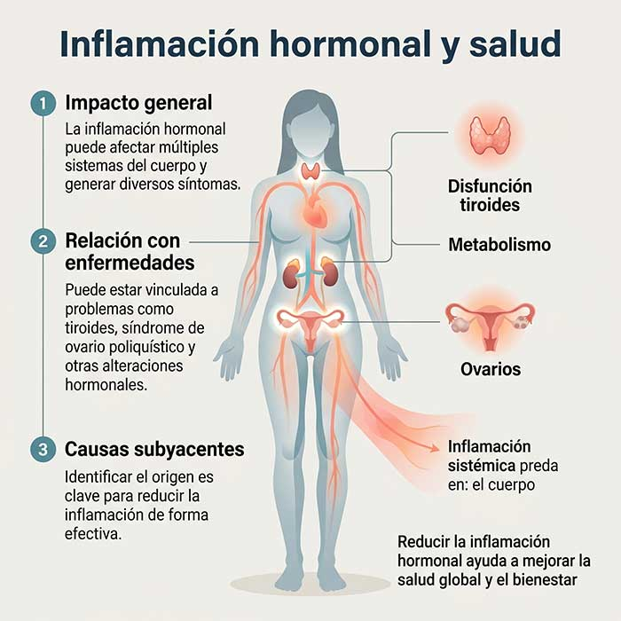

Causas, síntomas y estrategias naturales para reducir la inflamación hormonal y mejorar tu bienestar

#### Tabla de contenidos

01. [Introducción](/sintomas-inflamacion-hormonal/#elementor-toc__heading-anchor-0)

02. [Qué vas a aprender](/sintomas-inflamacion-hormonal/#elementor-toc__heading-anchor-1)

03. [¿Qué es la inflamación hormonal?](/sintomas-inflamacion-hormonal/#elementor-toc__heading-anchor-2)

04. [Síntomas de la inflamación hormonal](/sintomas-inflamacion-hormonal/#elementor-toc__heading-anchor-3)

05. [Cómo afecta la inflamación hormonal el cuerpo](/sintomas-inflamacion-hormonal/#elementor-toc__heading-anchor-4)

06. [Relación entre la inflamación hormonal y la salud](/sintomas-inflamacion-hormonal/#elementor-toc__heading-anchor-5)

07. [Soluciones para reducir la inflamación hormonal](/sintomas-inflamacion-hormonal/#elementor-toc__heading-anchor-6)

    1. [Alimentación antiinflamatoria](/sintomas-inflamacion-hormonal/#elementor-toc__heading-anchor-7)

    2. [Apoyo con suplementos](/sintomas-inflamacion-hormonal/#elementor-toc__heading-anchor-8)

    3. [Gestión del estrés](/sintomas-inflamacion-hormonal/#elementor-toc__heading-anchor-9)

    4. [Sueño reparador](/sintomas-inflamacion-hormonal/#elementor-toc__heading-anchor-10)

    5. [Actividad física regular](/sintomas-inflamacion-hormonal/#elementor-toc__heading-anchor-11)

    6. [Evitar hábitos perjudiciales](/sintomas-inflamacion-hormonal/#elementor-toc__heading-anchor-12)
08. [Preguntas Frecuentes](/sintomas-inflamacion-hormonal/#elementor-toc__heading-anchor-13)

09. [conclusión](/sintomas-inflamacion-hormonal/#elementor-toc__heading-anchor-14)

10. [Artículos relacionados](/sintomas-inflamacion-hormonal/#elementor-toc__heading-anchor-15)

    1. [La perimenopausia puede empezar antes de lo esperado: estas son sus primeras señales](/sintomas-inflamacion-hormonal/#elementor-toc__heading-anchor-16)

    2. [Ultraprocesados y salud digestiva: nueva alerta](/sintomas-inflamacion-hormonal/#elementor-toc__heading-anchor-17)

    3. [Dieta cetogénica y salud cerebral: qué dice la ciencia sobre Alzheimer y Parkinson](/sintomas-inflamacion-hormonal/#elementor-toc__heading-anchor-18)

    4. [El sueño profundo: la hormona natural que ayuda a regenerar músculo, metabolismo y cerebro](/sintomas-inflamacion-hormonal/#elementor-toc__heading-anchor-19)

    5. [Colesterol alto: por qué el LDL aislado podría no contar toda la historia clínica](/sintomas-inflamacion-hormonal/#elementor-toc__heading-anchor-20)
11. [¿Sientes que tu energía sube y baja constantemente?](/sintomas-inflamacion-hormonal/#elementor-toc__heading-anchor-21)

## Introducción

La inflamación hormonal es un factor cada vez más relevante cuando hablamos de salud y bienestar. Aunque no siempre es evidente, puede estar detrás de síntomas como fatiga, cambios de peso, problemas digestivos o alteraciones del estado de ánimo.

Cuando la inflamación se mantiene en el tiempo, puede afectar al equilibrio hormonal y aumentar el riesgo de desarrollar problemas de salud más complejos, como enfermedades cardiovasculares o metabólicas.

En este artículo entenderás qué es la inflamación hormonal, cuáles son sus causas más habituales, cómo identificar sus síntomas y qué puedes hacer para reducirla de forma efectiva.

## Qué vas a aprender

En este artículo descubrirás qué es la inflamación hormonal y por qué puede afectar a tu bienestar más de lo que parece.

Verás cuáles son sus causas más frecuentes, cómo identificar sus síntomas y de qué manera influye en la salud general.

Además, encontrarás estrategias prácticas y naturales para ayudarte a reducirla y recuperar el equilibrio hormonal.

## ¿Qué es la inflamación hormonal?

Definición y explicación

La inflamación hormonal se refiere a un estado en el que los procesos inflamatorios del organismo interfieren con el equilibrio normal de las hormonas. Esta interacción puede alterar la forma en la que el cuerpo regula funciones clave como el metabolismo, la energía o el estado de ánimo.

Cuando este desequilibrio se mantiene en el tiempo, pueden aparecer síntomas como fatiga, hinchazón abdominal, problemas de piel o cambios en el peso, entre otros.

Factores como el estrés crónico, una alimentación poco equilibrada, la falta de descanso o el sedentarismo pueden favorecer este tipo de inflamación y contribuir a la desregulación hormonal.

## Síntomas de la inflamación hormonal

Cómo reconocer los síntomas de la inflamación hormonal

Los síntomas de la inflamación hormonal pueden variar de una persona a otra, dependiendo del origen y del grado de desequilibrio.

Aun así, existen señales frecuentes que pueden ayudar a identificarla, como la fatiga persistente, el dolor o malestar abdominal, los problemas de piel (como acné o sensibilidad), y los cambios en el estado de ánimo, como irritabilidad o tristeza sin causa aparente.

Reconocer estos signos a tiempo es importante para comprender lo que está ocurriendo en el organismo y poder abordar la situación de forma adecuada, especialmente si los síntomas se mantienen en el tiempo o interfieren con la calidad de vida.

## Cómo afecta la inflamación hormonal el cuerpo

Consecuencias de la inflamación hormonal en la salud

Cuando la inflamación hormonal se mantiene en el tiempo, puede influir en múltiples sistemas del organismo, alterando su funcionamiento normal.

A nivel físico, puede contribuir a síntomas como fatiga persistente, molestias digestivas, cambios en la piel y alteraciones en el peso. Estos signos suelen afectar directamente a la energía y la calidad de vida diaria.

Además, cuando este estado inflamatorio se cronifica, puede aumentar el riesgo de desarrollar problemas metabólicos y cardiovasculares, entre otros desequilibrios más complejos.

Por ello, entender su impacto permite abordarlo de forma más consciente y prevenir que el problema avance.

## Relación entre la inflamación hormonal y la salud

Cómo la inflamación hormonal afecta la salud en general

La inflamación hormonal no afecta solo a un síntoma concreto, sino que puede influir en el equilibrio global del organismo, alterando distintas funciones del cuerpo de forma progresiva.

Cuando este estado inflamatorio se mantiene en el tiempo, puede contribuir a la aparición de síntomas persistentes y aumentar la probabilidad de desarrollar distintos desequilibrios hormonales y metabólicos.

Además, se ha relacionado con condiciones como el síndrome de ovario poliquístico o la enfermedad de Hashimoto, entre otras alteraciones del sistema endocrino.

Por ello, es importante no centrarse únicamente en los síntomas, sino también en identificar y abordar las posibles causas subyacentes para favorecer una recuperación más estable del equilibrio hormonal.

## Soluciones para reducir la inflamación hormonal

Cómo reducir la inflamación hormonal de manera natural y efectiva

### Alimentación antiinflamatoria

La dieta juega un papel clave. Aumentar el consumo de alimentos frescos como frutas, verduras, grasas saludables y proteínas de calidad puede ayudar a reducir los procesos inflamatorios. Al mismo tiempo, es recomendable limitar los ultraprocesados, el azúcar añadido y las harinas refinadas.

### Apoyo con suplementos

En algunos casos, ciertos suplementos pueden ser un apoyo adicional, como los ácidos grasos omega-3, los probióticos o algunas vitaminas. Su uso debe adaptarse a las necesidades individuales.

### Gestión del estrés

El estrés crónico es uno de los principales factores que favorecen la inflamación hormonal.

Técnicas como la meditación, la respiración consciente o el yoga pueden ayudar a regular la respuesta del sistema nervioso.

### Sueño reparador

Dormir entre 7 y 9 horas de calidad es esencial para la regulación hormonal. Mantener horarios regulares y una buena higiene del sueño favorece la recuperación del organismo.

### Actividad física regular

El ejercicio moderado contribuye a reducir la inflamación y mejorar la sensibilidad hormonal.

Caminar, entrenar fuerza o practicar actividades aeróbicas suaves pueden ser opciones efectivas.

### Evitar hábitos perjudiciales

Reducir o evitar el consumo de alcohol y tabaco también es clave, ya que ambos pueden aumentar los procesos inflamatorios y afectar el equilibrio hormonal.

## Preguntas Frecuentes

¿Qué es la inflamación hormonal?

La inflamación hormonal es un estado en el que los procesos inflamatorios del cuerpo interfieren con el equilibrio normal de las hormonas, afectando a funciones como la energía, el metabolismo o el estado de ánimo.

¿Qué causa la inflamación hormonal?

Suele estar relacionada con factores como el estrés crónico, una alimentación poco equilibrada, el sedentarismo, la falta de descanso o alteraciones en el sistema hormonal.

¿Cuáles son los síntomas de la inflamación hormonal?

Puede manifestarse de distintas formas, como fatiga persistente, cambios en el peso, molestias digestivas, problemas de piel y alteraciones en el estado de ánimo. La intensidad puede variar según cada persona.

¿Cómo puedo reducir la inflamación hormonal?

Se puede mejorar mediante cambios en el estilo de vida, como una alimentación antiinflamatoria, la reducción del estrés, el ejercicio regular, un buen descanso y, en algunos casos, el apoyo de suplementos.

¿Es importante reducir la inflamación hormonal?

Sí, ya que mantenerla en el tiempo puede influir en el equilibrio general del organismo. Abordarla de forma temprana ayuda a mejorar el bienestar y prevenir que los síntomas se cronifiquen.

## conclusión

La inflamación hormonal es un factor cada vez más relevante en la salud actual, ya que puede influir en múltiples procesos del organismo cuando el equilibrio hormonal se ve alterado.

A lo largo del artículo hemos visto qué es, cuáles son sus posibles causas, cómo se manifiesta y qué estrategias pueden ayudar a reducirla de forma natural.

Entender este proceso es el primer paso para poder tomar decisiones más conscientes sobre el estilo de vida y favorecer un mejor equilibrio hormonal a largo plazo.
