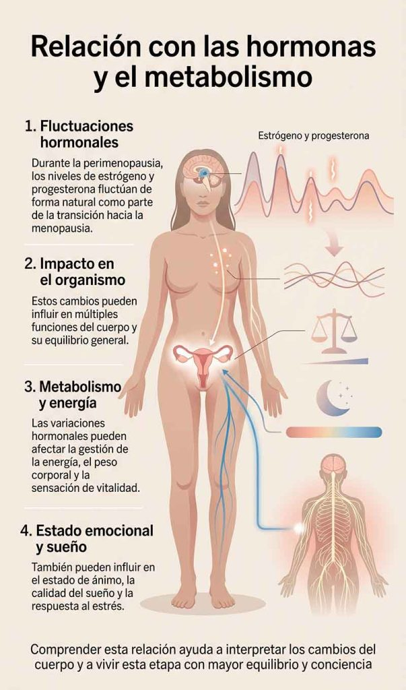

Descubre qué es la perimenopausia, cuánto dura esta etapa de transición hormonal, sus síntomas más frecuentes y cómo puede afectar a tu salud física y emocional

## Introducción

La perimenopausia es una etapa de transición natural en la vida de la mujer que puede prolongarse durante varios años y que marca el inicio de importantes cambios hormonales en el organismo.

Durante este periodo, los niveles de estrógenos y progesterona comienzan a fluctuar de forma irregular, lo que puede dar lugar a síntomas físicos y emocionales que varían en intensidad según cada persona.

Comprender qué es la perimenopausia, cuánto puede durar y cómo se manifiesta es fundamental para identificar sus señales a tiempo y abordar esta etapa con mayor claridad y bienestar. En este artículo exploraremos sus principales características y su impacto en la salud femenina.

## Qué vas a aprender

En este artículo descubrirás qué es la perimenopausia y por qué se considera una etapa clave de transición en la vida de la mujer.

Aprenderás a identificar sus síntomas más comunes, entender cómo pueden variar de una persona a otra y comprender cuánto suele durar este proceso hormonal.

Además, conocerás cómo puede influir en la salud física y emocional, y qué estrategias y opciones pueden ayudarte a gestionar esta etapa con mayor equilibrio y bienestar.

## ¿Qué es la perimenopausia?

Definición y explicación de la perimenopausia

La perimenopausia es una etapa de transición que ocurre antes de la menopausia, en la que el cuerpo de la mujer comienza a experimentar una disminución progresiva y fluctuante de hormonas como el estrógeno y la progesterona.

Estos cambios hormonales no son lineales, por lo que los niveles pueden variar de forma irregular, dando lugar a distintos síntomas físicos y emocionales.

Esta fase puede durar varios años y marca el inicio de una adaptación hormonal en el organismo, por lo que comprenderla es clave para reconocer sus señales y entender cómo puede influir en la salud general.

## Síntomas de la perimenopausia

¿Cuáles son los síntomas de la perimenopausia?

Los síntomas de la perimenopausia pueden variar mucho entre mujeres, tanto en intensidad como en frecuencia, ya que dependen de cómo fluctúan los niveles hormonales en esta etapa.

Uno de los signos más comunes son los cambios en el ciclo menstrual, que puede volverse irregular, más corto o más largo de lo habitual.

También es frecuente experimentar sofocos, sudores nocturnos, alteraciones del sueño, cambios de humor y mayor irritabilidad. En algunos casos, pueden aparecer dificultades de concentración, sensación de fatiga o pequeños problemas de memoria.

Reconocer estos síntomas ayuda a entender mejor los cambios que está atravesando el cuerpo durante esta fase de transición hormonal.

## Cómo afecta la perimenopausia a tu salud

Efectos de la perimenopausia en la salud

La perimenopausia puede influir en la salud de la mujer de diferentes formas debido a las fluctuaciones hormonales que se producen durante esta etapa.

Estos cambios pueden afectar al bienestar general, provocando síntomas como alteraciones del sueño, cambios en la energía o variaciones en el estado de ánimo, que en algunos casos impactan en la calidad de vida diaria.

A largo plazo, la disminución progresiva de estrógenos también puede estar relacionada con una mayor vulnerabilidad a la pérdida de densidad ósea, lo que incrementa el riesgo de osteoporosis, así como con cambios en la salud cardiovascular y el equilibrio emocional.

Comprender estos efectos permite adoptar hábitos y estrategias que ayuden a cuidar la salud de forma preventiva durante esta transición.

## Relación con las hormonas y el metabolismo

Cómo la perimenopausia afecta a las hormonas y el metabolismo

Durante la perimenopausia, el cuerpo de la mujer experimenta fluctuaciones hormonales importantes, especialmente en los niveles de estrógeno y progesterona.

Estos cambios forman parte natural de la transición hacia la menopausia, pero pueden tener un impacto notable en diferentes funciones del organismo.

A nivel metabólico, estas variaciones hormonales pueden influir en la forma en que el cuerpo gestiona la energía, lo que en algunos casos se traduce en cambios en el peso, mayor dificultad para mantenerlo o sensación de menor vitalidad.

También pueden afectar al estado de ánimo, la calidad del sueño y la respuesta del organismo al estrés, ya que las hormonas están estrechamente relacionadas con el equilibrio general del sistema nervioso y metabólico.

Comprender esta relación ayuda a interpretar mejor los cambios que ocurren en esta etapa y a abordar sus síntomas de una forma más consciente y equilibrada.

## Soluciones para la perimenopausia

¿Qué puedes hacer para manejar esta etapa?

La perimenopausia es una fase natural del cuerpo femenino, pero sus síntomas pueden gestionarse mejor con un enfoque integral que combine hábitos saludables, apoyo emocional y, en algunos casos, tratamiento médico.

### Terapia de reemplazo hormonal

En determinados casos, la terapia hormonal puede ayudar a aliviar síntomas como los sofocos, las alteraciones del sueño o los cambios de ánimo. Su uso debe ser siempre valorado y supervisado por un profesional de la salud.

### Técnicas de relajación

Prácticas como la meditación, el yoga o la respiración consciente pueden ser útiles para reducir el estrés, mejorar el estado de ánimo y favorecer un mayor equilibrio emocional.

### Hábitos de vida saludables

Una alimentación equilibrada, la actividad física regular y un buen descanso son pilares fundamentales para ayudar al organismo a adaptarse mejor a los cambios hormonales de esta etapa.

### Apoyo emocional

Contar con el apoyo de familiares, amigos o incluso profesionales puede ser clave para afrontar los cambios emocionales asociados a la perimenopausia.

### Suplementos naturales

Algunos suplementos de origen vegetal, como la maca o la ashwagandha, pueden utilizarse como apoyo en ciertos casos, siempre con supervisión adecuada.

### Consulta con un profesional

Cada mujer vive la perimenopausia de forma diferente, por lo que es importante consultar con un profesional de la salud para recibir una orientación personalizada.

## Preguntas frecuentes

¿Cuánto dura la perimenopausia?

La perimenopausia puede durar varios años, generalmente entre 2 y 8 años, aunque su duración varía mucho de una mujer a otra. Este periodo finaliza cuando se alcanza la menopausia, momento en el que cesa definitivamente la menstruación.

¿Qué son los síntomas más comunes de la perimenopausia?

Los síntomas más frecuentes incluyen cambios en el ciclo menstrual, sofocos, sudores nocturnos, problemas de sueño, cambios de humor, irritabilidad y dificultades de concentración. Su intensidad puede variar a lo largo del tiempo.

¿Cómo puedo manejar los síntomas de la perimenopausia?

Los síntomas pueden mejorar con hábitos saludables como una alimentación equilibrada, ejercicio regular, técnicas de relajación, buen descanso y, en algunos casos, apoyo médico o terapias específicas según cada situación.

¿Es importante buscar tratamiento para la perimenopausia?

No siempre es necesario un tratamiento médico, pero sí es recomendable consultar con un profesional si los síntomas afectan la calidad de vida. De esta forma se puede valorar la mejor estrategia para cada caso.

## conclusión

La perimenopausia es una etapa natural de transición en la vida de la mujer que puede implicar cambios físicos y emocionales importantes, pero no tiene por qué vivirse con incertidumbre.

Comprender qué ocurre en el cuerpo, identificar sus síntomas y conocer cómo evoluciona esta fase permite afrontarla con mayor claridad y seguridad.

Con hábitos saludables, apoyo adecuado y, cuando sea necesario, orientación profesional, es posible reducir el impacto de los síntomas y mantener una buena calidad de vida durante esta transición.
