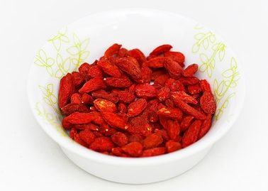
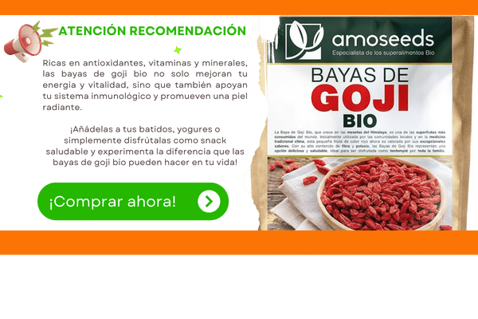

## Superalimento Bayas de Goji ¿Qué son?

Las bayas de goji son pequeñas frutas rojas que provienen de un arbusto que crece en China. Estas bayas se han usado en la medicina tradicional china durante miles de años y hoy en día se consideran un superalimento debido a sus increíbles beneficios para la salud.

## ¿Por Qué las Bayas de Goji Son un Superalimento?

### 1\. Llenas de Nutrientes

Las bayas de goji están repletas de vitaminas y minerales. Son especialmente ricas en vitamina C, vitamina A, hierro y antioxidantes. ¡Todos estos nutrientes son esenciales para mantener tu cuerpo fuerte y saludable!

### 2\. Mejoran la Visión

Una de las razones por las que las bayas de goji se consideran un superalimento es porque contienen zeaxantina, un antioxidante que ayuda a proteger tus ojos. Comer bayas de goji puede ayudar a mantener una buena visión y proteger tus ojos de la luz dañina.

### 3\. Refuerzan el Sistema Inmunológico

Las bayas de goji pueden ayudar a fortalecer tu sistema inmunológico. Esto significa que tu cuerpo puede combatir mejor los resfriados y otras enfermedades. Los antioxidantes presentes en las bayas de goji son los superhéroes que ayudan a mantener tu cuerpo defendido.

### 4\. Ayudan a Mantener la Piel Sana

Gracias a su alto contenido de vitamina C y antioxidantes, las bayas de goji pueden contribuir a una piel más sana y radiante. Estos nutrientes ayudan a proteger la piel del daño causado por el sol y otros factores ambientales.

### 5\. Aumentan la Energía

Comer bayas de goji puede darte un impulso de energía. Son una fuente natural de carbohidratos y fibra, lo que te ayuda a mantener niveles de energía estables durante el día. ¡Perfectas para un snack saludable!

Otras mejoras que pueden aportar:

- Protegen el hígado
- Calman el nerviosismo
- Mejoran la memoria
- Ayudan al crecimiento muscular
- Son beneficiosas en la lucha contra la leucemia y la hepatitis B
- Ayuda en la eliminación de hongos y bacterias
- Tiene propiedades anti-inflamatorias
- Mejora la impotencia sexual
- Disminuye el colesterol
- Regulan la presión arterial
- Mejoran el cáncer de cuello uterino
- Mejoran el funcionamiento del corazón
- Mejora los efectos de la quimio y radioterapia
- Son un potente antienvejecimiento y antioxidante
- Protegen el sistema inmune
- Ayudan a mejorar la piel y la visión

## ¿Cómo Comer Bayas de Goji?

Solas como Snack

Las bayas de goji se pueden comer directamente como un snack delicioso y nutritivo. Solo un puñado puede proporcionar una buena cantidad de nutrientes.

En Batidos

Puedes agregar bayas de goji a tus batidos para un extra de sabor y nutrientes. Simplemente mezcla un puñado de bayas de goji con tus frutas y verduras favoritas.

En Cereales o Yogur

Las bayas de goji también son excelentes para añadir a tu desayuno. Pon un puñado en tu cereal, avena o yogur para comenzar el día con energía.

En Ensaladas

Agrega bayas de goji a tus ensaladas para darles un toque dulce y un aumento de nutrientes. ¡Combinan muy bien con verduras frescas y aderezos ligeros!

## ¿Dónde Puedes Encontrar Bayas de Goji?

Las bayas de goji se pueden encontrar en tiendas de alimentos saludables, supermercados y en línea. Busca bayas de goji secas en la sección de frutas secas o en el área de productos naturales.

El superalimento bayas de goji es una adición maravillosa a tu dieta. Estas pequeñas frutas rojas están llenas de nutrientes, ayudan a mejorar la visión, refuerzan el sistema inmunológico, mantienen la piel sana y aumentan la energía. ¡Incorpora las bayas de goji en tus comidas y disfruta de sus increíbles beneficios para la salud!

Recuerda, una dieta equilibrada y variada es clave para una vida saludable. ¡Así que no dudes en probar este superalimento y ver cómo mejora tu bienestar!

Puedes ver el [vídeo haciendo clic](https://www.youtube.com/watch?v=GFwJ2ZZ5vRs) a continuación:

Nos vemos en el camino 🙂

Si quieres saber más sobre nutrición y vida sana, [suscríbete a mi canal](https://www.youtube.com/user/nutriclubweb) y sigue mi página de [Facebook](https://www.facebook.com/clubdenutricion.es/). Visita la sección de blog [aquí](/blog/).
